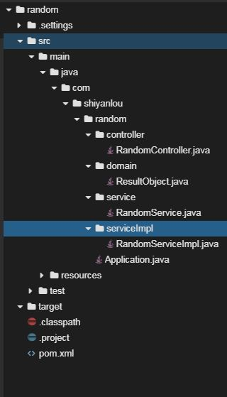

# 生成指定个数随机数

   * [生成指定个数随机数](#生成指定个数随机数)
      * [介绍](#介绍)
      * [目标](#目标)
      * [提示语](#提示语)
      * [知识点](#知识点)

## 介绍

题目需求如下：

需求1. 使用手工构建项目方式创建项目

需求2. 创建项目

- 创建Spring Boot 基本目录结构，包括controller、service、serviceImpl、domain
- 创建启动类Application.java
- 修改pom.xml文件

需求3. 编写代码实现功能，该web主要功能为：返回指定个数、指定范围内的随机数。

举例：在终端中输入`curl -v http://localhost:8080/random/get/10/3/7`，后台返回10个3~7之间的随机数，第一个PathVariable表示个数，第二个PathVariable表示随机数最小值，第三个PathVariable表示随机数最大值。

需求4. 打包发布

​	使用maven将项目打包成jar包，使用java -jar命令运行

## 目标

1. 浏览器发出请求前，Spring Boot项目代码没有bug，可以正常启动，控制台打印出启动日志。
2. 保证在终端中输入`curl -v http://localhost:8080/random/get/{randomCounter}/{randomMin}/{randomMax}`，后台有正确的返回，即返回randomCounter个在randomMin ~ randomMax返回内的随机数。
3. 打包发布后，项目依然可以正常访问，依然满足目标2的测试要求。

## 提示语

1. 创建好的项目目录结构如下图所示

2. 通过curl访问，正确的URL及返回结果如下所示

3. 通过curl访问，错误的URL及返回结果如下所示

4. 打包完成后，使用java -jar命令运行，如下图所示

## 知识点

1. Spring Boot 项目构建及简单开发
2. Java指定返回内随机数生成
3. maven打包发布项目

