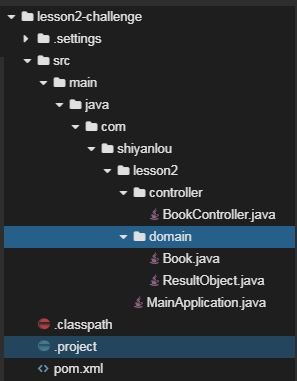

# Spring Boot Web开发

## 介绍

题目需求如下：

需求1. 使用maven创建java Web项目，创建`Book`类，实现对其增删改查、分页查询五大功能，通过`HashMap`存储`Book`信息，模拟数据库

## 目标

1. 通过maven创建项目，根据提示创建目录结构
2. 创建Spring Boot启动类
3. 正确配置`pom.xml`
4. 创建`Book`类，包含四个属性
   - `id`，图书id
   - `name`，图书名称
   - `author`，作者
   - `press`，出版社
5. 编写controller，实现增删改查、分页查询五大功能
6. 启动Spring Boot项目代码没有bug，可以正常启动，控制台打印出启动日志。
7. 通过curl访问，正确的URL及返回结果如下所示，该功能为创建`book`
   
8. 通过curl访问，正确的URL及返回结果如下所示，该功能为访问`book`的信息
   
9. 通过curl访问，正确的URL及返回结果如下所示，该功能为修改`book`
   
10. 通过curl访问，正确的URL及返回结果如下所示，该功能为删除指定`id`的`book`
   
11. 通过curl访问，正确的URL及返回结果如下所示，该功能为分页查询`book`，该接口需要进行容错处理，例如：`pageSize`、`pageNum`用户输入为负数、特别大的数字等
    

## 提示语

1. 创建好的项目目录结构如下图所示
   

## 知识点

- Spring Boot Web开发，包括`@RestController`、 `@RequestMapping`、 `@PathVariable`、 `@GetMapping`、 `@PostMapping `等常见注解的使用

