# Spring Boot Web开发

##  一、实验简介

### 1.1 实验内容
​	本实验首先介绍Spring Boot Web开发的基础知识，包括Web开发常用注解、序列化工具Jackson、以及使用命令行方式的接口测试工具Curl。然后通过实战熟悉Web开发中多种参数传递方式、请求类型、路由映射，并且通过Curl测试后端接口可用性。

### 1.2 实验知识点

- Spring Boot Web开发入门
- Jackson序列化工具
- Curl测试工具


### 1.3 实验环境

- Eclipse Neon.2 Release (4.6.2)
- Java 1.8
- Maven 3.5
- Spring Boot 2.0.6
- curl


## 二、实验步骤

### 2.1 Spring Boot Web开发介绍

​        在 Spring Boot 快速入门中，只要在 pom.xml 加入了 spring-boot-starter-web 依赖，即可快速开发 web 应用。可见，Spring Boot 极大地简化了 Spring 应用从搭建到开发的过程，做到了「开箱即用」的方式。Spring Boot 已经提供很多「开箱即用」的依赖，如上面开发 web 应用使用的 spring-boot-starter-web ，都是以 spring-boot-starter-xx 进行命名的。下面对常用的注解进行介绍。

应用标记

- `@SpringBootApplication` 标记启动入口类，是一个复合注解，包括`@ComponentScan`，和`@SpringBootConfiguration`，`@EnableAutoConfiguration`。

  - `@ComponentScan` 扫描当前包及其子包下被`@Component`，`@Controller`，`@Service`，`@Repository`注解标记的类并纳入到spring容器中进行管理。
  - `@SpringBootConfiguration ` 继承自`@Configuration`，二者功能也一致，标注当前类是配置类，
  - `@EnableAutoConfiguration` 启动自动的配置

分层标记

- `@RestController` 标记控制层，在Spring4以后引入的复合注解，即`@Controller `和`@ResponseBody`的结合，被标记的类默认返回json数据，方便使用

- `@Service` 标记业务逻辑层

- `@Repository` 标记持久层

- `@Component ` 标记普通的组件，同样可以被注入到spring容器中管理

地址映射

- `@RequestMapping` 用来处理请求地址映射的注解，可用于类或方法上。用于类上，表示类中的所有响应请求的方法都是以该地址作为父路径。
  - `value` 请求地址
  - `method` 请求方法类型
  - `params` 请求必须包含哪些参数才能处理
  - `headers` 请求必须包含`header`才能处理
  - `consumes` 请求内容类型`Content-Type`，例如常用的`application/json`
  - `produces` 指定返回的内容类型，请求头部中`Accept`包含该类型才能处理
- `@GetMapping`  等于`@RequestMapping(method = RequestMethod.GET)`
- `@PostMapping`  等于`@RequestMapping(method = RequestMethod.POST)`
- `@PutMapping`  等于`@RequestMapping(method = RequestMethod.PUT)`
- `@DeleteMapping`  等于`@RequestMapping(method = RequestMethod.DELETE)`

数据绑定

- `@RequestBody` 从请求体中获取参数，一般在`POST`方法上传数据时使用，需要设置`Content-Type: application/json`
- `@PathVariable` URL路径变量，例如：`http://localhost:8080/job/delete/1`，其中的1便是
- `@RequestParam` URL问号参数，例如：`http://localhost:8080/job/delete?id=1`，其中id便是
- `@ResponseBody` 将返回数据存放在响应体中

### 2.2 Curl 介绍

​          curl是一个利用URL语法在字符终端中通过命令行方式工作的文件传输工具。它支持文件上传和下载，所以可以作为测试后台接口的工具。除此之外，日常开发工作中，常用的图形化测试工具还有`postman`，`fiddler`，大家可以课外自学以备工作时候使用。下面介绍一下curl常用参数，方便大家在之后实验中使用。

```shell
$ curl [option] [url]
```

常见参数：

- `-X GET | POST | PUT | DELETE`  自定义请求方法类型
- `-H header`  自定义请求头信息
- `-d data`  自定义请求体中的数据
- `--cookie cookie`  自定义请求需要携带的`cookie`
- `-F "file=@path/filename"`  自定义需要上传的文件
- `-v `  显示服务器响应的详细信息

### 2.3  Jackson介绍

​         Jackson是一个简单易用、性能良好的Java序列化类库，Jackson可以轻松的将java对象序列化为json对象，同样也可以将json对象反序列化为java对象。Jackson所依赖的jar包较少，并且社区比较活跃，更新速度也比较快。

​	在Spring Boot web开发过程中，经常需要借助Jackson完成将前端请求中的json对象反序列化为java对象，同时也需要将后端响应中的java对象序列化为json对象，下面介绍常用的Jackson注解。

- `@JsonProperty`   将该注解添加在java类的某个属性上，实现属性重命名

- `@JsonIgnore`   将该注解添加在java类的某个属性上，则在序列化、反序列化过程中忽略该字段，该字段不可见

- `@JsonFormat`   将该注解添加在java类的时间、日期这类属性上，实现这类字段的格式化

- `@JsonInclude(Include.NON_NULL)`   将该注解添加在java类或者属性上，控制在有些情况下属性才参加序列化、反序列化，如属性非null的情况下


### 2.4 项目实战

#### 2.4.1 项目结构

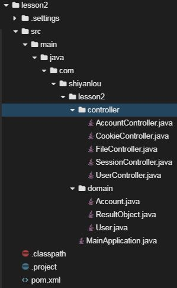

#### 2.4.2 创建项目

在web IDE界面中，选择File -> Open New Terminal，在终端中输入

```shell
$ mvn archetype:generate -DgroupId=com.shiyanlou -DartifactId=lesson2 -DarchetypeArtifactId=maven-archetype-webapp
```

参数介绍：

- `archetype:generate`：表示使用maven创建项目基本骨架
- `DgroupId`：该项目所属组织，一般将域名倒着写，例如：com.shiyanlou
- `DartifactId`：项目名称，例如：lesson2
- `DarchetypeArtifactId`：指定所用maven项目骨架类型

输入命令后，maven开始创建项目、下载所需的依赖，等待片刻，maven提示我们输入版本号，直接回车，我们使用默认版本号`1.0-SNAPSHOT`即可。随后maven会输出`groupId`、`artifactId`、`version`、`package`这些基本信息，直接输入`Y`确认即可。最后可以看到绿色的`BUILD SUCCESS`项目创建成功的提示。

然后在web IDE界面中，选择File -> Open Workspace切换工作空间，选择lesson2目录，必须切换到该目录下，否则识别不了项目。

最后大家可以根据上图所示的目录结构，自己创建目录、文件，较为简单，无需赘述。


#### 2.4.3 修改pom文件

`将如下配置文件覆盖到pom.xml中`

下面介绍一下常见的`dependencies`

- `spring-boot-starter-web`：Spring Boot为Web开发提供支持

```xml
<project xmlns="http://maven.apache.org/POM/4.0.0" xmlns:xsi="http://www.w3.org/2001/XMLSchema-instance" xsi:schemaLocation="http://maven.apache.org/POM/4.0.0 http://maven.apache.org/xsd/maven-4.0.0.xsd">
     <modelVersion>4.0.0</modelVersion>
     <groupId>com.shiyanlou</groupId>
     <artifactId>lesson2</artifactId>
     <version>0.0.1-SNAPSHOT</version>
     
    <parent>
   		<groupId>org.springframework.boot</groupId>
   		<artifactId>spring-boot-starter-parent</artifactId>
   		<version>2.0.1.RELEASE</version>
   		<relativePath /> <!-- lookup parent from repository -->
   	</parent>

   	<properties>
   		<project.build.sourceEncoding>UTF-8</project.build.sourceEncoding>
   		<project.reporting.outputEncoding>UTF-8</project.reporting.outputEncoding>
   		<java.version>1.8</java.version>
   	</properties>

   	<dependencies>
   		<dependency>
   			<groupId>org.springframework.boot</groupId>
   			<artifactId>spring-boot-starter-web</artifactId>
   		</dependency>
   	</dependencies>

   	<build>
   		<plugins>
   			<plugin>
   				<groupId>org.springframework.boot</groupId>
   				<artifactId>spring-boot-maven-plugin</artifactId>
   			</plugin>
   		</plugins>
   	</build>
   	
   </project>
```


#### 2.4.4 创建domain目录及文件

`ResultObject.java` 用来封装后台返回结果

```java
package com.shiyanlou.lesson2.domain;

public class ResultObject {

  	// 状态返回码
	private int code;
  	// 相关消息
	private String msg;
  	// 返回结果
	private Object result;
  	// 构造函数
	public ResultObject() {
		super();
		// TODO Auto-generated constructor stub
	}
  	// 构造函数
	public ResultObject(int code, String msg, Object result) {
		super();
		this.code = code;
		this.msg = msg;
		this.result = result;
	}
	// 构造函数
	public ResultObject(Object result) {
		super();
		this.code = 0;
		this.msg = "success";
		this.result = result;
	}
	// 构造函数
	public ResultObject(int code, String msg) {
		super();
		this.code = code;
		this.msg = msg;
		this.result = null;
	}
	// 属性的setter getter方法
	public int getCode() {
		return code;
	}
	public void setCode(int code) {
		this.code = code;
	}
	public String getMsg() {
		return msg;
	}
	public void setMsg(String msg) {
		this.msg = msg;
	}
	public Object getResult() {
		return result;
	}
	public void setResult(Object result) {
		this.result = result;
	}
  
    // 重写toString方法
	@Override
	public String toString() {
		return "ResultObject [code=" + code + ", msg=" + msg + ", result=" + result + "]";
	}
}
```


`User.java` 封装的用户类

```java
package com.shiyanlou.lesson2.domain;

public class User{

  	// 用户id
	private int id;
  	// 用户姓名
	private String name;
    // 用户性别
	private int gender;
    // 用户年龄
	private int age;
	// 构造函数
	public User() {
		super();
		// TODO Auto-generated constructor stub
	}
	// 构造函数
	public User(String name, int gender, int age) {
		super();
		this.name = name;
		this.gender = gender;
		this.age = age;
	}
	// 属性的setter getter方法
	public int getId() {
		return id;
	}

	public void setId(int id) {
		this.id = id;
	}

	public String getName() {
		return name;
	}

	public void setName(String name) {
		this.name = name;
	}

	public int getGender() {
		return gender;
	}

	public void setGender(int gender) {
		this.gender = gender;
	}

	public int getAge() {
		return age;
	}

	public void setAge(int age) {
		this.age = age;
	}
  
  	// 重写toString方法
	@Override
	public String toString() {
		return "User [id=" + id + ", name=" + name + ", gender=" + gender + ", age=" + age + "]";
	}	
}
```


`Account.java` 账户类，用来熟悉Jackson的使用

```java
package com.shiyanlou.lesson2.domain;

import java.util.Date;

import com.fasterxml.jackson.annotation.JsonFormat;
import com.fasterxml.jackson.annotation.JsonIgnore;
import com.fasterxml.jackson.annotation.JsonInclude;
import com.fasterxml.jackson.annotation.JsonInclude.Include;
import com.fasterxml.jackson.annotation.JsonProperty;

public class Account{

  	// 账户id，只有在非null的情况下才序列化
	@JsonInclude(Include.NON_NULL)
	private int id;
  	// 账户名称，重命名为name
	@JsonProperty("name")
	private String username;
	// 账户密码，关注一下getPassword、setPassword上的注解
	private String password;
  	// 账户创建创建时间，格式化时间
	@JsonFormat(pattern="yyyy-MM-dd hh:mm:ss", locale="zh", timezone="GMT+8")
	private Date date;
  
	// 构造函数	
	public Account() {
		super();
		// TODO Auto-generated constructor stub
	}
	// 构造函数
	public Account(String username, String password, Date date) {
		super();
		this.username = username;
		this.password = password;
		this.date = date;
	}
  
	// 属性的setter getter方法
	public int getId() {
		return id;
	}

	public void setId(int id) {
		this.id = id;
	}

	public String getUsername() {
		return username;
	}

	public void setUsername(String username) {
		this.username = username;
	}

  	// 向前端返回响应数据的时候，忽略password，该属性不参加序列化，防止泄露密码
	@JsonIgnore
	public String getPassword() {
		return password;
	}

  	// 从前端接受参数的时候，可以正常反序列化
	@JsonProperty
	public void setPassword(String password) {
		this.password = password;
	}

	public Date getDate() {
		return date;
	}

	public void setDate(Date date) {
		this.date = date;
	}

  	// 重写toString方法
	@Override
	public String toString() {
		return "Account [id=" + id + ", username=" + username + ", password=" + password + ", date=" + date + "]";
	}
	
}
```


#### 2.4.5 创建controller目录及文件


`AccountController.java` 账户控制器，用来熟悉Jackson的使用

```java
package com.shiyanlou.lesson2.controller;

import org.springframework.web.bind.annotation.PostMapping;
import org.springframework.web.bind.annotation.RequestBody;
import org.springframework.web.bind.annotation.RequestMapping;
import org.springframework.web.bind.annotation.RestController;

import com.shiyanlou.lesson2.domain.Account;
import com.shiyanlou.lesson2.domain.ResultObject;

// 标注为返回json数据的controller，该类下的方法的URL前缀为account
@RestController
@RequestMapping("account")
public class AccountController {
	
  	// 指定请求方法类型为post、URL为/account/add，从请求消息体中获取account对象，通过Jackson完成反序列化
	@PostMapping("add")
	public ResultObject add(@RequestBody Account account) {
		System.out.println(account);
      	// 将前端发送的account参数直接返回，观察id是否存在、username的名称、password是否存在、date的格式
		return new ResultObject(account);
	}	
}
```


`CookieController.java` `cookie`控制器，用来熟悉对`cookie`的操作

```java
package com.shiyanlou.lesson2.controller;

import javax.servlet.http.Cookie;
import javax.servlet.http.HttpServletRequest;
import javax.servlet.http.HttpServletResponse;

import org.springframework.web.bind.annotation.CookieValue;
import org.springframework.web.bind.annotation.GetMapping;
import org.springframework.web.bind.annotation.RequestMapping;
import org.springframework.web.bind.annotation.RestController;

import com.shiyanlou.lesson2.domain.ResultObject;

// 标注为返回json数据的controller，该类下的方法的URL前缀为cookie
@RestController
@RequestMapping("cookie")
public class CookieController {
	
    // 功能为设置cookie，返回给前端，指定请求方法类型为get、URL为/cookie/set
	@GetMapping("set")
	public ResultObject setCookie(HttpServletRequest request, HttpServletResponse response) {
      	// 获取当前时间
		String time = String.valueOf(System.currentTimeMillis()); 
      	// 创建cookie，用来记录用户最近一次访问时间
		Cookie cookie = new Cookie("last", time);
      	// 设置cookie过期时间，单位秒，当前例子为一个星期
		cookie.setMaxAge(60 * 60 * 24 * 7);
      	// 将cookie添加到响应中
		response.addCookie(cookie);
		return new ResultObject(null);
	}
	
   // 功能为从前端请求中获取cookie，指定请求方法类型为get、URL为/cookie/get
	@GetMapping("get")
	public ResultObject getCookie(HttpServletRequest request, HttpServletResponse response) {
      	// 获取请求携带的所有cookie
		Cookie[] cookies = request.getCookies();
      	// 如果一个cookie都没有，直接返回失败
		if (cookies != null) {
          	// 通过循环比较获取指定cookie
			for(Cookie cookie: cookies) {
				if (cookie.getName().equals("last")) {
                  	// 获取指定cookie的值
					System.out.println(cookie.getValue());
					return new ResultObject(null);
				}
			}
		}
		return new ResultObject(-1, "get cookie fail");
	}
	
     // 功能为通过注解从前端请求中获取指定名称的cookie，指定请求方法类型为get、URL为/cookie/getByAnnotation
	@GetMapping("getByAnnotation")
	public ResultObject getCookieByAnnotation(@CookieValue("last") String last) {
		System.out.println(last);
		return new ResultObject(null);
	}
}
```


`FileController.java` 文件控制器，实现上传文件功能

```java
package com.shiyanlou.lesson2.controller;

import java.io.File;
import java.io.IOException;

import org.springframework.web.bind.annotation.PostMapping;
import org.springframework.web.bind.annotation.RequestMapping;
import org.springframework.web.bind.annotation.RestController;
import org.springframework.web.multipart.MultipartFile;

import com.shiyanlou.lesson2.domain.ResultObject;

// 标注为返回json数据的controller，该类下的方法的URL前缀为/file
@RestController
@RequestMapping("file")
public class FileController {
	
  	// 文件保存路径
	private static String PATH = "/home/project/";
	
     // 功能为上传文件，指定请求方法类型为post、URL为/file/upload
	@PostMapping("upload")
	public ResultObject add(MultipartFile file) {
      	// 如果file为空直接返回
		if(file.isEmpty()) {
			return new ResultObject(-1, "file is empty");
		}
		
      	// 获取文件名
		String fileName = file.getOriginalFilename();
      	// 获取文件大小
		long size = file.getSize();
		System.out.println(size);
		
      	// 创建文件
		File dest = new File(PATH + fileName); 
		
		try {
          	// 保存文件
			file.transferTo(dest);
		} catch (IllegalStateException e) {
			e.printStackTrace();
			return new ResultObject(-1, "state exception");
		} catch (IOException e) {
			e.printStackTrace();
			return new ResultObject(-1, "io exception");
		}
		
		return new ResultObject(null);
	}	
}
```


`SessionController.java` 会话控制器，熟悉session常见操作，包括创建session、设置、获取session属性

```java
package com.shiyanlou.lesson2.controller;

import javax.servlet.http.HttpServletRequest;
import javax.servlet.http.HttpServletResponse;
import javax.servlet.http.HttpSession;

import org.springframework.web.bind.annotation.GetMapping;
import org.springframework.web.bind.annotation.RequestMapping;
import org.springframework.web.bind.annotation.RestController;

import com.shiyanlou.lesson2.domain.ResultObject;

// 标注为返回json数据的controller，该类下的方法的URL前缀为/session
@RestController
@RequestMapping("session")
public class SessionController {
	
    // 功能为创建session，设置session属性，指定请求方法类型为get、URL为/session/set
	@GetMapping("set")
	public ResultObject setSession(HttpServletRequest request, HttpServletResponse response) {
      	// 若session不存在则创建、若存在则获取session
		HttpSession session = request.getSession();
      	// 获取sessionId
		String sessionId = session.getId();
		System.out.println(sessionId);
		
      	// 设置session属性
		session.setAttribute("company", "shiyanlou");

		return new ResultObject(null);
	}
  
	// 功能为获取session属性，指定请求方法类型为post、URL为/file/upload
	@GetMapping("get")
	public ResultObject getSession(HttpServletRequest request, HttpServletResponse response) {
        // 若session不存在则创建、若存在则获取session
		HttpSession session = request.getSession();
      	// 获取session属性
		String name = (String)session.getAttribute("company");
      	// 返回给前端显示
		return new ResultObject(name);
	}
}
```


`UserController.java` 用户控制器，熟悉常见请求方法类型

```java
package com.shiyanlou.lesson2.controller;


import java.util.HashMap;
import java.util.Map;

import javax.servlet.http.HttpServletRequest;
import javax.servlet.http.HttpServletResponse;

import org.springframework.web.bind.annotation.DeleteMapping;
import org.springframework.web.bind.annotation.GetMapping;
import org.springframework.web.bind.annotation.PathVariable;
import org.springframework.web.bind.annotation.PostMapping;
import org.springframework.web.bind.annotation.PutMapping;
import org.springframework.web.bind.annotation.RequestBody;
import org.springframework.web.bind.annotation.RequestHeader;
import org.springframework.web.bind.annotation.RequestMapping;
import org.springframework.web.bind.annotation.RequestParam;
import org.springframework.web.bind.annotation.RestController;

import com.shiyanlou.lesson2.domain.ResultObject;
import com.shiyanlou.lesson2.domain.User;

// 标注为返回json数据的controller，该类下的方法的URL前缀为/user
@RestController
@RequestMapping("user")
public class UserController {

  	// 保存用户信息，模拟数据库的作用
	private static Map<Integer, User> userMap = new HashMap<>();
	
  	// 创建用户，指定请求方法类型为post、URL为/user/add，从请求消息体中获取user，通过Jackson反序列化为user对象
	@PostMapping("add")
	public ResultObject add(@RequestBody User user) {
		userMap.put(user.getId(), user);
		return new ResultObject(userMap);
	}
	
   	// 删除指定id用户，指定请求方法类型为delete、URL为/user/delete/{id}，从url路径中获取id参数
	@DeleteMapping("delete/{id}")
	public ResultObject delete(@PathVariable int id) {
		userMap.remove(id);
		return new ResultObject(userMap);
	}
	
  	// 修改用户，指定请求方法类型为put、URL为/user/modify，通过Jackson反序列化为user对象
	@PutMapping("modify")
	public ResultObject modify(@RequestBody User user) {
		userMap.put(user.getId(), user);
		return new ResultObject(userMap);
	}
	
     // 获取指定id用户，指定请求方法类型为get、URL为/user/findByPathVariable/{id}，从url路径中获取id参数
	@GetMapping("findByPathVariable/{id}")
	public ResultObject findByPathVariable(@PathVariable int id) {
		User user = userMap.get(id);
		return new ResultObject(user);
	}
	
     // 获取指定id用户，指定请求方法类型为get、URL为/user/findByRequestParam，从url路径中获取id参数
	@GetMapping("findByRequestParam")
	public ResultObject findByRequestParam(@RequestParam int id) {
		User user = userMap.get(id);
		return new ResultObject(user);
	}
	
	// 获取请求中的header信息，指定请求方法类型为get、URL为/user/getHeader
	@GetMapping("getHeader")
	public ResultObject getHeader(@RequestHeader String token) {
		return new ResultObject(token);
	}
	
	// 获取请求中的参数，指定请求方法类型为get、URL为/user/getRequest
	@GetMapping("getRequest")
	public ResultObject getRequest(HttpServletRequest request, HttpServletResponse response) {
		String id = request.getParameter("id");
		return new ResultObject(id);
	}
}
```


#### 2.4.6 创建启动类文件

`MainApplication.java`，内置Tomcat，整个web程序的入口

```java
package com.shiyanlou.lesson2;

import org.springframework.boot.SpringApplication;
import org.springframework.boot.autoconfigure.SpringBootApplication;

// 启动入口
@SpringBootApplication
public class MainApplication {

	public static void main(String[] args) {
		SpringApplication.run(MainApplication.class, args);
	}
}
```


#### 2.4.7 访问测试

在终端中输入如下命令，启动web项目

```shell
$ mvn spring-boot:run
```

在web IDE界面中，选择File -> Open New Terminal，在终端中进行测试

- 创建`user`

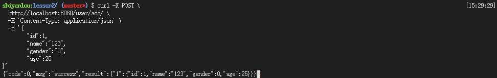

- 通过`PathVariable`获取指定`id`的`user`信息

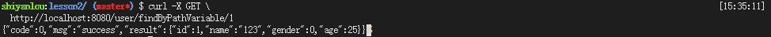


- 通过`RequestParam`获取指定`id`的`user`信息

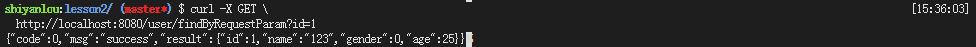

- 修改指定`user`的信息

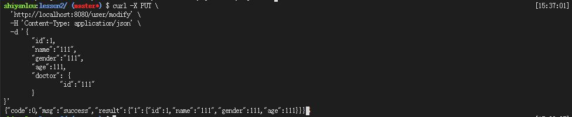

- 删除指定`user`

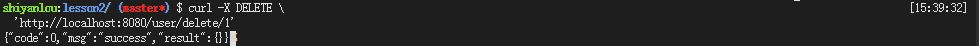

- 获取`header`

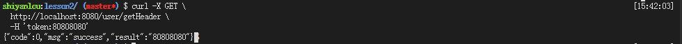

- 通过`servlet`获取请求参数

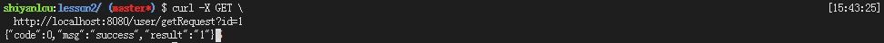

- 获取`cookie`，从图中响应可以看到`header`中`Set-Cookie：last=XXX`，`cookie`已经获取


- 携带`cookie`请求后端接口，第一次后端成功获取`last`这个`cookie`，第二次由于请求没有携带正确`cookie`，所以后端返回失败信息

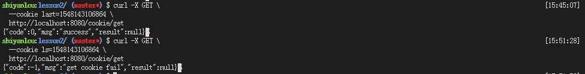

- 携带`cookie`请求后端接口，后端通过注解获取请求携带的`cookie`

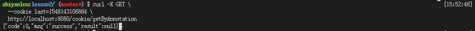

- 上传指定文件

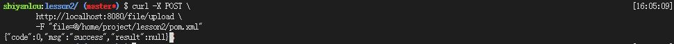

- 创建`account`，`password`没有返回，序列化的时候被忽略，`username`被重命名为`name`，``date`被序列化为指定格式

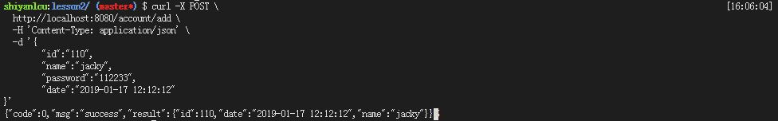

- 在反序列化的时候，`password`被成功获取


- 第一次请求：创建`session`，设置`JSESSIONID`这个`cookie`，并且设置`session`属性
- 第二次请求：携带`JSESSIONID`这个`cokkie`，获取`session`属性


## 三、实验总结

​	本节课先对Spring Boot Web、Curl、Jackson进行了基本介绍，然后通过实战让同学们对这些理论知识一个直观的体验。