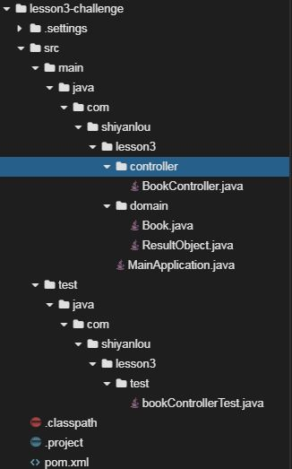

# Spring Boot 测试

## 介绍

题目需求如下：

需求1. 针对lesson2的挑战项目编写测试代码，实现对`Book`类的增删改查、分页查询五大功能的测试

## 目标

1. 通过maven创建项目，根据提示创建目录结构
2. 正确配置`pom.xml`
3. 仿照`UserControllerTest.java`编写测试代码，实现对`Book`类的增删改查、分页查询五大功能的测试
4. 通过maven运行测试代码，效果如下所示
   

## 提示语

1. 创建好的项目目录结构如下图所示
   

## 知识点

- Spring Boot 测试
  - 包括`@RunWith`、`@SpringBootTest`、`@AutoConfigureMockMvc `、`@Test`等常见注解的使用
  - 正确构造`RequestBuilder`请求体
  - 设置合理高效的`andExpect`断言
  - 获取响应消息体，查看响应结果

