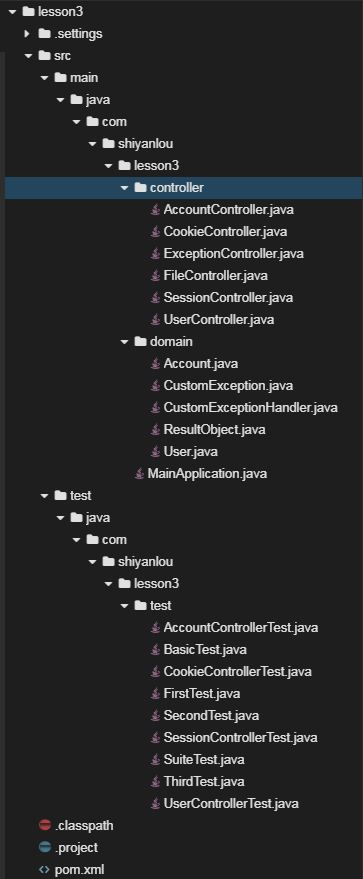

# Spring Boot 测试

##  一、实验简介

### 1.1 实验内容
​	测试是软件开发过程中一个不可或缺的部分，通过编写测试用例，可以提高测试效率实现自动化测试，发现手工测试中遗漏的bug，及时完善代码中的缺陷。本实验首先介绍Junit测试、套件测试、Spring Boot测试的基础知识，然后通过为lesson2中的业务代码编写相应的测试用例来熟悉相关知识点。

### 1.2 实验知识点

- Junit 单元测试
- Junit 套件测试
- Spring Boot Web 测试


### 1.3 实验环境

- Eclipse Neon.2 Release (4.6.2)
- Java 1.8
- Maven 3.5
- Spring Boot 2.0.6


## 二、实验步骤

### 2.1 Spring Boot 测试介绍

​       Junit是一款自动化测试框架，开发人员通过编写测试用例，提高代码质量的同时，并没有显著降低开发效率。下面介绍Junit测试框架基础知识，并且说明SpringBoot Web项目中如何使用Junit。

1. `pom.xml`文件中添加依赖

   - 普通应用直接添加`junit`
     ```xml
     <dependency>
       <groupId>junit</groupId>
       <artifactId>junit</artifactId>
       <scope>test</scope>
       <version>4.12</version>
     </dependency>
     ```

   - Spring Boot 添加`spring-boot-starter-test`
      ```xml
      <dependency>
        <groupId>org.springframework.boot</groupId>
        <artifactId>spring-boot-starter-test</artifactId>
      </dependency>
      ```

2. `/src/test/java`中创建相应的测试文件

3. Junit单元测试

   单元测试是针对项目中单一目标（一个类或几个方法）的测试。单元测试可以有效保证代码质量和产量。

   - Junit中的常用注解

     - `@BeforeClass`：初始化测试类，当前测试类中所有测试方法执行之前执行该方法，只执行一次，且必须为static void

     - `@Before`：初始化测试方法，当前测试类中每个测试方法执行前都要执行该方法

     - `@Test`：测试方法，主要参数如下：

       - `timeout`设置超时时间，单位毫秒，例如：`@Test(timeout=2000)`
       - `expected`设置期望异常，例如：`@Test(expected=NullPointerException.class)`

     - `@After`：释放资源，当前测试类中每个测试方法执行之后都要执行该方法

     - `@AfterClass`：释放资源，当前测试类中所有测试方法执行之后执行该方法，只执行一次，且必须为static void

     - `@Ignore`：忽略被注解的测试方法

   - 一个有两个测试方法的测试类其中方法的执行顺序为：

     `@BeforeClass –> @Before –> @Test –> @After –> @Before –> @Test –> @After –> @AfterClass`

4. Junit套件测试

   ​	在实际项目中，随着产品需求的不断增加，业务代码会飞速增长，单元测试类也会随之增加，如果我们继续一个个的单独运行测试类，可想而知我们的工作量会非常之大。为了解决这个问题，Junit提供了一种批量运行测试类的方法，即套件测试。测试套件的写法非常简单，创建一个空类作为测试套件的入口，使用如下两个注解配置即可。

   - `@RunWith`： 设置测试运行器 ，缺省值`org.junit.runner.Runner`，套件测试需要设置为`Suite.class`
   - `@SuiteClasses`： 设置多个测试类

5. Spring Boot 测试

   ​	在 Spring Boot 中，我们可以通过添加`spring-boot-starter-test`依赖快速开启和使用它。创建一个普通类，使用如下三个注解配置即可。

   - `@RunWith`： 设置测试运行器 ，缺省值`org.junit.runner.Runner`，Spring Boot测试需要设置为`SpringRunner.class`
   - `@SpringBootTest`： 获取Spring Boot Web应用启动类，加载配置
   - `@AutoConfigureMockMvc `： 自动注入`MockMvc`


### 2.2 项目实战

#### 2.2.1 项目结构



#### 2.2.2 创建项目

首先，下载lesson2代码，在web IDE界面中，选择File -> Open New Terminal，在终端中输入

```shell
$ wget 
```

然后，在web IDE界面中，选择File -> Open Workspace切换工作空间，选择lesson3目录，必须切换到该目录下，否则识别不了项目。

最后，大家可以根据上图所示的目录结构，自己创建目录、文件，较为简单，无需赘述。


#### 2.2.3 修改pom文件

`将如下配置文件覆盖到pom.xml中`

下面介绍一下常见的`dependencies`

- `spring-boot-starter-web` Spring Boot为Web开发提供支持
- `spring-boot-starter-test` Spring Boot为测试提供支持

```xml
<project xmlns="http://maven.apache.org/POM/4.0.0" xmlns:xsi="http://www.w3.org/2001/XMLSchema-instance" xsi:schemaLocation="http://maven.apache.org/POM/4.0.0 http://maven.apache.org/xsd/maven-4.0.0.xsd">
  <modelVersion>4.0.0</modelVersion>
  <groupId>com.shiyanlou</groupId>
  <artifactId>lesson3</artifactId>
  <version>0.0.1-SNAPSHOT</version>
  	<parent>
		<groupId>org.springframework.boot</groupId>
		<artifactId>spring-boot-starter-parent</artifactId>
		<version>2.0.1.RELEASE</version>
		<relativePath /> <!-- lookup parent from repository -->
	</parent>

	<properties>
		<project.build.sourceEncoding>UTF-8</project.build.sourceEncoding>
		<project.reporting.outputEncoding>UTF-8</project.reporting.outputEncoding>
		<java.version>1.8</java.version>
	</properties>

	<dependencies>
		<dependency>
			<groupId>org.springframework.boot</groupId>
			<artifactId>spring-boot-starter-web</artifactId>
		</dependency>
		
		<dependency>
			<groupId>org.springframework.boot</groupId>
			<artifactId>spring-boot-starter-test</artifactId>
		</dependency>
	</dependencies>

	<build>
		<plugins>
			<plugin>
				<groupId>org.springframework.boot</groupId>
				<artifactId>spring-boot-maven-plugin</artifactId>
			</plugin>
		</plugins>
	</build>
</project>
```


#### 2.2.4 Junit单元测试

`BasicTest.java` 熟悉Junit基本注解、执行顺序

```java
package com.shiyanlou.lesson3.test;

import java.util.concurrent.TimeUnit;

import org.junit.After;
import org.junit.AfterClass;
import org.junit.Before;
import org.junit.BeforeClass;
import org.junit.Ignore;
import org.junit.Test;

public class BasicTest {
	// 第0个测试方法
	@Test
	public void test0() throws Exception {
		System.out.println("testing0...");
	}
	
  	// 第1个测试方法
	@Test
	public void test1() {
		System.out.println("testing1...");
	}
	
  	// 超时测试，如果超过2000毫秒没有执行完，认为执行失败
	@Test(timeout=2000)
	public void testTimeout() throws InterruptedException {
      	// 休眠1秒，测试结果为成功，如果将其修改为3秒，则测试结果为失败
		TimeUnit.SECONDS.sleep(1);
		System.out.println("testTimeout...");
	}
	
    // 异常测试，指定期望出现的异常
	@Test(expected=NullPointerException.class)
	public void testException() {
		System.out.println("testException...");
		throw new NullPointerException();
	}
  
	// 忽略被注解的测试方法
	@Ignore
	public void ignore() {
		System.out.println("ignore...");
	}
	
  	// 在执行每一个测试方法之前都要执行该方法
	@Before
	public void setUp() {
		System.out.println("before...");
	}
	
  	// 在执行每一个测试方法之后都要执行该方法
	@After
	public void tearDown() {
		System.out.println("after...");
	}
	
    // 在执行所有测试方法之前执行该方法
	@BeforeClass
	public static void beforeClass() {
		System.out.println("@BeforeClass...");
	}
	
  	// 在执行所有测试方法之后执行该方法
	@AfterClass
	public static void afterClass() {
		System.out.println("@AfterClass...");
	}
}
```


#### 2.2.5 Junit套件测试

`FirstTest.java` 第一个测试类

```java
package com.shiyanlou.lesson3.test;

import org.junit.Test;

public class FirstTest {
	@Test
	public void test() {
		System.out.println("first test");
	}
}
```


`SecondTest.java` 第二个测试类

```java
package com.shiyanlou.lesson3.test;

import org.junit.Test;

public class SecondTest {
	@Test
	public void test() {
		System.out.println("second test");
	}
}
```


`ThirdTest.java` 第三个测试类

```java
package com.shiyanlou.lesson3.test;

import org.junit.Test;

public class ThirdTest {
	@Test
	public void test() {
		System.out.println("third test");
	}
}
```


`SuiteTest.java` 套件测试中的空类

```java
package com.shiyanlou.lesson3.test;

import org.junit.runner.RunWith;
import org.junit.runners.Suite;
import org.junit.runners.Suite.SuiteClasses;

// 设置测试运行器，并且指定多个测试类
@RunWith(Suite.class)
@SuiteClasses({FirstTest.class, SecondTest.class, ThirdTest.class})
public class SuiteTest {

}
```


#### 2.2.5 Spring Boot测试
`AccountControllerTest.java` 针对lesson2中的`AccountController.java`的方法进行测试

```java
package com.shiyanlou.lesson3.test;

import org.junit.Test;
import org.junit.runner.RunWith;
import org.springframework.beans.factory.annotation.Autowired;
import org.springframework.boot.test.autoconfigure.web.servlet.AutoConfigureMockMvc;
import org.springframework.boot.test.context.SpringBootTest;
import org.springframework.http.MediaType;
import org.springframework.test.context.junit4.SpringRunner;
import org.springframework.test.web.servlet.MockMvc;
import org.springframework.test.web.servlet.MvcResult;
import org.springframework.test.web.servlet.RequestBuilder;
import org.springframework.test.web.servlet.request.MockMvcRequestBuilders;
import org.springframework.test.web.servlet.result.MockMvcResultMatchers;

import com.shiyanlou.lesson3.MainApplication;

// 设置测试运行器，并且指定Springboot web启动类
@RunWith(SpringRunner.class)
@SpringBootTest(classes={MainApplication.class})
@AutoConfigureMockMvc 
public class AccountControllerTest {

  	// 注入mockMVC
	@Autowired
	private MockMvc mockMvc;
	
  	// 测试方法
	@Test
	public void testAdd() throws Exception {
      	// json字符串
		String params = "{\"id\":1,\"name\":\"jacky\",\"password\":123,\"date\":\"2018-01-01 11:11:11\"}";
		
      	// 构建请求 指定post方法、URL：/account/add、content-type：json、传入json字符串
		RequestBuilder  builder = MockMvcRequestBuilders.post("/account/add")
		.contentType(MediaType.APPLICATION_JSON_UTF8).content(params.getBytes());
		
      	// 执行请求，设置返回期望值，若返回值与期望值不同，测试不通过
        // 断言 code 为0
      	// 断言 msg 为success
      	// 断言 result对象中id为1
        // 断言 result对象中name为jacky
        // 断言 result对象中date为2018-01-01 11:11:11
        // 断言 result对象中password不存在
		MvcResult mvcResult = mockMvc.perform(builder)
				.andExpect(MockMvcResultMatchers.status().isOk())
				.andExpect(MockMvcResultMatchers.jsonPath("code").value("0"))
				.andExpect(MockMvcResultMatchers.jsonPath("msg").value("success"))
				.andExpect(MockMvcResultMatchers.jsonPath("result.id").value("1"))
				.andExpect(MockMvcResultMatchers.jsonPath("result.name").value("jacky"))
				.andExpect(MockMvcResultMatchers.jsonPath("result.date").value("2018-01-01 11:11:11"))
				.andExpect(MockMvcResultMatchers.jsonPath("result.password").doesNotExist())
				.andReturn();
	
      	// 测试整个过程：
        // 1、MockMvcRequestBuilders.post("/account/add")构造请求
        // 2、mockMvc.perform执行请求
        // 3、andExpect添加执行完成后需要执行的断言，验证控制器执行完成后结果是否正确
        // 4、andDo添加结果处理器，比如调试时打印结果到控制台
        // 5、andReturn表示执行完成后返回相应的结果
      
      	// 获取响应消息体	
		String response = mvcResult.getResponse().getContentAsString();
		System.out.println(response);
      	// 获取状态码
		int status = mvcResult.getResponse().getStatus();
		System.out.println(status);
	}
}
```


`CookieControllerTest.java` 针对lesson2中的`CookieController.java`的方法进行测试

```java
package com.shiyanlou.lesson3.test;

import javax.servlet.http.Cookie;

import org.junit.FixMethodOrder;
import org.junit.Test;
import org.junit.runner.RunWith;
import org.springframework.beans.factory.annotation.Autowired;
import org.springframework.boot.test.autoconfigure.web.servlet.AutoConfigureMockMvc;
import org.springframework.boot.test.context.SpringBootTest;
import org.springframework.test.context.junit4.SpringRunner;
import org.springframework.test.web.servlet.MockMvc;
import org.springframework.test.web.servlet.MvcResult;
import org.springframework.test.web.servlet.RequestBuilder;
import org.springframework.test.web.servlet.request.MockMvcRequestBuilders;
import org.springframework.test.web.servlet.result.MockMvcResultMatchers;

import org.junit.runners.MethodSorters;
import com.shiyanlou.lesson3.MainApplication;

// 设置测试运行器，并且指定Springboot web启动类，此外指定测试方法执行顺序为：方法名正序
@RunWith(SpringRunner.class)
@SpringBootTest(classes={MainApplication.class})
@AutoConfigureMockMvc
@FixMethodOrder(MethodSorters.NAME_ASCENDING)
public class CookieControllerTest {

    // 注入mockMVC
	@Autowired
	private MockMvc mockMvc;
	
  	// 存储获取的cookie
	private static Cookie cookie;
	
  	// 测试方法
	@Test
	public void test1SetCookie() throws Exception {
		
      	// 构造请求，指定get方法，URL为：/cookie/set
		RequestBuilder  builder = MockMvcRequestBuilders.get("/cookie/set");
		
      	// 执行已经构造好的请求，并且测试返回状态码是否为Ok(即200),last这个cookie是否存在		 
      	// last最大生命期是否为7天
		MvcResult mvcResult = mockMvc.perform(builder)
				.andExpect(MockMvcResultMatchers.status().isOk())
				.andExpect(MockMvcResultMatchers.cookie().exists("last"))
				.andExpect(MockMvcResultMatchers.cookie().maxAge("last", 60 * 60 * 24 * 7))
				.andReturn();
		
      	// 获取last这个cookie
		cookie = mvcResult.getResponse().getCookie("last");
      	// 打印last这个cookie的值
		System.out.println(cookie.getValue());
	}
	
    // 测试方法
	@Test
	public void testGetCookie() throws Exception {
      	// 构造请求，指定get方法，URL为：/cookie/get，并且携带后端返回的cookie
		RequestBuilder  builder = MockMvcRequestBuilders.get("/cookie/get")
				.cookie(cookie);
		
        // 执行请求，并且获取响应
		MvcResult mvcResult = mockMvc.perform(builder)
				.andExpect(MockMvcResultMatchers.status().isOk())
				.andReturn();
		
        // 获取响应消息体
		String response = mvcResult.getResponse().getContentAsString();
		System.out.println(response);
	}
	
    // 测试方法
	@Test
	public void testGetCookieByAnnotation() throws Exception {
         // 构造请求，指定get方法，URL为：/cookie/getByAnnotation，并且携带后端返回的cookie
		RequestBuilder  builder = MockMvcRequestBuilders.get("/cookie/getByAnnotation")
				.cookie(cookie);
		
         // 执行请求，并且获取响应
		MvcResult mvcResult = mockMvc.perform(builder)
				.andExpect(MockMvcResultMatchers.status().isOk())
				.andReturn();
		
        // 获取响应消息体
		String response = mvcResult.getResponse().getContentAsString();
		System.out.println(response);
	}
}
```


`SessionControllerTest.java` 针对lesson2中的`SessionController.java`的方法进行测试

```java
package com.shiyanlou.lesson3.test;

import javax.servlet.http.Cookie;

import org.junit.FixMethodOrder;
import org.junit.Ignore;
import org.junit.Test;
import org.junit.runner.RunWith;
import org.springframework.beans.factory.annotation.Autowired;
import org.springframework.boot.test.autoconfigure.web.servlet.AutoConfigureMockMvc;
import org.springframework.boot.test.context.SpringBootTest;
import org.springframework.test.context.junit4.SpringRunner;
import org.springframework.test.web.servlet.MockMvc;
import org.springframework.test.web.servlet.MvcResult;
import org.springframework.test.web.servlet.RequestBuilder;
import org.springframework.test.web.servlet.request.MockMvcRequestBuilders;
import org.springframework.test.web.servlet.result.MockMvcResultMatchers;

import org.junit.runners.MethodSorters;
import com.shiyanlou.lesson3.MainApplication;

// 设置测试运行器，并且指定Springboot web启动类，此外指定测试方法执行顺序为：方法名正序
@RunWith(SpringRunner.class)
@SpringBootTest(classes={MainApplication.class})
@AutoConfigureMockMvc
@FixMethodOrder(MethodSorters.NAME_ASCENDING)
public class SessionControllerTest {

    // 自动注入mockMVC
	@Autowired
	private MockMvc mockMvc;
	
    // 用于保存从后端获取的cookie
	private static Cookie cookie;
	
  	// 测试方法
	@Test
	public void test1SetSession() throws Exception {
      
        // 构造请求对象，指定get方法，URL为：/session/set
		RequestBuilder  builder = MockMvcRequestBuilders.get("/session/set");
		
      	// 执行请求，判断是否请求成功，即返回码为200，并且获取响应
		MvcResult mvcResult = mockMvc.perform(builder)
				.andExpect(MockMvcResultMatchers.status().isOk())
				.andReturn();
		
//		cookie = mvcResult.getResponse().getCookie("JSESSIONID");
//		System.out.println(cookie.getValue());
		
      	// 获取响应中的所有cookie
		Cookie[] cookies = mvcResult.getResponse().getCookies();

      	// 遍历每一个cookie
		for (Cookie cookie: cookies) {
			System.out.println(cookie.getName());
		}
		
        // 获取响应消息体
		String response = mvcResult.getResponse().getContentAsString();
		System.out.println(response);
		
//		mockMvc.perform(builder)
//		.andExpect(MockMvcResultMatchers.status().isOk())
//		.andDo(MockMvcResultHandlers.print());
	}
	
  	// 忽略测试方法
	@Ignore
	public void test2GetSession() throws Exception {
        
      	// 构造请求对象，指定get方法，URL为：/session/get，并且携带后端返回的cookie
		RequestBuilder  builder = MockMvcRequestBuilders.get("/session/get")
				.cookie(cookie);
		
        // 执行请求，判断请求是否成功，获取响应
		MvcResult mvcResult = mockMvc.perform(builder)
				.andExpect(MockMvcResultMatchers.status().isOk())
				.andReturn();
		
        // 获取响应消息体
		String response = mvcResult.getResponse().getContentAsString();
		System.out.println(response);
	}
}
```


`UserControllerTest.java` 针对lesson2中的`UserController.java`的方法进行测试

```java
package com.shiyanlou.lesson3.test;

import org.junit.Test;
import org.junit.runner.RunWith;
import org.springframework.beans.factory.annotation.Autowired;
import org.springframework.boot.test.autoconfigure.web.servlet.AutoConfigureMockMvc;
import org.springframework.boot.test.context.SpringBootTest;
import org.springframework.http.MediaType;
import org.springframework.test.context.junit4.SpringRunner;
import org.springframework.test.web.servlet.MockMvc;
import org.springframework.test.web.servlet.MvcResult;
import org.springframework.test.web.servlet.RequestBuilder;
import org.springframework.test.web.servlet.request.MockMvcRequestBuilders;
import org.springframework.test.web.servlet.result.MockMvcResultHandlers;
import org.springframework.test.web.servlet.result.MockMvcResultMatchers;

import com.shiyanlou.lesson3.MainApplication;

// 设置测试运行器，并且指定Springboot web启动类
@RunWith(SpringRunner.class)
@SpringBootTest(classes={MainApplication.class})
@AutoConfigureMockMvc 
public class UserControllerTest {

    // 自动注入mockMVC
	@Autowired
	private MockMvc mockMvc;
	
  	// 测试方法
	@Test
	public void testAdd() throws Exception {
		
      	// 构造json字符串
		String params = "{\"id\":1,\"name\":\"jacky\",\"gender\":1,\"age\":24}";
		
      	// 构造请求对象，请求方法post，URL：/user/add，content-type：application/json
		RequestBuilder  builder = MockMvcRequestBuilders.post("/user/add")
		.contentType(MediaType.APPLICATION_JSON_UTF8).content(params.getBytes());
		
      	// 执行请求，判断请求是否成功
		MvcResult mvcResult = mockMvc.perform(builder)
				.andExpect(MockMvcResultMatchers.status().isOk())
				.andExpect(MockMvcResultMatchers.jsonPath("code").value("0"))
				.andExpect(MockMvcResultMatchers.jsonPath("msg").value("success"))
				.andExpect(MockMvcResultMatchers.jsonPath("result.1.id").value("1"))
				.andExpect(MockMvcResultMatchers.jsonPath("result.1.name").value("jacky"))
				.andExpect(MockMvcResultMatchers.jsonPath("result.1.age").value("24"))
				.andExpect(MockMvcResultMatchers.jsonPath("result.1.gender").value("1"))
				.andReturn();

      	// 执行请求，并判断请求是否成功，打印完整响应
		mockMvc.perform(builder)
				.andExpect(MockMvcResultMatchers.status().isOk())
				.andDo(MockMvcResultHandlers.print());
		
        // 获取响应消息体
		String response = mvcResult.getResponse().getContentAsString();
		System.out.println(response);
        // 获取响应状态码
		int status = mvcResult.getResponse().getStatus();
		System.out.println(status);
	}
	
   	// 测试方法
	@Test
	public void testFindByRequestParam() throws Exception {
		
      	// 构造请求，设置请求方法类型为get，url:/user/findByRequestParam，content-type：application/json
        // 参数 id = 1
		RequestBuilder  builder = MockMvcRequestBuilders.get("/user/findByRequestParam")
          .param("id", "1");
		
      	// 执行请求，判断请求状态是否成功，获取响应
		MvcResult mvcResult = mockMvc.perform(builder)
				.andExpect(MockMvcResultMatchers.status().isOk())
				.andReturn();
		
        // 获取响应消息体
		String response = mvcResult.getResponse().getContentAsString();
		System.out.println(response);
        // 获取响应状态码
		int status = mvcResult.getResponse().getStatus();
		System.out.println(status);
	}
	
    // 测试方法
	@Test
	public void testModify() throws Exception {
		
      	// 构造json字符串
		String params = "{\"id\":1,\"name\":\"mary\",\"gender\":0,\"age\":23}";
		
      	// 构造请求，指定请求方法为put，content-type：application/json，携带json字符串为参数
		RequestBuilder  builder = MockMvcRequestBuilders.put("/user/modify")
		.contentType(MediaType.APPLICATION_JSON_UTF8).content(params.getBytes());
		
      	// 执行请求
		MvcResult mvcResult = mockMvc.perform(builder)
				.andExpect(MockMvcResultMatchers.status().isOk())
				.andExpect(MockMvcResultMatchers.jsonPath("code").value("0"))
				.andReturn();

//		mockMvc.perform(builder)
//				.andExpect(MockMvcResultMatchers.status().isOk())
//				.andDo(MockMvcResultHandlers.print());
		
        // 获取响应
		String response = mvcResult.getResponse().getContentAsString();
		System.out.println(response);
      
        // 获取响应状态码
		int status = mvcResult.getResponse().getStatus();
		System.out.println(status);
	}
	
    // 测试方法
	@Test
	public void testFindByPathVariable() throws Exception {
		
         // 构造请求，指定请求方法为get，URL：/user/findByPathVariable/1
		RequestBuilder  builder = MockMvcRequestBuilders.get("/user/findByPathVariable/1");
		
      	// 执行请求，判断请求状态，获取响应
		MvcResult mvcResult = mockMvc.perform(builder)
				.andExpect(MockMvcResultMatchers.status().isOk())
				.andReturn();
		
        // 获取响应消息体
		String response = mvcResult.getResponse().getContentAsString();
		System.out.println(response);
      
        // 获取响应状态码
		int status = mvcResult.getResponse().getStatus();
		System.out.println(status);
	}

    // 测试方法
	@Test
	public void testDelete() throws Exception {
		
        // 构造请求，指定请求方法为get，URL：/user/findByPathVariable/1
		RequestBuilder  builder = MockMvcRequestBuilders.delete("/user/delete/1");
		
      	// 执行请求，判断请求状态，获取响应
		MvcResult mvcResult = mockMvc.perform(builder)
				.andExpect(MockMvcResultMatchers.status().isOk())
				.andReturn();
		
        // 获取响应消息体
		String response = mvcResult.getResponse().getContentAsString();
		System.out.println(response);
      
        // 获取响应状态码
		int status = mvcResult.getResponse().getStatus();
		System.out.println(status);
	}
	
    // 测试方法
	@Test
	public void testGetHeader() throws Exception {
		
        // 构造请求，指定请求方法为get，URL：/user/findByPathVariable/1，设置header
		RequestBuilder  builder = MockMvcRequestBuilders.get("/user/getHeader")
			.header("token", "abcdefg");
		
        // 执行请求，判断请求状态，获取响应
		MvcResult mvcResult = mockMvc.perform(builder)
				.andExpect(MockMvcResultMatchers.status().isOk())
				.andReturn();
		
        // 获取响应消息体
		String response = mvcResult.getResponse().getContentAsString();
		System.out.println(response);
      
        // 获取响应状态码
		int status = mvcResult.getResponse().getStatus();
		System.out.println(status);
	}
	
    // 测试方法
	@Test
	public void testGetRequest() throws Exception {
		
        // 构造请求，指定请求方法为get，URL：/user/findByPathVariable/1，参数为id=123456
		RequestBuilder  builder = MockMvcRequestBuilders.get("/user/getRequest")
			.param("id", "123456");
		
        // 执行请求，判断请求状态，获取响应
		MvcResult mvcResult = mockMvc.perform(builder)
				.andExpect(MockMvcResultMatchers.status().isOk())
				.andReturn();
		
      	// 获取响应消息体
		String response = mvcResult.getResponse().getContentAsString();
		System.out.println(response);
        
      	// 获取响应状态码
		int status = mvcResult.getResponse().getStatus();
		System.out.println(status);
	}
}
```


#### 2.2.6 运行测试用例

在终端中输入如下命令，使用maven运行测试代码，最终可以看到测试全部通过

```shell
$ mvn test
```


## 三、实验总结

​	本节课先对Junit单元测试、套件测试、Spring Boot Web进行了基本介绍，然后通过对lesson2的业务代码编写测试用例让同学们对这些理论知识一个直观的体验。