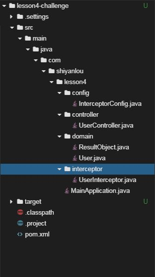

# 基于拦截器的登录功能

## 介绍

题目需求如下：

需求1. 使用maven创建java Web项目，模仿本实验中`LoginFilter.java`基于过滤器的登录功能，实现基于拦截器的登录功能

## 目标

1. 通过maven创建项目，根据提示创建目录结构
2. 创建Spring Boot启动类
3. 正确配置`pom.xml`
4. 编写配置文件，拦截除了登录接口外的所有接口，只有登录状态下的用户才能访问那些接口
5. 编写controller，实现登录接口、测试接口（方法中不需要业务代码，只要返回成功信息即可）
6. 实现拦截器，检测到用户已经登录，返回True，继续处理业务逻辑；若用户没有登录，则返回False，中断处理
7. 启动Spring Boot项目代码没有bug，可以正常启动，控制台打印出启动日志。
8. 通过curl访问，正确的URL及返回结果如下所示，使用正确账号、密码登录成功
   
9. 通过curl访问，正确的URL及返回结果如下所示，使用错误账号、密码登录失败
   
10. 通过curl访问，正确的URL及返回结果如下所示，携带`cookie`，即处于登录状态下，访问测试接口成功
   

## 提示语

1. 创建好的项目目录结构如下图所示
   

## 知识点

- `session`的使用
- 判断用户是否登录的逻辑
- 拦截器配置、编写

