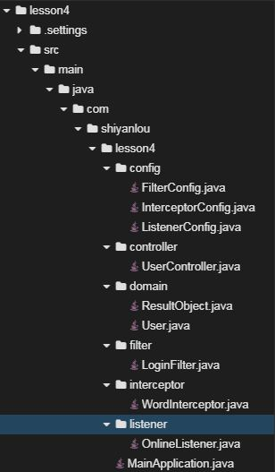
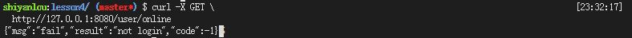
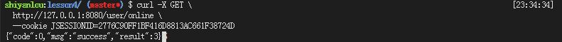
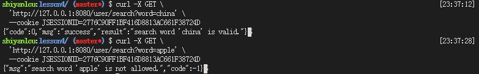

# 过滤器、监听器、拦截器

##  一、实验简介

### 1.1 实验内容
​	在实际工作中，经常会遇到注册登录、统计在线人数、过滤敏感词汇等功能，这些功能与业务系统本身无关，但是也十分重要。这些功能主要由本实验讲解的过滤器、监听器、拦截器来实现。本实验首先介绍过滤器、监听器、拦截器，然后通过上述常见功能来使大家熟悉它们的使用。

### 1.2 实验知识点

- 过滤器
- 监听器
- 拦截器


### 1.3 实验环境

- Eclipse Neon.2 Release (4.6.2)
- Java 1.8
- Maven 3.5
- Spring Boot 2.0.6
- curl


## 二、实验步骤

### 2.1 过滤器介绍

​	`filter`是`servlet`规范中定义的一种特殊类。用于对指定的请求进行过滤，然后将请求交给对应的`servlet`进行处理并生成响应，最后`filter`再对服务器响应进行后处理，可以实现访问权限控制、过滤敏感词汇、压缩响应信息等功能。

### 2.2 监听器介绍

​        `listener`也是`servlet`规范中定义的一种特殊类。用于监听`servletContext`、`HttpSession`和`servletRequest`等域对象的创建和销毁事件。在事件发生前后做一些必要的处理，可以实现在线人数统计等功能。

### 2.3 拦截器介绍

​       `interceptor`在面向切面编程（Aspect-Oriented Programming，AOP）中用于在某个方法或字段被访问之前进行拦截，然后在处理前后加入某些功能，例如：日志，安全等功能。一般拦截器方法都是通过动态代理的方式实现，可以通过它来进行权限验证、判断用户是否登陆、日志记录。


### 2.4 项目实战

#### 2.4.1 项目结构



#### 2.4.2 创建项目

在web IDE界面中，选择File -> Open New Terminal，在终端中输入

```shell
$ mvn archetype:generate -DgroupId=com.shiyanlou -DartifactId=lesson4 -DarchetypeArtifactId=maven-archetype-webapp
```

参数介绍：

- `archetype:generate`：表示使用maven创建项目基本骨架
- `DgroupId`：该项目所属组织，一般将域名倒着写，例如：com.shiyanlou
- `DartifactId`：项目名称，例如：lesson2
- `DarchetypeArtifactId`：指定所用maven项目骨架类型

输入命令后，maven开始创建项目、下载所需的依赖，等待片刻，maven提示我们输入版本号，直接回车，我们使用默认版本号`1.0-SNAPSHOT`即可。随后maven会输出`groupId`、`artifactId`、`version`、`package`这些基本信息，直接输入`Y`确认即可。最后可以看到绿色的`BUILD SUCCESS`项目创建成功的提示。

然后在web IDE界面中，选择File -> Open Workspace切换工作空间，选择lesson4目录，必须切换到该目录下，否则识别不了项目。

最后大家可以根据上图所示的目录结构，自己创建目录、文件，较为简单，无需赘述。


#### 2.4.3 修改pom文件

`将如下配置文件覆盖到pom.xml中`

下面介绍一下常见的`dependencies`

- `spring-boot-starter-web`：Spring Boot为Web开发提供支持
- `json`： 提供对`json`数据解析等支持

```xml
<project xmlns="http://maven.apache.org/POM/4.0.0" xmlns:xsi="http://www.w3.org/2001/XMLSchema-instance"
	xsi:schemaLocation="http://maven.apache.org/POM/4.0.0 http://maven.apache.org/xsd/maven-4.0.0.xsd">
	<modelVersion>4.0.0</modelVersion>
	<groupId>com.shiyanlou</groupId>
	<artifactId>lesson4</artifactId>
	<version>0.0.1-SNAPSHOT</version>

	<parent>
		<groupId>org.springframework.boot</groupId>
		<artifactId>spring-boot-starter-parent</artifactId>
		<version>2.0.1.RELEASE</version>
		<relativePath /> <!-- lookup parent from repository -->
	</parent>

	<properties>
		<project.build.sourceEncoding>UTF-8</project.build.sourceEncoding>
		<project.reporting.outputEncoding>UTF-8</project.reporting.outputEncoding>
		<java.version>1.8</java.version>
	</properties>

	<dependencies>
		<dependency>
			<groupId>org.springframework.boot</groupId>
			<artifactId>spring-boot-starter-web</artifactId>
		</dependency>
		
		<dependency>
		    <groupId>org.json</groupId>
		    <artifactId>json</artifactId>
		    <version>20180813</version>
		</dependency>
	</dependencies>

	<build>
		<plugins>
			<plugin>
				<groupId>org.springframework.boot</groupId>
				<artifactId>spring-boot-maven-plugin</artifactId>
			</plugin>
		</plugins>
	</build>
</project>
```


#### 2.4.4 创建domain目录及文件

`ResultObject.java` 用来封装后台返回结果、状态码、失败消息等信息

```java
package com.shiyanlou.lesson4.domain;

public class ResultObject {

  	// 后台返回码
	private int code;
  	// 后台返回消息
	private String msg;
  	// 结果
	private Object result;
  	
  	// 构造函数
	public ResultObject() {
		super();
		// TODO Auto-generated constructor stub
	}
  
  	// 构造函数
	public ResultObject(int code, String msg, Object result) {
		super();
		this.code = code;
		this.msg = msg;
		this.result = result;
	}
	
  	// 后台处理成功时使用的构造函数
	public ResultObject(Object result) {
		super();
		this.code = 0;
		this.msg = "success";
		this.result = result;
	}
	
  	// 属性的setter、getter方法
	public int getCode() {
		return code;
	}
	public void setCode(int code) {
		this.code = code;
	}
	public String getMsg() {
		return msg;
	}
	public void setMsg(String msg) {
		this.msg = msg;
	}
	public Object getResult() {
		return result;
	}
	public void setResult(Object result) {
		this.result = result;
	}
	@Override
	public String toString() {
		return "ResultObject [code=" + code + ", msg=" + msg + ", result=" + result + "]";
	}
}
```


`User.java` 用户类，封装用户姓名、密码属性

```java
package com.shiyanlou.lesson4.domain;

public class User{

  	// 用户名称
	private String username;
  	// 用户密码
	private String password;
  
  	// 构造函数
	public User() {
		super();
		// TODO Auto-generated constructor stub
	}
  	
  	// 构造函数
	public User(String username, String password) {
		super();
		this.username = username;
		this.password = password;
	}
  
  	// 属性的setter、getter方法
	public String getUsername() {
		return username;
	}
	public void setUsername(String username) {
		this.username = username;
	}
	public String getPassword() {
		return password;
	}
	public void setPassword(String password) {
		this.password = password;
	}
  
  	// 重写toString方法
	@Override
	public String toString() {
		return "Book [username=" + username + ", password=" + password + "]";
	}
	
  	// 重写hashCode方法
	@Override
	public int hashCode() {
		final int prime = 31;
		int result = 1;
		result = prime * result + ((password == null) ? 0 : password.hashCode());
		result = prime * result + ((username == null) ? 0 : username.hashCode());
		return result;
	}
	
   	// 重写equals方法，便于直接比较user对象
	@Override
	public boolean equals(Object obj) {
		if (this == obj)
			return true;
		if (obj == null)
			return false;
		if (getClass() != obj.getClass())
			return false;
		User other = (User) obj;
		if (password == null) {
			if (other.password != null)
				return false;
		} else if (!password.equals(other.password))
			return false;
		if (username == null) {
			if (other.username != null)
				return false;
		} else if (!username.equals(other.username))
			return false;
		return true;
	}
}
```


#### 2.4.5 创建controller目录及文件

`UserController.java` 用户控制器，为在线用户数、登录、搜索等功能提供访问接口

```java
package com.shiyanlou.lesson4.controller;

import javax.servlet.http.HttpServletRequest;
import javax.servlet.http.HttpServletResponse;
import javax.servlet.http.HttpSession;

import org.springframework.web.bind.annotation.GetMapping;
import org.springframework.web.bind.annotation.PostMapping;
import org.springframework.web.bind.annotation.RequestBody;
import org.springframework.web.bind.annotation.RequestMapping;
import org.springframework.web.bind.annotation.RequestParam;
import org.springframework.web.bind.annotation.RestController;

import com.shiyanlou.lesson4.domain.ResultObject;
import com.shiyanlou.lesson4.domain.User;

@RestController
@RequestMapping("user")
public class UserController {

  	// 统计在线用户数，请求方法类型get，URL：/user/online
	@GetMapping("online")
	public ResultObject setSession(HttpServletRequest request, HttpServletResponse response) {
      	// 获取session
		HttpSession session = request.getSession();
      	// 获取sessionid，即JSESSIONID
		String sessionId = session.getId();
		System.out.println(sessionId);
		
      	// 获取session属性
		Object onlineNumber = session.getServletContext().getAttribute("onlineNumber");
		System.out.println(onlineNumber);
		// 返回结果
		return new ResultObject(onlineNumber);
	}
	
  	// 登录验证用户，请求方法类型post，URL：/user/login
	@PostMapping("login")
	public ResultObject login(@RequestBody User user, HttpServletRequest request, HttpServletResponse response) {
		
      	// 正确账号密码，模拟数据库中的信息
		User realUser = new User("jacky", "112233");
      	// 判断账号、密码是否正确
		if (realUser.equals(user)) {
          	// 获取session，获取不到则新建
			HttpSession session = request.getSession();
          	
          	// 获取sessionid，即JSESSIONID
			String sessionId = session.getId();
			System.out.println(sessionId);
			
          	// 设置session属性user
			session.setAttribute("user", user);
			
			return new ResultObject("login success");
		} else {
			return new ResultObject(-1, "fail", "login fail");
		}
	}
	
  	// 搜索功能，过滤敏感词汇，请求方法类型get，URL：/user/search
	@GetMapping("search")
	public ResultObject search(@RequestParam String word) {
      	// 若关键字是敏感词，在拦截器中已经被拦截不可能走到这里
		return new ResultObject("search word " + "'" + word + "'" + " is valid.");
	}
}
```


#### 2.4.6 创建filter目录及文件

`LoginFilter.java` 登录过滤器，过滤除登录接口外的所有接口，通过检查`session`属性---`user`实现登录功能

```java
package com.shiyanlou.lesson4.filter;

import java.io.IOException;
import java.io.OutputStream;

import javax.servlet.Filter;
import javax.servlet.FilterChain;
import javax.servlet.FilterConfig;
import javax.servlet.ServletException;
import javax.servlet.ServletRequest;
import javax.servlet.ServletResponse;
import javax.servlet.http.HttpServletRequest;
import javax.servlet.http.HttpServletResponse;
import javax.servlet.http.HttpSession;

import org.json.JSONObject;

import com.shiyanlou.lesson4.domain.ResultObject;

public class LoginFilter implements Filter {

  	// 存储不需要过滤的URLs
	private static String exclusions;
  	// 存储不需要过滤的URLs
	private static String[] ALLOWEDURLS;

	@Override
	public void init(FilterConfig filterConfig) throws ServletException {
		// TODO Auto-generated method stub
      	// 获取在filterconfig中配置好的，不需要过滤的URLs
		exclusions = filterConfig.getInitParameter("exclusions");
		if (!exclusions.isEmpty()) {
          	// 获取不需要过滤的URLs，可以直接访问的URLs
			ALLOWEDURLS = exclusions.split(",");
		}
	}

	@Override
	public void doFilter(ServletRequest servletRequest, ServletResponse servletResponse, FilterChain chain)
			throws IOException, ServletException {
		
      	// 强转
		HttpServletRequest request = (HttpServletRequest)servletRequest;
		HttpServletResponse response = (HttpServletResponse)servletResponse;
		
      	// 获取当前请求的URL
		String url = request.getRequestURI();
				
      	// 获取session，false表示如果没有获取到也不会创建
		HttpSession session = request.getSession(false);
      	// 如果当前请求的URL不需要过滤或者已经登录的用户的请求，则继续处理
		if (isAllowed(url) || session != null && session.getAttribute("user") != null) {
			chain.doFilter(request, response);
		} else {
          	// 若用户没有登录，否则直接返回
			render(response, "not login");
		}
	}

	@Override
	public void destroy() {
		// TODO Auto-generated method stub

	}
	
  	// 当前请求是否需要过滤
	public boolean isAllowed(String url) {
		for (String ALLOWEDURL: ALLOWEDURLS) {
			if (ALLOWEDURL.equals(url)) {
				return true;
			}
		}
		return false;
	}
	
  	// 返回请求失败消息
	public void render(HttpServletResponse response, String msg) throws IOException {
      	// 构造返回消息
		ResultObject resultObject = new ResultObject(-1, "fail", msg);
		
      	// 生成json数据
		JSONObject object = new JSONObject(resultObject);

      	// 返回json数据
		response.setContentType("application/json;charset=UTF-8");
        OutputStream out = response.getOutputStream();
        out.write(object.toString().getBytes("UTF-8"));
        out.flush();
        out.close();
	}

}
```


#### 2.4.7 创建listener目录及文件

`OnlineListener.java` 在线人数监听器，通过监听`session`，实现统计在线人数

```java
package com.shiyanlou.lesson4.listener;

import javax.servlet.annotation.WebListener;
import javax.servlet.http.HttpSessionEvent;
import javax.servlet.http.HttpSessionListener;

@WebListener
public class OnlineListener implements HttpSessionListener{

  	// 记录当前登录用户数
	private int onlineNumber = 0;
	
	@Override
	public void sessionCreated(HttpSessionEvent se) {
      	// 监听到创建了新的session，在线用户累加1
		onlineNumber++;
     	// 设置session属性
		se.getSession().getServletContext().setAttribute("onlineNumber", onlineNumber);
	}

	@Override
	public void sessionDestroyed(HttpSessionEvent se) {
      	// 监听到销毁了旧的session，在线用户减少1
		onlineNumber--;
      	// 设置session属性
		se.getSession().getServletContext().setAttribute("onlineNumber", onlineNumber);
	}
}
```


#### 2.4.8 创建interceptor目录及文件

`WordInterceptor.java` 敏感词汇拦截器，通过拦截`/user/search`接口，获取请求参数，实现拦截敏感词汇拦截功能

```java
package com.shiyanlou.lesson4.interceptor;

import java.io.IOException;
import java.io.OutputStream;

import javax.servlet.http.HttpServletRequest;
import javax.servlet.http.HttpServletResponse;

import org.json.JSONObject;
import org.springframework.stereotype.Component;
import org.springframework.web.servlet.HandlerInterceptor;
import org.springframework.web.servlet.ModelAndView;

import com.shiyanlou.lesson4.domain.ResultObject;


@Component
public class WordInterceptor  implements HandlerInterceptor{

  	// 设置敏感词汇
	private static final String[] forbitWords = {"apple", "pear", "peach", "Lemon "};
  
  	// 处理前方法
	@Override
	public boolean preHandle(HttpServletRequest request, HttpServletResponse response, Object handler) throws Exception {
      	 // 获取请求中的参数word
		 String word = request.getParameter("word");
      	 // 与敏感词汇对比
		 for (String forbitWord: forbitWords) {
			 if (word.equals(forbitWord)) {
					render(response, "search word " + "'" + word + "'" + " is not allowed.");
               	 // 返回假，中断请求
				 return false;
			 }
		 }
		 
      	// 返回真，继续处理请求
		 return true;
	}

   	// 处理后方法
	@Override  
    public void postHandle(HttpServletRequest request, HttpServletResponse response, Object handler,  
            ModelAndView modelAndView) throws Exception {
    }  
  
  	// 完成后方法
    @Override  
    public void afterCompletion(HttpServletRequest request, HttpServletResponse response, Object handler, Exception ex)  
            throws Exception {  
    }
    
  	// 返回失败消息
    public void render(HttpServletResponse response, String msg) throws IOException {
		ResultObject resultObject = new ResultObject(-1, msg, null);
		
		JSONObject object = new JSONObject(resultObject);

		response.setContentType("application/json;charset=UTF-8");
        OutputStream out = response.getOutputStream();
        out.write(object.toString().getBytes("UTF-8"));
        out.flush();
        out.close();
	}
}
```


#### 2.4.9 创建config目录及文件

`FilterConfig.java` 过滤器配置文件

```java
package com.shiyanlou.lesson4.config;

import org.springframework.boot.web.servlet.FilterRegistrationBean;
import org.springframework.context.annotation.Bean;
import org.springframework.context.annotation.Configuration;

import com.shiyanlou.lesson4.filter.LoginFilter;

// 标识本类为配置类
@Configuration
public class FilterConfig {

	@Bean
    public FilterRegistrationBean<LoginFilter> registFilter() {
      	// 创建注册器
        FilterRegistrationBean<LoginFilter> registration = new FilterRegistrationBean<LoginFilter>();
        // 设置过滤器
        registration.setFilter(new LoginFilter());
        // 设置属性exclusions，不需要过滤的URL
        registration.addInitParameter("exclusions", "/user/login");
        // 添加过滤规则
        registration.addUrlPatterns("/*");
      	// 过滤器设置名称
        registration.setName("LoginFilter");
      	// 设置过滤器顺序，值越小优先级越高
        registration.setOrder(1);
        
        return registration;
    }
}
```


`ListenerConfig.java` 监听器配置文件

```java
package com.shiyanlou.lesson4.config;

import org.springframework.context.annotation.Bean;
import org.springframework.context.annotation.Configuration;

import com.shiyanlou.lesson4.listener.OnlineListener;

// 标识本类为配置类
@Configuration
public class ListenerConfig {
	
	@Bean
	public OnlineListener init() {
		return new OnlineListener();
	}
}
```


`InterceptorConfig.java` 拦截器配置文件

```java
package com.shiyanlou.lesson4.config;

import org.springframework.beans.factory.annotation.Autowired;
import org.springframework.context.annotation.Configuration;
import org.springframework.web.servlet.config.annotation.InterceptorRegistry;
import org.springframework.web.servlet.config.annotation.WebMvcConfigurationSupport;

import com.shiyanlou.lesson4.interceptor.WordInterceptor;

// 标识本类为配置类
@Configuration
public class InterceptorConfig extends WebMvcConfigurationSupport{

	@Autowired
	private WordInterceptor wordInterceptor;
	
	@Override
    public void addInterceptors(InterceptorRegistry registry) {
		// 注册敏感词汇拦截器，设置拦截路径
        registry.addInterceptor(wordInterceptor).addPathPatterns("/user/search");

        super.addInterceptors(registry);
    }
}
```


#### 2.4.10 创建启动类文件

`MainApplication.java`，内置Tomcat，整个web程序的入口

```java
package com.shiyanlou.lesson4;

import org.springframework.boot.SpringApplication;
import org.springframework.boot.autoconfigure.SpringBootApplication;

// springboot启动入口
@SpringBootApplication
public class MainApplication {

	public static void main(String[] args) {
		SpringApplication.run(MainApplication.class, args);
	}
}
```


#### 2.4.11 访问测试

在终端中输入如下命令，启动web项目

```shell
$ mvn spring-boot:run
```

在web IDE界面中，选择File -> Open New Terminal，在终端中进行测试

- 在没有登录的情况下，访问在线人数统计接口，访问失败



- 访问登录接口，从响应中可以看到，登录成功，获取到`JSESSIONID`这个`cookie`


- 携带`JSESSIONID`这个`cookie`，即处于登录状态下，访问在线人数统计接口，可以正常获取结果



- 携带`JSESSIONID`这个`cookie`，即处于登录状态下，使用正常关键字`China`，访问搜索接口，可以正常获取结果；使用敏感关键字`apple`，访问搜索接口，响应结果`msg`字段表示关键字不被允许



## 三、实验总结

​	本节课先对过滤器、监听器、拦截器进行了基本介绍，然后通过判断用户登录、统计在线用户人数、过滤敏感词汇三个功能让大家对这些理论知识一个深入的体验。