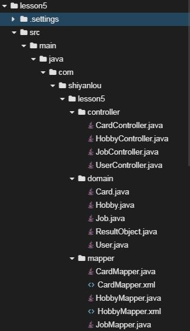
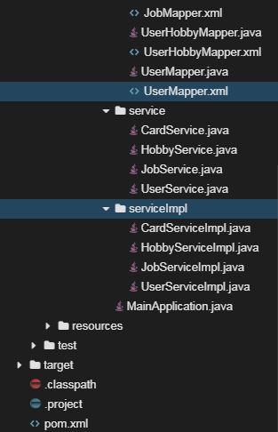

# 实现Hobby数据表的操作

## 介绍

题目需求如下：

需求1. 在本项目基础之上完成对hobby数据表的增删改查，其中访问指定`id`的`hobby`的信息这一接口较为复杂，实质为`N:N`的级联查询。

## 目标

1. 启动Spring Boot项目代码没有bug，可以正常启动，控制台打印出启动日志。
2. 通过curl访问，正确的URL及返回结果如下所示，该功能为访问指定`id`的`hobby`的信息
   
3. 通过curl访问，正确的URL及返回结果如下所示，该功能为访问`hobby`的信息
   
4. 通过curl访问，正确的URL及返回结果如下所示，该功能为新增`hobby`
   
5. 通过curl访问，正确的URL及返回结果如下所示，该功能为修改指定`id`的`hobby`的信息
   
6. 通过curl访问，正确的URL及返回结果如下所示，该功能为删除指定`id`的`hobby`的信息
   

## 提示语

1. 创建好的项目目录结构如下图所示
   
   
2. 在这五个接口中，访问指定`id`的`hobby`的信息这一接口较为复杂，在获取`hobby`中`users`的字段时需要用到级联查询，可以参考访问指定`id`的`user`这一接口，原理相同。
3. 修改指定`id`的`hobby`的信息时，需要考虑多种情况，合理使用动态SQL

## 知识点

- Spring Boot的简单开发，包括`@RestController`、 `@RequestMapping`、 `@PathVariable`、 `@GetMapping`、 `@PostMapping `等常见注解的使用
- Mybatis的简单开发，包括`select`、`insert`、`update`、`delete`常见标签的使用
- Mybatis的进阶开发，例如级联查询、动态SQL的使用，包括`resultMap`、`collection`、`if`、`set`等标签的使用

