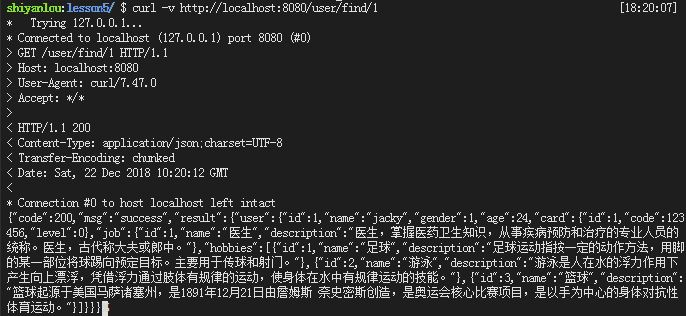
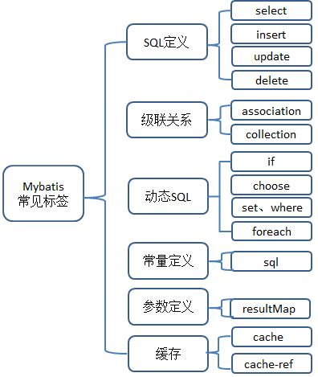
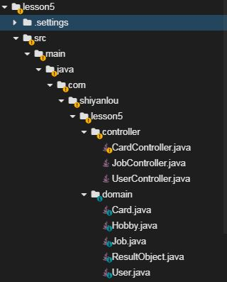
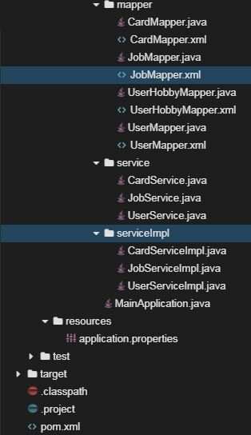
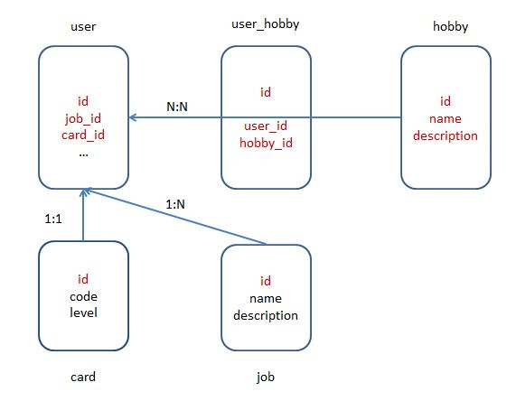
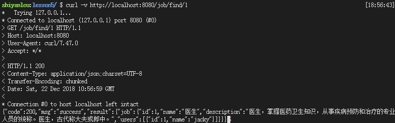
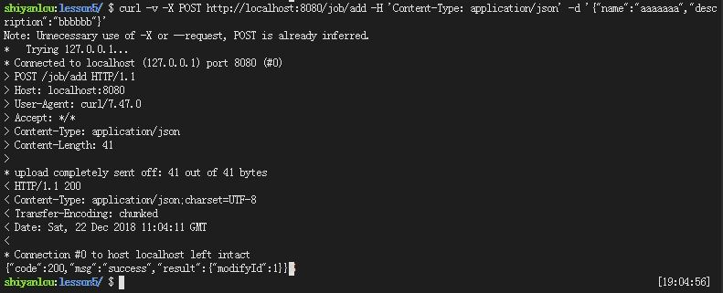
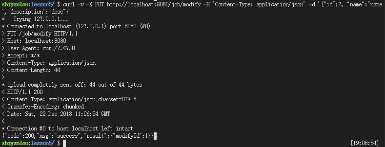
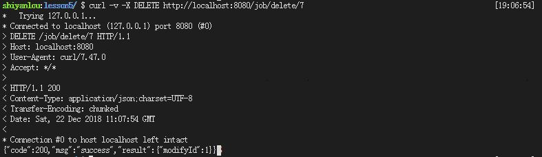

# Spring Boot整合Mybatis

[TOC]

##  一、实验简介

### 1.1 实验内容
​	本实验首先讲解Mybatis的基本知识，让大家对其有一个基本认识之后，接着通过一个项目，结合前面几节课关于Spring Boot的知识，完成Spring Boot与Mybatis的整合，并且可以熟悉应用相关知识，该项目是一个前后端分离的、前后端通过`json`数据进行交互的用户基本信息后台管理系统，主要涉及对用户、爱好、工作及用户身份证等信息的维护，实质即基于spring boot与Mybatis完成对`user`、`hobby`、`job`、`card`这几张表的`insert`、`delete`、`update`、`select`等基本操作，并学习Mybatis级联查询、动态SQL等进阶知识点。

### 1.2 实验知识点

- Spring Boot整合Mybatis
- Mybatis基本知识介绍
- Mybatis进阶知识点
  - 级联查询
  - 动态SQL

### 1.3 效果展示

​	下图为通过curl向后台接口发送请求，后台返回给前端的数据，该接口功能为获取`id=1`用户的所有信息，`id、name、gender、age`这些信息是通过对`user`表进行简单的`select`获取的，而`card、job、hobby`这些信息由于和`user`分别有着`1:1、1:N、N:N`的关系，所以需要级联查询。表后的`json`数据就是后台返回给前端用于页面展示的数据。除该接口外，后台还提供获取所有用户、更新用户、删除用户、新增用户的接口，并且还提供增删改查`hobby`、 `job`、 `card`这些数据的接口，由于接口较多不一一展示，大家可以自己使用curl测试。



### 1.4 实验环境

- Eclipse Neon.2 Release (4.6.2)
- Java 1.8
- Maven 3.5
- Spring Boot 2.0.6
- Mybatis 3.4.6
- MySQL 5.7
- curl

## 二、实验步骤

### 2.1 Mybatis 概述
> ​	MyBatis 是一款优秀的持久层框架，它支持定制化 SQL、存储过程以及高级映射。MyBatis 避免了几乎所有的 JDBC 代码和手动设置参数以及获取结果集。MyBatis 可以使用简单的 XML 或注解来配置和映射原生信息，将接口和 Java 的 POJOs(Plain Old Java Objects，普通的 Java对象)映射成数据库中的记录。

#### 2.1.1 Mybatis优点
- 与直接使用JDBC相比操作已经非常简便
- 支持动态SQL，简化操作
- 程序员可以直接书写SQL，可以根据自己的使用场景优化SQL
- 提供对象关系映射机制

#### 2.2.2 Mybatis缺点

- 编写大量SQL，工作量很大
- 完全依赖底层数据库

#### 2.2.3 Mybatis基础知识

​	Mybatis主要有两种使用方式分别是注解、标签，当前标签功能更为强大，故使用更为广泛，在本项目中也使用标签，常用标签总结如下，详细用法可以查看官方文档，文档十分完备。链接如下：`http://www.mybatis.org/mybatis-3/zh/index.html`



### 2.2 项目实战
#### 2.2.1 项目结构




#### 2.2.2 创建项目

在web IDE界面中，选择File -> Open New Terminal，在终端中输入

```shell
$ mvn archetype:generate -DgroupId=com.shiyanlou -DartifactId=lesson5 -DarchetypeArtifactId=maven-archetype-webapp
```

参数介绍：

- `archetype:generate`：表示使用maven创建项目基本骨架
- `DgroupId`：该项目所属组织，一般将域名倒着写，例如：com.shiyanlou
- `DartifactId`：项目名称，例如：clock
- `DarchetypeArtifactId`：指定所用maven项目骨架类型

输入命令后，maven开始创建项目、下载所需的依赖，等待片刻，maven提示我们输入版本号，直接回车，我们使用默认版本号`1.0-SNAPSHOT`即可。随后maven会输出`groupId`、`artifactId`、`version`、`package`这些基本信息，直接输入`Y`确认即可。最后可以看到绿色的`BUILD SUCCESS`项目创建成功的提示。

然后在web IDE界面中，选择File -> Open Workspace切换工作空间，选择lesson5目录，必须切换到该目录下，否则识别不了项目。

最后大家可以根据上图所示的目录结构，自己创建目录、文件，较为简单，无需赘述。


#### 2.2.3 修改pom文件

`将如下配置文件覆盖到pom.xml中`

下面介绍一下常见的`dependencies`

- `spring-boot-starter-web`：Spring Boot为Web开发提供支持
- `mybatis-spring-boot-starter`：为Mybatis与Spring Boot整合提供支持
- `mysql-connector-java`：MySQL的JDBC驱动包，连接MySQL数据库时必须使用该jar包。
- `druid`：阿里巴巴开源的数据库连接池

   ```xml
   <project xmlns="http://maven.apache.org/POM/4.0.0" xmlns:xsi="http://www.w3.org/2001/XMLSchema-instance"
   	xsi:schemaLocation="http://maven.apache.org/POM/4.0.0 http://maven.apache.org/xsd/maven-4.0.0.xsd">
   	<modelVersion>4.0.0</modelVersion>
   	<groupId>com.shiyanlou</groupId>
   	<artifactId>lesson5</artifactId>
   	<version>0.0.1-SNAPSHOT</version>
   	<packaging>jar</packaging>

   	<parent>
   		<groupId>org.springframework.boot</groupId>
   		<artifactId>spring-boot-starter-parent</artifactId>
   		<version>2.0.1.RELEASE</version>
   		<relativePath /> <!-- lookup parent from repository -->
   	</parent>

   	<properties>
   		<project.build.sourceEncoding>UTF-8</project.build.sourceEncoding>
   		<project.reporting.outputEncoding>UTF-8</project.reporting.outputEncoding>
   		<java.version>1.8</java.version>
   	</properties>

   	<dependencies>
   		<dependency>
   			<groupId>org.springframework.boot</groupId>
   			<artifactId>spring-boot-starter-web</artifactId>
   		</dependency>

   		<dependency>
   			<groupId>org.mybatis.spring.boot</groupId>
   			<artifactId>mybatis-spring-boot-starter</artifactId>
   			<version>1.3.2</version>
   		</dependency>

   		<dependency>
   			<groupId>mysql</groupId>
   			<artifactId>mysql-connector-java</artifactId>
   			<scope>runtime</scope>
   		</dependency>

   		<dependency>
   			<groupId>com.alibaba</groupId>
   			<artifactId>druid</artifactId>
   			<version>1.1.6</version>
   		</dependency>

   	</dependencies>

   	<build>
   		<plugins>
   			<plugin>
   				<groupId>org.springframework.boot</groupId>
   				<artifactId>spring-boot-maven-plugin</artifactId>
   			</plugin>
   		</plugins>
   	</build>
   </project>
   ```


#### 2.2.4 创建application文件

- `spring.datasource.driver-class-name`：指定driver-class
- `spring.datasource.url`：指定数据库host、port、database、encode
- `spring.datasource.username`：指定用户名
- `spring.datasource.password`：指定密码
- `spring.datasource.type`：指定数据库连接池
- `logging.level`：开启日志，开发时可以打印SQL语句，高效debug

```properties
spring.datasource.driver-class-name=com.mysql.jdbc.Driver
spring.datasource.url=jdbc:mysql://localhost:3306/lesson5?useUnicode=true&characterEncoding=utf-8
spring.datasource.username=root
spring.datasource.password=
spring.datasource.type=com.alibaba.druid.pool.DruidDataSource
logging.level.com.shiyanlou.lesson5.mapper=debug
```


#### 2.2.5 创建数据库和数据表

- 启动MySQL数据库服务

```sh
$ sudo service mysql start
```

- 进入MySQL数据库

```sh
$ mysql -uroot
```

- 创建数据库

```sql
mysql> create database lesson5; 
```

- 导入数据表

```sh
$ mysql -uroot lesson5 < dump.sql
```

- 由下图可见五张数据表的关系。



#### 2.2.6 创建mapper目录及文件

`CardMapper.java`是针对`table card`的`mapper`接口文件

```java
package com.shiyanlou.lesson5.mapper;

import java.util.List;
import com.shiyanlou.lesson5.domain.Card;

public interface CardMapper {

	Card selectById(int id);
	List<Card> fuzzySearch(Card card);
	List<Card> selectAll();
	List<Card> selectByLevelId(List<Integer> levels);
  
	int insert(Card job);
	int update(Card job);
	int delete(int id);	
}
```


`JobMapper.java`是针对`table job`的`mapper`接口文件

```java
package com.shiyanlou.lesson5.mapper;

import java.util.List;
import com.shiyanlou.lesson5.domain.Job;

public interface JobMapper {
  
	Job selectById(int id);
	Job selectBriefById(int id);
	List<Job> selectAll();
	int insert(Job job);
	int update(Job job);
	int delete(int id);	
}
```


`UserHobbyMapper.java`是针对`table user_hobby`的`mapper`接口文件

```java
package com.shiyanlou.lesson5.mapper;

import com.shiyanlou.lesson5.domain.Hobby;
import com.shiyanlou.lesson5.domain.User;

public interface UserHobbyMapper {
	public Hobby findHobbyById(int id);
}
```


`UserMapper.xml`是针对`table user`的`mapper`接口文件

```java
package com.shiyanlou.lesson5.mapper;

import java.util.List;
import com.shiyanlou.lesson5.domain.User;

public interface UserMapper {
  
	User selectById(int id);
	User selectByJobId(int id);
	List<User> selectAll();
	int insert(User user);
	int update(User user);
	int delete(int id);
}
```


`CardMapper.xml`

- `	selectById` 功能：通过`id`查找`card`所有信息，主要练习`select`标签的使用
- `fuzzySearch` 功能：通过`code`、`level`查找匹配的`card` ，主要练习`where`、`if`标签的使用
- `selectByLevelId` 功能：通过`level`查找匹配的`card` ，主要练习`foreach`标签的使用
- `insert` 功能：新增`card`， 主要练习`insert`标签的使用，尤其是`useGeneratedKeys`和`keyProperty`这两个属性，可以实现主键回填功能
- `update` 功能：更新指定`card`的信息，主要练习`update`、`set`、`if`标签的使用
- `delete` 功能：删除指定`card`，主要练习`delete`标签的使用

```xml
<?xml version="1.0" encoding="UTF-8"?>
 <!DOCTYPE mapper 
 PUBLIC "-//mybatis.org//DTD Mapper 3.0//EN" 
 "http://mybatis.org/dtd/mybatis-3-mapper.dtd">

<mapper namespace="com.shiyanlou.lesson5.mapper.CardMapper">
	<select id="selectById" parameterType="Integer"
		resultType="com.shiyanlou.lesson5.domain.Card">
		select id, code, level
		from card where id = #{id};
	</select>

	<select id="fuzzySearch" parameterType="com.shiyanlou.lesson5.domain.Card"
		resultType="com.shiyanlou.lesson5.domain.Card">
		select id, code, level from
		card
		<where>
			<if test="code != null and code != 0"> code = #{code} </if>
			<if test="level != null and level != 0"> and level = #{level} </if>
		</where>
	</select>

	<select id="selectByLevelId" resultType="com.shiyanlou.lesson5.domain.Card">
		select id, code, level
		from card
		<where>
		<if test="list.size() > 0 ">
			level in
			<foreach item="item" index="index" collection="list" open="("
				separator="," close=")">
				#{item}
			</foreach>
		</if>
		</where>
		

	</select>
	<select id="selectAll" resultType="com.shiyanlou.lesson5.domain.Card">
		select id, code, level
		from card
	</select>

	<insert id="insert" parameterType="com.shiyanlou.lesson5.domain.Card"
		useGeneratedKeys="true" keyProperty="id">
		insert into card(code, level)
		values(#{code}, #{level});
	</insert>

	<update id="update" parameterType="com.shiyanlou.lesson5.domain.Card">
		update card
		<set>
			<if test="code != null">
				code = #{code},
			</if>
			<if test="level != null">
				level = #{level},
			</if>
		</set>
		where id = #{id};
	</update>

	<delete id="delete" parameterType="Integer">
		delete from card where id = #{id};
	</delete>
</mapper> 
```


`JobMapper.xml`

- `selectById`中要重视`resultMap`的使用，由于`job`和`user`是`1:N`关系，故获取`users`时需要使用`collection`标签，其中`property`是`com.shiyanlou.demo.domain.Job`中的`users`属性，`column`是`table job`的主键`id`，`ofType`是每一条记录对应的对象类型，`select`是级联查找对应的`SQL`语句
- `selectBriefById`，方便`user`查找相关`job`基本信息，直接使用`selectById`会产生死循环
- `selectAll`、`insert`、`update`、`delete`分别为查找所有`job`、新增`job`、更新`job`、删除`job`，不再赘述

```xml
<?xml version="1.0" encoding="UTF-8"?>
 <!DOCTYPE mapper 
 PUBLIC "-//mybatis.org//DTD Mapper 3.0//EN" 
 "http://mybatis.org/dtd/mybatis-3-mapper.dtd">

<mapper namespace="com.shiyanlou.demo.mapper.JobMapper">
	<resultMap type="com.shiyanlou.demo.domain.Job" id="JobInfo">
		<id column="id" property="id" />
		<result column="name" property="name" />
		<result column="description" property="description" />
		<collection property="users" column="id"
			ofType="com.shiyanlou.demo.domain.User" 
			select="com.shiyanlou.demo.mapper.UserMapper.selectByJobId" />
	</resultMap>

	<select id="selectById" parameterType="Integer" resultMap="JobInfo">
		select id, name, description
		from job where id = #{id};
	</select>

	<select id="selectBriefById" parameterType="Integer"
		resultType="com.shiyanlou.demo.domain.Job">
		select id, name, description
		from job where id = #{id};
	</select>

	<select id="selectAll" resultMap="JobInfo">
		select id, name, description from job
	</select>

	<insert id="insert" parameterType="com.shiyanlou.demo.domain.Job"
		useGeneratedKeys="true" keyProperty="id">
		insert into job(name, description)
		values(#{name}, #{description});
	</insert>

	<update id="update" parameterType="com.shiyanlou.demo.domain.Job">
		update job
		<set>
			<if test="name != null and name != ''">
				name = #{name},
			</if>
			<if test="description != null and description != ''">
				description = #{description},
			</if>
		</set>
		where id = #{id};
	</update>

	<delete id="delete" parameterType="Integer">
		delete from job where id = #{id};
	</delete>
</mapper> 
```


`UserHobbyMapper.xml`

- `findHobbyById`中的`SQL`语句是`table user_hobby`和`table hobby`的多表连接查询，用于查找指定用户的爱好

```xml
<?xml version="1.0" encoding="UTF-8"?>
 <!DOCTYPE mapper 
 PUBLIC "-//mybatis.org//DTD Mapper 3.0//EN" 
 "http://mybatis.org/dtd/mybatis-3-mapper.dtd">
<mapper namespace="com.shiyanlou.demo.mapper.UserHobbyMapper">
	<select id="findHobbyById" parameterType="Integer"
		resultType="com.shiyanlou.demo.domain.Hobby">
		select h.* from
		user_hobby ub
		join hobby h
		on ub.hobby_id = h.id
		where ub.user_id = #{id};
	</select>
</mapper> 
```


`UserMapper.xml`

- `selectById`这个接口最为复杂，其`resultMap`中，`id`、`name`、`gender`、`age`较为简单直接获取即可，`card`与`user`是`1:1`关系，`column`需要传递外键`card_id`，`job`与`user`是`1:N`关系，`column`也需要传递外键`job_id`，而`hobby`与`user`是`N:N`关系，需要传递主键`id`。
- `selectByJobId`是方便拥有指定`job`的`user`，不能直接使用`selectById`，会产生死循环

```xml
<?xml version="1.0" encoding="UTF-8"?>
 <!DOCTYPE mapper 
 PUBLIC "-//mybatis.org//DTD Mapper 3.0//EN" 
 "http://mybatis.org/dtd/mybatis-3-mapper.dtd">

<mapper namespace="com.shiyanlou.demo.mapper.UserMapper">
	<resultMap type="com.shiyanlou.demo.domain.User" id="UserInfo">
		<id column="id" property="id" />
		<result column="name" property="name" />
		<result column="gender" property="gender" />
		<result column="age" property="age" />

		<association column="card_id" property="card"
			javaType="com.shiyanlou.demo.domain.Card" 
			select="com.shiyanlou.demo.mapper.CardMapper.selectById" />

		<association column="job_id" property="job"
			javaType="com.shiyanlou.demo.domain.Job" 
			select="com.shiyanlou.demo.mapper.JobMapper.selectBriefById" />

		<collection column="id" property="hobbies"
			ofType="com.shiyanlou.demo.domain.Hobby" 
			select="com.shiyanlou.demo.mapper.UserHobbyMapper.findHobbyById" />

	</resultMap>

	<select id="selectById" parameterType="Integer" resultMap="UserInfo">
		select id, name, gender, age, job_id, card_id
		from user where id = #{id};
	</select>

	<select id="selectByJobId" parameterType="Integer"
		resultType="com.shiyanlou.demo.domain.User">
		select id, name
		from user where job_id = #{job_id};
	</select>

	<select id="selectAll" resultMap="UserInfo">
		select id, name, gender, age,
		job_id, card_id
		from user
	</select>

	<insert id="insert" parameterType="com.shiyanlou.demo.domain.User"
		useGeneratedKeys="true" keyProperty="id">
		insert into user(name, gender,
		age, job_id, card_id)
		values(#{name}, #{gender}, #{age}, #{job.id},
		#{card.id});
	</insert>

	<update id="update" parameterType="com.shiyanlou.demo.domain.User">
		update user
		<set>
			<if test="name != null and name != ''">
				name = #{name},
			</if>
			<if test="gender != null">
				gender = #{gender},
			</if>
			<if test="age != null">
				age = #{age},
			</if>
			<if test="job != null">
				job_id = #{job.id},
			</if>
			<if test="card != null">
				card_id = #{card.id},
			</if>
		</set>
		where id = #{id};
	</update>

	<delete id="delete" parameterType="Integer">
		delete from user where id = #{id};
	</delete>
</mapper> 
```


#### 2.2.7 创建domain目录及文件

`ResultObject.java`

`ResultObject`用来封装后台返回结果，`ResultObject这个class有三个属性`

- `code`：表示后台状态
- `msg`：表示相关消息
- `result`：表示结果

```java
package com.shiyanlou.lesson5.domain;

public class ResultObject {

	private int code;
	private String msg;
	private Object result;
	public ResultObject() {
		super();
		// TODO Auto-generated constructor stub
	}
	public ResultObject(int code, String msg, Object result) {
		super();
		this.code = code;
		this.msg = msg;
		this.result = result;
	}
	public int getCode() {
		return code;
	}
	public void setCode(int code) {
		this.code = code;
	}
	public String getMsg() {
		return msg;
	}
	public void setMsg(String msg) {
		this.msg = msg;
	}
	public Object getResult() {
		return result;
	}
	public void setResult(Object result) {
		this.result = result;
	}
	@Override
	public String toString() {
		return "ResultObject [code=" + code + ", msg=" + msg + ", result=" + result + "]";
	}
}
```


`User.java`

```java
package com.shiyanlou.lesson5.domain;

import java.util.List;

import com.fasterxml.jackson.annotation.JsonInclude;
import com.fasterxml.jackson.annotation.JsonInclude.Include;

public class User{

  	// id 为主键
	private int id;
  	// name 用户名
	private String name;
  
  	// gender 用户性别，如果为null不返回给前端
	@JsonInclude(Include.NON_DEFAULT)
	private int gender;
  
  	// age 用户年龄，如果为null不返回给前端
	@JsonInclude(Include.NON_DEFAULT)
	private int age;
	
  	
	// 一对一 用户身份证信息
	@JsonInclude(Include.NON_DEFAULT)
	private Card card;	

	// 多对一 用户工作信息
	@JsonInclude(Include.NON_DEFAULT)
	private Job job;
	
	// 多对多 用户爱好信息
	@JsonInclude(Include.NON_DEFAULT)
	private List<Hobby> hobbies;
	
	public User() {
		super();
		// TODO Auto-generated constructor stub
	}

	public User(String name, int gender, int age, Card card, Job job, List<Hobby> hobbies) {
		super();
		this.name = name;
		this.gender = gender;
		this.age = age;
		this.card = card;
		this.job = job;
		this.hobbies = hobbies;
	}

	public int getId() {
		return id;
	}

	public void setId(int id) {
		this.id = id;
	}

	public String getName() {
		return name;
	}

	public void setName(String name) {
		this.name = name;
	}

	public int getGender() {
		return gender;
	}

	public void setGender(int gender) {
		this.gender = gender;
	}

	public int getAge() {
		return age;
	}

	public void setAge(int age) {
		this.age = age;
	}

	public Card getCard() {
		return card;
	}

	public void setCard(Card card) {
		this.card = card;
	}

	public Job getJob() {
		return job;
	}

	public void setJob(Job job) {
		this.job = job;
	}

	public List<Hobby> getHobbies() {
		return hobbies;
	}

	public void setHobbies(List<Hobby> hobbies) {
		this.hobbies = hobbies;
	}

	@Override
	public String toString() {
		return "User [id=" + id + ", name=" + name + ", gender=" + gender + ", age=" + age + ", card=" + card + ", job=" + job + ", hobbies=" + hobbies + "]";
	}	
}
```


`Hobby.java`

```java
package com.shiyanlou.lesson5.domain;

import java.util.List;

import com.fasterxml.jackson.annotation.JsonInclude;
import com.fasterxml.jackson.annotation.JsonInclude.Include;

public class Hobby {

    // 主键id
	private int id;
  	// 爱好名称
	private String name;
  	// 爱好描述
	private String description;
	
  	// 哪些用户用户该爱好
	@JsonInclude(Include.NON_DEFAULT)
	private List<User> users;
	
	public Hobby() {
		super();
		// TODO Auto-generated constructor stub
	}

	public Hobby(String name, String description, List<User> users) {
		super();
		this.name = name;
		this.description = description;
		this.users = users;
	}

	public int getId() {
		return id;
	}

	public void setId(int id) {
		this.id = id;
	}

	public String getName() {
		return name;
	}

	public void setName(String name) {
		this.name = name;
	}

	public String getDescription() {
		return description;
	}

	public void setDescription(String description) {
		this.description = description;
	}

	public List<User> getUsers() {
		return users;
	}

	public void setUsers(List<User> users) {
		this.users = users;
	}

	@Override
	public String toString() {
		return "Hobby [id=" + id + ", name=" + name + ", description=" + description + ", users=" + users + "]";
	}
}
```


`Job.xml`

```java
package com.shiyanlou.lesson5.domain;

import java.util.List;

import com.fasterxml.jackson.annotation.JsonInclude;
import com.fasterxml.jackson.annotation.JsonInclude.Include;

public class Job {

  	// 工作主键
	private int id;
  	// 工作名称
	private String name;
  	// 工作描述
	private String description;
	
	// 一对多 哪些用户拥有该工作
	@JsonInclude(Include.NON_DEFAULT)
	private List<User> users;
	
	public Job() {
		super();
		// TODO Auto-generated constructor stub
	}

	public Job(String name, String description, List<User> users) {
		super();
		this.name = name;
		this.description = description;
		this.users = users;
	}

	public int getId() {
		return id;
	}

	public void setId(int id) {
		this.id = id;
	}

	public String getName() {
		return name;
	}

	public void setName(String name) {
		this.name = name;
	}

	public String getDescription() {
		return description;
	}

	public void setDescription(String description) {
		this.description = description;
	}

	public List<User> getUsers() {
		return users;
	}

	public void setUsers(List<User> users) {
		this.users = users;
	}

	@Override
	public String toString() {
		return "Job [id=" + id + ", name=" + name + ", description=" + description + ", users=" + users + "]";
	}
}
```


`Card.java`

```java
package com.shiyanlou.lesson5.domain;

public class Card {
  	// 身份证主键id
	private int id;
  	// 身份证号码
	private int code;
  	// 身份证等级
	private int level;
	
	public Card() {
		super();
		// TODO Auto-generated constructor stub
	}
	public Card(int code, int level) {
		super();
		this.code = code;
		this.level = level;
	}
	public int getId() {
		return id;
	}
	public void setId(int id) {
		this.id = id;
	}
	public int getCode() {
		return code;
	}
	public void setCode(int code) {
		this.code = code;
	}
	public int getLevel() {
		return level;
	}
	public void setLevel(int level) {
		this.level = level;
	}
	@Override
	public String toString() {
		return "Card [id=" + id + ", code=" + code + ", level=" + level + "]";
	}
}
```


#### 2.2.8 创建service目录及文件

`CardService.java`

```java
package com.shiyanlou.lesson5.service;

import java.util.List;
import com.shiyanlou.lesson5.domain.Card;

public interface CardService {
	public int insertCard(Card card);
	public int deleteCard(int id);
	public int updateCard(Card card);
	public Card selectCardById(int id);
	public List<Card> selectAllCard();
	public List<Card> fuzzySearch(Card card);
	public List<Card> selectCardByLevelId(List<Integer> levels);
}
```


`JobService.java`

```java
package com.shiyanlou.lesson5.service;

import java.util.List;
import com.shiyanlou.lesson5.domain.Job;

public interface JobService {
	public int insertJob(Job job);
	public int deleteJob(int id);
	public int updateJob(Job job);
	public Job selectJobById(int id);
	public List<Job> selectAllJob();
}
```


`UserService.java`

```java
package com.shiyanlou.lesson5.service;

import java.util.List;
import com.shiyanlou.lesson5.domain.User;

public interface UserService {
	public int insertUser(User user);
	public int deleteUser(int id);
	public int updateUser(User user);
	public User selectUserById(int id);
	public List<User> selectAllUser();
}
```


#### 2.2.9 创建serviceImpl目录及文件

`CardServiceImpl.java`

```java
package com.shiyanlou.lesson5.serviceImpl;

import java.util.List;

import org.springframework.beans.factory.annotation.Autowired;
import org.springframework.stereotype.Service;

import com.shiyanlou.lesson5.domain.Card;
import com.shiyanlou.lesson5.mapper.CardMapper;
import com.shiyanlou.lesson5.service.CardService;

@Service
public class CardServiceImpl implements CardService{

	@Autowired
	private CardMapper cardMapper;
	
	public int insertCard(Card card) {
		int modifyId = cardMapper.insert(card);
		return modifyId;
	}
	
	public int deleteCard(int id) {
		int modifyId = cardMapper.delete(id);
		return modifyId;
	}
	
	public int updateCard(Card card) {
		int modifyId = cardMapper.update(card);
		return modifyId;
	}
	
	public Card selectCardById(int id) {
		Card card = cardMapper.selectById(id);
		return card;
	}
	
	public List<Card> selectAllCard() {
		List<Card> cards = cardMapper.selectAll();
		return cards;
	}
	
	public List<Card> fuzzySearch(Card card) {
		List<Card> cards = cardMapper.fuzzySearch(card);
		return cards;
	}
	
	public List<Card> selectCardByLevelId(List<Integer> levels) {
		List<Card> cards = cardMapper.selectByLevelId(levels);
		return cards;
	}
}
```


`JobServiceImpl.java`

```java
package com.shiyanlou.lesson5.serviceImpl;

import java.util.List;

import org.springframework.beans.factory.annotation.Autowired;
import org.springframework.stereotype.Service;

import com.shiyanlou.lesson5.domain.Job;
import com.shiyanlou.lesson5.mapper.JobMapper;
import com.shiyanlou.lesson5.service.JobService;


@Service
public class JobServiceImpl implements JobService{

	@Autowired
	private JobMapper jobMapper;
	
	public int insertJob(Job job) {
		int modifyId = jobMapper.insert(job);
		return modifyId;
	}
	
	public int deleteJob(int id) {
		int modifyId = jobMapper.delete(id);
		return modifyId;
	}
	
	public int updateJob(Job job) {
		int modifyId = jobMapper.update(job);
		return modifyId;
	}
	
	public Job selectJobById(int id) {
		Job job = jobMapper.selectById(id);
		return job;
	}
	
	public List<Job> selectAllJob() {
		List<Job> jobs = jobMapper.selectAll();
		return jobs;
	}
}
```


`UserServiceImpl.java`

```java
package com.shiyanlou.lesson5.serviceImpl;

import java.util.List;

import org.springframework.beans.factory.annotation.Autowired;
import org.springframework.stereotype.Service;

import com.shiyanlou.lesson5.domain.User;
import com.shiyanlou.lesson5.mapper.UserMapper;
import com.shiyanlou.lesson5.service.UserService;


@Service
public class UserServiceImpl implements UserService{

	@Autowired
	private UserMapper userMapper;
	
	public int insertUser(User user) {
		int modifyId = userMapper.insert(user);
		return modifyId;
	}
	
	public int deleteUser(int id) {
		int modifyId = userMapper.delete(id);
		return modifyId;
	}
	
	public int updateUser(User user) {
		int modifyId = userMapper.update(user);
		return modifyId;
	}
	
	public User selectUserById(int id) {
		User user = userMapper.selectById(id);
		return user;
	}
	
	public List<User> selectAllUser() {
		List<User> users = userMapper.selectAll();
		return users;
	}
}
```


#### 2.2.10 创建controller目录及文件

参数传递总结

- `@PathVariable`：URL路径变量，例如：`http://localhost:8080/job/delete/1`，其中的1便是
- `@RequestParam`：URL问号参数，例如：`http://localhost:8080/job/delete?id=1`，其中id便是
- `@RequestBody`：`json`传递方式，一般在`POST`方法上传数据时使用，需要设置`Content-Type: application/json`


`CardController.java`

```java
package com.shiyanlou.lesson5.controller;

import java.util.ArrayList;
import java.util.Arrays;
import java.util.HashMap;
import java.util.List;
import java.util.Map;

import org.springframework.beans.factory.annotation.Autowired;
import org.springframework.web.bind.annotation.DeleteMapping;
import org.springframework.web.bind.annotation.GetMapping;
import org.springframework.web.bind.annotation.PathVariable;
import org.springframework.web.bind.annotation.PostMapping;
import org.springframework.web.bind.annotation.PutMapping;
import org.springframework.web.bind.annotation.RequestMapping;
import org.springframework.web.bind.annotation.RequestParam;
import org.springframework.web.bind.annotation.RestController;
import org.springframework.web.bind.annotation.RequestBody;

import com.shiyanlou.lesson5.domain.Card;
import com.shiyanlou.lesson5.domain.ResultObject;
import com.shiyanlou.lesson5.service.CardService;

@RestController
@RequestMapping("card")
public class CardController {
	
	@Autowired
	private CardService cardService;
	
	@PostMapping("add")
	public ResultObject add(@RequestBody Card card) {
		int modifyId = cardService.insertCard(card);
		Map<String, Integer> map = new HashMap<>();
		map.put("modifyId", modifyId);
		ResultObject resultObject = new ResultObject(200, "success", map);
		return resultObject;
	}

	@DeleteMapping("delete/{id}")
	public ResultObject delete(@PathVariable int id) {
		int modifyId = cardService.deleteCard(id);
		Map<String, Integer> map = new HashMap<>();
		map.put("modifyId", modifyId);
		ResultObject resultObject = new ResultObject(200, "success", map);
		return resultObject;
	}
	
	@PutMapping("modify")
	public ResultObject modify(@RequestBody Card card) {
		int modifyId = cardService.updateCard(card);
		Map<String, Integer> map = new HashMap<>();
		map.put("modifyId", modifyId);
		ResultObject resultObject = new ResultObject(200, "success", map);
		return resultObject;
	}
	
	@GetMapping("find/{id}")
	public ResultObject find(@PathVariable int id) {
		Card card = cardService.selectCardById(id);
		Map<String, Card> map = new HashMap<>();
		map.put("card", card);
		ResultObject resultObject = new ResultObject(200, "success", map);
		return resultObject;
	}
	
	@GetMapping("findAll")
	public ResultObject findAll() {
		List<Card> cards = cardService.selectAllCard();
		Map<String, List<Card>> map = new HashMap<>();
		map.put("card", cards);
		ResultObject resultObject = new ResultObject(200, "success", map);
		return resultObject;
	}
	
	@PostMapping("fuzzySearch")
	public ResultObject fuzzySearch(Card card) {
		List<Card> cards = cardService.fuzzySearch(card);
		Map<String, List<Card>> map = new HashMap<>();
		map.put("card", cards);
		ResultObject resultObject = new ResultObject(200, "success", map);
		return resultObject;
	}
	
	@PostMapping("findByLevelId")
	public ResultObject selectCardByLevelId(String levels) {
		System.out.println("levels" + levels);
		System.out.println("levels-length:" + levels.length());
		String[] strings = levels.split(",");
		List<Integer> ids = new ArrayList<>(); 
		System.out.println("strings" + Arrays.toString(strings));
		System.out.println(strings.length);
		for(int i = 0; i < levels.length(); i++) {
			ids.add(Integer.parseInt(strings[i]));
		}
		System.out.println("ids" + ids);
		List<Card> cards = cardService.selectCardByLevelId(ids);
		Map<String, List<Card>> map = new HashMap<>();
		map.put("card", cards);
		ResultObject resultObject = new ResultObject(200, "success", map);
		return resultObject;
	}

}
```


`JobController.java`

```java
package com.shiyanlou.lesson5.controller;

import java.util.HashMap;
import java.util.List;
import java.util.Map;

import org.springframework.beans.factory.annotation.Autowired;
import org.springframework.web.bind.annotation.DeleteMapping;
import org.springframework.web.bind.annotation.GetMapping;
import org.springframework.web.bind.annotation.PathVariable;
import org.springframework.web.bind.annotation.PostMapping;
import org.springframework.web.bind.annotation.PutMapping;
import org.springframework.web.bind.annotation.RequestMapping;
import org.springframework.web.bind.annotation.RestController;
import org.springframework.web.bind.annotation.RequestBody;

import com.shiyanlou.lesson5.domain.Job;
import com.shiyanlou.lesson5.domain.ResultObject;
import com.shiyanlou.lesson5.service.JobService;

@RestController
@RequestMapping("job")
public class JobController {
	
	@Autowired
	private JobService jobService;
	
	@PostMapping("add")
	public ResultObject add(@RequestBody Job job) {
		int modifyId = jobService.insertJob(job);
		Map<String, Integer> map = new HashMap<>();
		map.put("modifyId", modifyId);
		ResultObject resultObject = new ResultObject(200, "success", map);
		return resultObject;
	}

	@DeleteMapping("delete/{id}")
	public ResultObject delete(@PathVariable int id) {
		int modifyId = jobService.deleteJob(id);
		Map<String, Integer> map = new HashMap<>();
		map.put("modifyId", modifyId);
		ResultObject resultObject = new ResultObject(200, "success", map);
		return resultObject;
	}
	
	@PutMapping("modify")
	public ResultObject modify(@RequestBody Job job) {
		int modifyId = jobService.updateJob(job);
		Map<String, Integer> map = new HashMap<>();
		map.put("modifyId", modifyId);
		ResultObject resultObject = new ResultObject(200, "success", map);
		return resultObject;
	}
	
	@GetMapping("find/{id}")
	public ResultObject find(@PathVariable int id) {
		Job job = jobService.selectJobById(id);
		Map<String, Job> map = new HashMap<>();
		map.put("job", job);
		ResultObject resultObject = new ResultObject(200, "success", map);
		return resultObject;
	}
	
	@GetMapping("findAll")
	public ResultObject findAll() {
		List<Job> jobs = jobService.selectAllJob();
		Map<String, List<Job>> map = new HashMap<>();
		map.put("job", jobs);
		ResultObject resultObject = new ResultObject(200, "success", map);
		return resultObject;
	}
}
```


`UserController.java`

```java
package com.shiyanlou.lesson5.controller;

import java.util.HashMap;
import java.util.List;
import java.util.Map;

import org.springframework.beans.factory.annotation.Autowired;
import org.springframework.web.bind.annotation.DeleteMapping;
import org.springframework.web.bind.annotation.GetMapping;
import org.springframework.web.bind.annotation.PathVariable;
import org.springframework.web.bind.annotation.PostMapping;
import org.springframework.web.bind.annotation.PutMapping;
import org.springframework.web.bind.annotation.RequestBody;
import org.springframework.web.bind.annotation.RequestMapping;
import org.springframework.web.bind.annotation.RestController;

import com.shiyanlou.lesson5.domain.ResultObject;
import com.shiyanlou.lesson5.domain.User;
import com.shiyanlou.lesson5.service.UserService;

@RestController
@RequestMapping("user")
public class UserController {
	
	@Autowired
	private UserService userService;
	
	@PostMapping("add")
	public ResultObject add(@RequestBody User user) {
		int modifyId = userService.insertUser(user);
		Map<String, Integer> map = new HashMap<>();
		map.put("modifyId", modifyId);
		ResultObject resultObject = new ResultObject(200, "success", map);
		return resultObject;
	}
	
	@DeleteMapping("delete/{id}")
	public ResultObject delete(@PathVariable int id) {
		int modifyId = userService.deleteUser(id);
		Map<String, Integer> map = new HashMap<>();
		map.put("modifyId", modifyId);
		ResultObject resultObject = new ResultObject(200, "success", map);
		return resultObject;
	}
	
	@PutMapping("modify")
	public ResultObject modify(@RequestBody User user) {
		int modifyId = userService.updateUser(user);
		Map<String, Integer> map = new HashMap<>();
		map.put("modifyId", modifyId);
		ResultObject resultObject = new ResultObject(200, "success", map);
		return resultObject;
	}
	
	@GetMapping("find/{id}")
	public ResultObject find(@PathVariable int id) {
		User user = userService.selectUserById(id);
		Map<String, User> map = new HashMap<>();
		map.put("user", user);
		ResultObject resultObject = new ResultObject(200, "success", map);
		return resultObject;
	}
	
	@GetMapping("findAll")
	public ResultObject findAll() {
		List<User> users = userService.selectAllUser();
		Map<String, List<User>> map = new HashMap<>();
		map.put("user", users);
		ResultObject resultObject = new ResultObject(200, "success", map);
		return resultObject;
	}
}
```


#### 2.2.11 创建启动类文件

`MainApplication.java`，内置Tomcat，整个web程序的入口

- `MapperScan`注解十分重要，`value`为`mapper`所在路径，Spring Boot由这个注解可以得知去哪里扫描`mapper`文件

```java
package com.shiyanlou.lesson5;

import org.mybatis.spring.annotation.MapperScan;
import org.springframework.boot.SpringApplication;
import org.springframework.boot.autoconfigure.SpringBootApplication;

@SpringBootApplication
@MapperScan("com.shiyanlou.lesson5.mapper")
public class MainApplication {

	public static void main(String[] args) {
		SpringApplication.run(MainApplication.class, args);
	}
}
```


#### 2.2.12 访问测试

在终端中输入如下命令，启动web项目

```shell
$ mvn spring-boot:run
```

- 指定查找指定`job`的信息



- 查找所有`job`的信息


- 新增`job`



- 修改指定`job`信息



- 删除指定`job`



## 三、实验总结

​	本节课先对Mybatis进行一个基本介绍，让同学们有了一个整体的认识，然后结合之前所讲的Spring Boot知识，将Spring Boot和Mybatis进行了整合，通过一个简单的前后端分离的用户信息管理系统，让同学们对这些理论知识一个直观的体验。