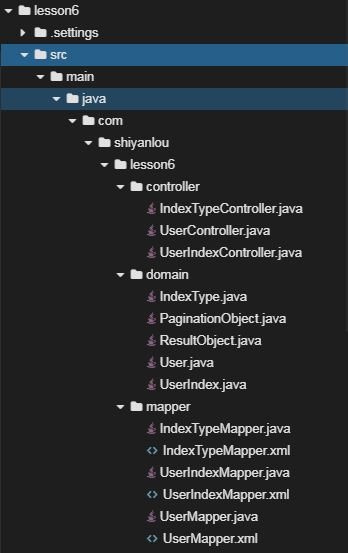
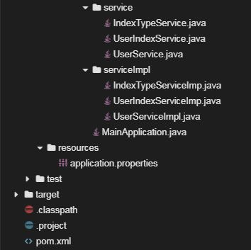

# 实现index_type数据表的操作

[TOC]

## 介绍

题目需求如下：

需求1. 为了方便运营人员对生理指标类型的维护管理，需要提供生理指标类型的增删改查功能，实质为在本项目基础之上完成对index_type数据表的增删改查，其中显示所有生理指标类型的时候需要提供分页展示的功能。

## 目标

1. 启动Spring Boot项目代码没有bug，可以正常启动，控制台打印出启动日志。

2. 通过curl访问，正确的URL及返回结果如下所示，该功能为分页访问`index_type`

   - Notice: URL要加引号，因为`&`在`Linux shell`中是特殊字符

   

3. 通过curl访问，正确的URL及返回结果如下所示，该功能为新增`index_type`
   

4. 通过curl访问，正确的URL及返回结果如下所示，该功能为修改指定`id`的`index_type`的信息
   

5. 通过curl访问，正确的URL及返回结果如下所示，该功能为删除指定`id`的`index_type`
   

## 提示语

1. 创建好的项目目录结构如下图所示
   
   
2. 在开发分页获取`index_type`时可以参考分页获取`user`，原理相同
3. 修改指定`id`的`index_type`的信息时，需要合理使用动态SQL

## 知识点

- Spring Boot的简单开发，包括`@RestController`、 `@RequestMapping`、  `@GetMapping`、 `@PostMapping `、 `@DeleteMapping`、 `@PutMapping`等常见注解的使用
- Mybatis的简单开发，包括`select`、`insert`、`update`、`delete`常见标签的使用
- Mybatis的分页使用

