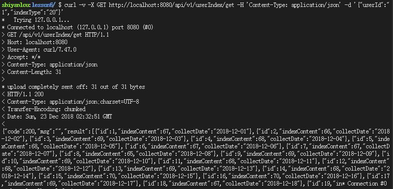
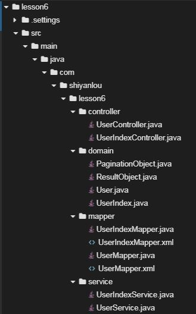
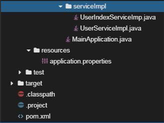
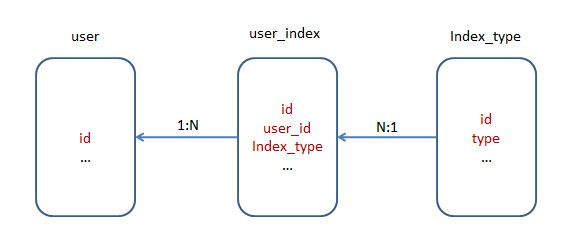
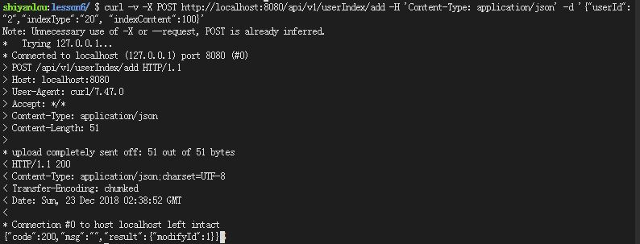
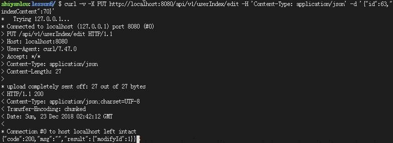
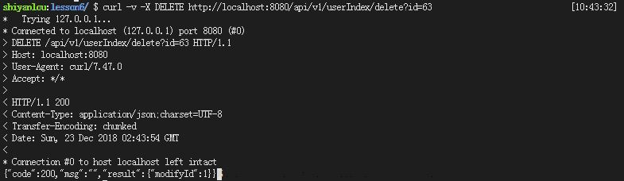

# 后台接口开发(用户侧-1)

* [后台接口开发(用户侧-1)](#后台接口开发用户侧-1)
     * [一、实验简介](#一实验简介)
        * [1.1 实验内容](#11-实验内容)
        * [1.2 实验知识点](#12-实验知识点)
        * [1.3 效果展示](#13-效果展示)
        * [1.4 实验环境](#14-实验环境)
     * [二、实验步骤](#二实验步骤)
       ​    * [2.1 项目结构](#21-项目结构)
       ​    * [2.2 创建项目](#22-创建项目)
       ​    * [2.3 修改pom文件](#23-修改pom文件)
       ​    * [2.4 创建application文件](#24-创建application文件)
       ​    * [2.5 创建数据库和数据表](#25-创建数据库和数据表)
       ​    * [2.6 创建mapper目录及文件](#26-创建mapper目录及文件)
       ​    * [2.7 创建domain目录及文件](#27-创建domain目录及文件)
       ​    * [2.8 创建service目录及文件](#28-创建service目录及文件)
       ​    * [2.9 创建serviceImpl目录及文件](#29-创建serviceimpl目录及文件)
       ​    * [2.10 创建controller目录及文件](#210-创建controller目录及文件)
       ​    * [2.11 创建启动类文件](#211-创建启动类文件)
       ​    * [2.12 访问测试](#212-访问测试)
     * [三、实验总结](#三实验总结)

##  一、实验简介

### 1.1 实验内容
​	前五节课为同学们讲解了Spring Boot、Mybatis、单元测试、curl等基本知识，从这堂课开始，我们要通过一个完整的项目使同学们进一步掌握这些知识点。本项目是一个前后端分离的，前后端通过`json`数据来进行通信、后端基于Spring Boot和Mybatis、前端基于react的用户健康管理系统，分为用户端和健康指导员端两端。用户端需要两次课为同学们讲解，健康指导员端需要一次课，登录注册功能需要一次课，最后前端页面展示需要一次课，通过这五次课为大家展示一个完整的项目开发测试流程。

​	本实验主要是用户端后台接口开发，主要功能有用户基本信息（姓名、性别、年龄、手机）的操作、用户日常生理指标（心率、血压、血糖、血脂、体重）的操作。

### 1.2 实验知识点

- Spring Boot 基础HTTP开发、常用配置
- Mybatis 基础配置及CURD操作
- Mybatis分页
- Spring Boot 热部署

### 1.3 效果展示

​	下图为通过curl向后台接口发送请求，后台接口返回给前端的数据。该接口功能为获取`id=1`用户的最近体重信息，前端可以使用这组数据渲染页面，展示用户体重变化趋势。`id`为自增序号，用于标记一条体重信息，在`delete`、 `update `时会用到，`indexContent`为用户指定的生理指标，这时为体重，`collectDate`为上传数据日期。



### 1.4 实验环境

- Eclipse Neon.2 Release (4.6.2)
- Java 1.8
- Maven 3.5
- Spring Boot 2.0.6
- Mybatis 3.4.6
- MySQL 5.7
- curl

## 二、实验步骤

#### 2.1 项目结构






#### 2.2 创建项目

在web IDE界面中，选择File -> Open New Terminal，在终端中输入

```shell
$ mvn archetype:generate -DgroupId=com.shiyanlou -DartifactId=lesson6 -DarchetypeArtifactId=maven-archetype-webapp
```

参数介绍：

- `archetype:generate`：表示使用maven创建项目基本骨架
- `DgroupId`：该项目所属组织，一般将域名倒着写，例如：com.shiyanlou
- `DartifactId`：项目名称，例如：lesson6
- `DarchetypeArtifactId`：指定所用maven项目骨架类型

输入命令后，maven开始创建项目、下载所需的依赖，等待片刻，maven提示我们输入版本号，直接回车，我们使用默认版本号`1.0-SNAPSHOT`即可。随后maven会输出`groupId`、`artifactId`、`version`、`package`这些基本信息，直接输入`Y`确认即可。最后可以看到绿色的`BUILD SUCCESS`项目创建成功的提示。

然后在web IDE界面中，选择File -> Open Workspace切换工作空间，选择lesson6目录，必须切换到该目录下，否则识别不了项目。

最后大家可以根据上图所示的目录结构，自己创建目录、文件，较为简单，无需赘述。


#### 2.3 修改pom文件

`将如下配置文件覆盖到pom.xml中`

下面介绍新增加的`dependencies`

- `pagehelper-spring-boot-starter`用来支持Mybatis分页
- `spring-boot-devtools`用来支持热部署，当配置了`devtools `后，我们在`classpath`修改任何文件，保存后，项目都将会自动重启，方便开发。

   ```xml
   <project xmlns="http://maven.apache.org/POM/4.0.0" xmlns:xsi="http://www.w3.org/2001/XMLSchema-instance"
   	xsi:schemaLocation="http://maven.apache.org/POM/4.0.0 http://maven.apache.org/xsd/maven-4.0.0.xsd">
   	<modelVersion>4.0.0</modelVersion>
   	<groupId>com.shiyanlou</groupId>
   	<artifactId>lesson6</artifactId>
   	<version>0.0.1-SNAPSHOT</version>
   	<packaging>jar</packaging>

   	<parent>
   		<groupId>org.springframework.boot</groupId>
   		<artifactId>spring-boot-starter-parent</artifactId>
   		<version>2.0.1.RELEASE</version>
   		<relativePath /> <!-- lookup parent from repository -->
   	</parent>

   	<properties>
   		<project.build.sourceEncoding>UTF-8</project.build.sourceEncoding>
   		<project.reporting.outputEncoding>UTF-8</project.reporting.outputEncoding>
   		<java.version>1.8</java.version>
   	</properties>

   	<dependencies>
   		<dependency>
   			<groupId>org.springframework.boot</groupId>
   			<artifactId>spring-boot-starter-web</artifactId>
   		</dependency>

   		<dependency>
   			<groupId>org.mybatis.spring.boot</groupId>
   			<artifactId>mybatis-spring-boot-starter</artifactId>
   			<version>1.3.2</version>
   		</dependency>

   		<dependency>
   			<groupId>mysql</groupId>
   			<artifactId>mysql-connector-java</artifactId>
   			<scope>runtime</scope>
   		</dependency>

   		<dependency>
   			<groupId>com.alibaba</groupId>
   			<artifactId>druid</artifactId>
   			<version>1.1.6</version>
   		</dependency>

   		<dependency>
   			<groupId>com.github.pagehelper</groupId>
   			<artifactId>pagehelper-spring-boot-starter</artifactId>
   			<version>1.2.3</version>
   		</dependency>
   		
   		<dependency>
   			<groupId>org.springframework.boot</groupId>
   			<artifactId>spring-boot-devtools</artifactId>
   			<optional>true</optional>
   		</dependency>

   	</dependencies>

   	<build>
   		<plugins>
   			<plugin>
   				<groupId>org.springframework.boot</groupId>
   				<artifactId>spring-boot-maven-plugin</artifactId>
   			</plugin>
   		</plugins>
   	</build>
   </project>
   ```


#### 2.4 创建application文件

`该文件主要介绍关于数据库基本的基本配置十分重要，选中src/main/resources，右键 -> New -> file-> Name填入application.properties -> Finish。`

- `spring.datasource.driver-class-name`：指定driver-class
- `spring.datasource.url`：指定数据库host、port、database、encode
- `spring.datasource.username`：指定用户名
- `spring.datasource.password`：指定密码
- `spring.datasource.type`：指定数据库连接池
- `logging.level`：开启日志，开发时可以打印SQL语句

```properties
spring.datasource.driver-class-name=com.mysql.jdbc.Driver
spring.datasource.url=jdbc:mysql://localhost:3306/lesson6?useUnicode=true&characterEncoding=utf-8
spring.datasource.username=root
spring.datasource.password=
spring.datasource.type=com.alibaba.druid.pool.DruidDataSource
logging.level.com.shiyanlou.lesson6.mapper=debug
```


#### 2.5 创建数据库和数据表

启动MySQL数据库服务

```sh
$ sudo service mysql start
```

进入MySQL数据库

```sh
$ mysql -uroot -p
```

创建数据库

```sql
mysql> create database lesson6; 
```
导入数据表

```sh
$ mysql -uroot lesson6 < dump.sql
```

由下图可见三张数据表的关系。



#### 2.6 创建mapper目录及文件

`UserMapper.java` 用户持久化层接口文件，定义用户类增删改查等方法

```java
package com.shiyanlou.lesson6.mapper;

import java.util.List;

import com.shiyanlou.lesson6.domain.User;

public interface UserMapper {

  	/**
	 * 通过id获取用户
	 * @param id
	 * @return
	 */
	User getById(int id);
	
  	/**
	 * 获取所有用户
	 * @return
	 */
	List<User> getAll();
	
 	 /**
	 * 创建用户
	 * @param user
	 * @return
	 */
	int insert(User user);
	
 	 /**
	 * 通过id更新用户
	 * @param user
	 * @return
	 */
	int update(User user);
	
 	 /**
	 * 删除用户
	 * @param id
	 * @return
	 */
	int delete(int id);
	
}
```


`UserIndexMapper.java` 用户生理指标持久化层接口，为用户生理指标类定义增删改查等方法

```java
package com.shiyanlou.lesson6.mapper;

import java.util.List;

import com.shiyanlou.lesson6.domain.UserIndex;

public interface UserIndexMapper {

	 /**
	 * 通过用户id和指标类型获取用户的所有指标
	 * @param userIndex
	 * @return
	 */
	List<UserIndex> getById(UserIndex userIndex);
		
  	/**
	 * 创建用户生理指标数据
	 * @param userIndex
	 * @return
	 */
	int insert(UserIndex userIndex);
	
  	/**
	 * 更新用户生理指标数据
	 * @param userIndex
	 * @return
	 */
	int update(UserIndex userIndex);
	
  	/**
	 * 删除用户生理指标数据
	 * @param userIndexId
	 * @return
	 */
	int delete(int userIndexId);
	
}
```


`UserMapper.xml` 用户持久化层，实现了`UserMapper.java`中定义的方法

```xml
<?xml version="1.0" encoding="UTF-8"?>
 <!DOCTYPE mapper 
 PUBLIC "-//mybatis.org//DTD Mapper 3.0//EN" 
 "http://mybatis.org/dtd/mybatis-3-mapper.dtd">
 
<mapper namespace="com.shiyanlou.lesson6.mapper.UserMapper">
	<select id="getById" parameterType="Integer" resultType="com.shiyanlou.lesson6.domain.User">
		select
		id, name, gender, age, phone, phone, job, address, 
		create_time as createTime
 		from user where id = #{id};
	</select>
	
	<select id="getAll" resultType="com.shiyanlou.lesson6.domain.User">
		select
		id, name, gender, age, phone, phone, job, address,
		create_time as createTime
 		from user
	</select>
	
	<insert id="insert" parameterType="com.shiyanlou.lesson6.domain.User"
	useGeneratedKeys="true" keyProperty="id">
		insert into user(name, gender, age, phone, job, address, create_time) 
		values(#{name}, #{gender}, #{age}, #{phone}, #{job}, #{address}, #{createTime});
	</insert>
	
	<update id="update" parameterType="com.shiyanlou.lesson6.domain.User">
		update user
		<set>
			<if test="name != null and name != ''">
				name = #{name},
			</if>
			<if test="gender != null">
				gender = #{gender},
			</if>
			<if test="age != null and age != 0">
				age = #{age},
			</if>
			<if test="phone != null and phone != ''">
				phone = #{phone},
			</if>
			<if test="job != null and job != 0">
				job = #{job},
			</if>
			<if test="address != null and address != ''">
				address = #{address}
			</if>
		</set>
		where id = #{id};
	</update>
	
	<delete id="delete" parameterType="Integer">
		delete from user where id = #{id};
	</delete>
</mapper> 
```


`UserIndexMapper.xml` 用户生理指标持久化层，实现了`UserIndexMapper.java`中定义的方法

```xml
<?xml version="1.0" encoding="UTF-8"?>
 <!DOCTYPE mapper 
 PUBLIC "-//mybatis.org//DTD Mapper 3.0//EN" 
 "http://mybatis.org/dtd/mybatis-3-mapper.dtd">
 
<mapper namespace="com.shiyanlou.lesson6.mapper.UserIndexMapper">
	<select id="getById" parameterType="com.shiyanlou.lesson6.domain.UserIndex" 
	resultType="com.shiyanlou.lesson6.domain.UserIndex">
		select id, 
		index_content as indexContent,
		collect_date as collectDate
 		from user_index where user_id = #{userId} and index_type = #{indexType};
	</select>
	
	<insert id="insert" parameterType="com.shiyanlou.lesson6.domain.UserIndex"
	useGeneratedKeys="true" keyProperty="id">
		insert into user_index(user_id, index_type, index_content, collect_date) 
		values(#{userId}, #{indexType}, #{indexContent}, #{collectDate});
	</insert>
	
	<update id="update" parameterType="com.shiyanlou.lesson6.domain.UserIndex">
		update user_index
		<set>
			<if test="userId != null and userId != 0">
				user_id = #{userId},
			</if>
			<if test="indexType != null and indexType != 0">
				index_type = #{indexType},
			</if>
			<if test="indexContent != null and indexContent != 0">
				index_content = #{indexContent},
			</if>
			<if test="collectDate != null">
				collect_date = #{collectDate},
			</if>
		</set>
		where id = #{id};
	</update>
	
	<delete id="delete" parameterType="Integer">
		delete from user_index where id = #{id};
	</delete>
</mapper> 
```


#### 2.7 创建domain目录及文件

`ResultObject` 封装后端返回数据、后端状态、失败消息等

```java
package com.shiyanlou.lesson6.domain;

public class ResultObject {
	
  	// 后台状态
	private int code;
  	// 相关消息
	private String msg;
  	// 结果
	private Object result;
  
  	// 构造函数
	public ResultObject() {
		super();
		// TODO Auto-generated constructor stub
	}
  
  	// 构造函数
	public ResultObject(int code, String msg, Object result) {
		super();
		this.code = code;
		this.msg = msg;
		this.result = result;
	}
  
  	// 属性的setter、getter方法
	public int getCode() {
		return code;
	}
	public void setCode(int code) {
		this.code = code;
	}
	public String getMsg() {
		return msg;
	}
	public void setMsg(String msg) {
		this.msg = msg;
	}
	public Object getResult() {
		return result;
	}
	public void setResult(Object result) {
		this.result = result;
	}
  
  	// 重写toString方法
	@Override
	public String toString() {
		return "ResultObject [code=" + code + ", msg=" + msg + ", result=" + result + "]";
	}
}
```


`User.java` 用户类，封装了用户`id`、姓名、年龄、性别等属性

```java
package com.shiyanlou.lesson6.domain;

import java.sql.Date;

public class User{

  	// 用户id
	private int id;
	// 用户姓名
	private String name;
  	// 用户性别
	private int gender;
  	// 用户年龄
	private int age;
	// 用户手机号
	private String phone;
	// 创建时间
  	private Date createTime;
	// 用户工作
	private int job;
  	// 用户地址
	private String address;
	
  	// 构造函数
	public User() {
		super();
		// TODO Auto-generated constructor stub
	}
	
    // 构造函数
	public User(String name, int gender, int age, String phone, Date createTime, int job, String address) {
		super();
		this.name = name;
		this.gender = gender;
		this.age = age;
		this.phone = phone;
		this.createTime = createTime;
		this.job = job;
		this.address = address;
	}

  	// 属性的setter、getter方法
	public int getId() {
		return id;
	}
	public void setId(int id) {
		this.id = id;
	}
	public String getName() {
		return name;
	}
	public void setName(String name) {
		this.name = name;
	}
	public int getGender() {
		return gender;
	}
	public void setGender(int gender) {
		this.gender = gender;
	}
	public int getAge() {
		return age;
	}
	public void setAge(int age) {
		this.age = age;
	}
	public String getPhone() {
		return phone;
	}
	public void setPhone(String phone) {
		this.phone = phone;
	}
	public Date getCreateTime() {
		return createTime;
	}
	public void setCreateTime(Date createTime) {
		this.createTime = createTime;
	}
	public int getJob() {
		return job;
	}
	public void setJob(int job) {
		this.job = job;
	}
	public String getAddress() {
		return address;
	}
	public void setAddress(String address) {
		this.address = address;
	}

  	// 重写toString方法
	@Override
	public String toString() {
		return "User [id=" + id + ", name=" + name + ", gender=" + gender + ", age=" + age + ", phone=" + phone
				+ ", createTime=" + createTime + ", job=" + job + ", address=" + address + "]";
	}
	
}
```


`UserIndex.java` 用户生理指标类，封装了`id`、生理指标类型、数值等属性

```java
package com.shiyanlou.lesson6.domain;

import java.sql.Date;

import com.fasterxml.jackson.annotation.JsonInclude;
import com.fasterxml.jackson.annotation.JsonInclude.Include;

public class UserIndex {

  	// 自增id在delete和update时会使用
	private int id;
  
  	// 用户id
	@JsonInclude(Include.NON_DEFAULT)
	private int userId;
  
  	// 生理指标类型，包括（体重、血压、血糖、血脂、心率等）
	@JsonInclude(Include.NON_DEFAULT)
	private int indexType;
  
  	// 生理指标值
	private int indexContent;
  
  	// 用户上传日期
	private Date collectDate;
  
  	// 构造函数
	public UserIndex() {
		super();
		// TODO Auto-generated constructor stub
	}
  
    // 构造函数
	public UserIndex(int userId, int indexType, int indexContent, Date collectDate) {
		super();
		this.userId = userId;
		this.indexType = indexType;
		this.indexContent = indexContent;
		this.collectDate = collectDate;
	}
  
  	// 属性getter、setter方法
	public int getId() {
		return id;
	}
	public void setId(int id) {
		this.id = id;
	}
	public int getUserId() {
		return userId;
	}
	public void setUserId(int userId) {
		this.userId = userId;
	}
	public int getIndexType() {
		return indexType;
	}
	public void setIndexType(int indexType) {
		this.indexType = indexType;
	}
	public int getIndexContent() {
		return indexContent;
	}
	public void setIndexContent(int indexContent) {
		this.indexContent = indexContent;
	}
	public Date getCollectDate() {
		return collectDate;
	}
	public void setCollectDate(Date collectDate) {
		this.collectDate = collectDate;
	}
  
  	// 重写toString方法
	@Override
	public String toString() {
		return "UserIndex [id=" + id + ", userId=" + userId + ", indexType=" + indexType + ", indexContent=" + indexContent + ", collectDate=" + collectDate + "]";
	}
}
```


`PaginationObject.java` 支持分页查询类，封装了结果等属性

```java
package com.shiyanlou.lesson6.domain;

public class PaginationObject {
	
  	// 结果
	private Object list;
  	// 第几页
	private int pageNum;
  	// 每页记录个数
	private int pageSize;
  	// 记录总数
	private long total;
  
  	// 构造函数
	public PaginationObject() {
		super();
		// TODO Auto-generated constructor stub
	}
  
   	// 构造函数
	public PaginationObject(Object list, int pageNum, int pageSize, long total) {
		super();
		this.list = list;
		this.pageNum = pageNum;
		this.pageSize = pageSize;
		this.total = total;
	}
  
  	// 属性getter、setter方法
	public Object getList() {
		return list;
	}
	public void setList(Object list) {
		this.list = list;
	}
	public int getPageNum() {
		return pageNum;
	}
	public void setPageNum(int pageNum) {
		this.pageNum = pageNum;
	}
	public int getPageSize() {
		return pageSize;
	}
	public void setPageSize(int pageSize) {
		this.pageSize = pageSize;
	}
	public long getTotal() {
		return total;
	}
	public void setTotal(long total) {
		this.total = total;
	}
  
  	// 重写toString方法
	@Override
	public String toString() {
		return "PaginationObject [list=" + list + ", pageNum=" + pageNum + ", pageSize=" + pageSize + ", total=" + total + "]";
	}
}
```


#### 2.8 创建service目录及文件

`UserService.java`  用户业务接口，定义增删改查等方法

```java
package com.shiyanlou.lesson6.service;

import com.shiyanlou.lesson6.domain.PaginationObject;
import com.shiyanlou.lesson6.domain.User;

public interface UserService {

  	/**
	 * 创建用户
	 * @param user
	 * @return
	 */
	public int insertUser(User user);
	
  	/**
	 * 通过id查询用户
	 * @param id
	 * @return
	 */
	public User getUserById(int id);
	
  	/**
	 * 分页查询用户
	 * @param pageNum 第几页，pageSize 每页几个
	 * @return
	 */
	public PaginationObject getAllUser(int pageNum, int pageSize);
	
  	/**
	 * 更新用户
	 * @param user
	 * @return
	 */
	public int updateUser(User user); 
	
  	/**
	 * 删除用户
	 * @param user
	 * @return
	 */
	public int deleteUser(int id);
}
```


`UserIndexService.java` 用户生理指标业务接口，定义增删改查等方法

```java
package com.shiyanlou.lesson6.service;

import java.util.List;

import com.shiyanlou.lesson6.domain.UserIndex;

public interface UserIndexService {
	
  	/**
	 * 通过userID、类型查询用户生理指标数据
	 * @param userIndex
	 * @return
	 */
	public List<UserIndex> getUserIndexById(UserIndex userIndex);
	
  	/**
	 * 创建用户生理指标数据
	 * @param userIndex
	 * @return
	 */
	public int insertUserIndex(UserIndex userIndex);
	
  	/**
	 * 更新用户生理指标数据
	 * @param userIndex
	 * @return
	 */
	public int updateUserIndex(UserIndex userIndex);
	
  	/**
	 * 删除用户生理指标数据
	 * @param userIndexId
	 * @return
	 */
	public int deleteUserIndex(int userIndexId);
}
```


#### 2.9 创建serviceImpl目录及文件

`UserServiceImpl.java` 用户业务类，实现`UserService.java`接口中定义增删改查等方法

```java
package com.shiyanlou.lesson6.serviceImpl;

import java.util.Date;
import java.util.List;

import org.springframework.beans.factory.annotation.Autowired;
import org.springframework.stereotype.Service;

import com.github.pagehelper.PageHelper;
import com.github.pagehelper.PageInfo;
import com.shiyanlou.lesson6.domain.PaginationObject;
import com.shiyanlou.lesson6.domain.User;
import com.shiyanlou.lesson6.mapper.UserMapper;
import com.shiyanlou.lesson6.service.UserService;

// 标记service
@Service
public class UserServiceImpl implements UserService{
	
  	// 自动注入mapper
	@Autowired
	private UserMapper userMapper;
	
  	/**
	 * 创建用户
	 * @param user
	 * @return
	 */
	public int insertUser(User user) {
      	// 设置创建时间
		user.setCreateTime(new java.sql.Date(new Date().getTime()));
		int modifyId = userMapper.insert(user);
		return modifyId; 
	}
	
  	/**
	 * 根据id查询用户
	 * @param user
	 * @return
	 */
	public User getUserById(int id){
		User user = userMapper.getById(id);
		return user;
	}
	
  	/**
	 * 分页查询用户
	 * @param pageNum, pageSize
	 * @return
	 */
	public PaginationObject getAllUser(int pageNum, int pageSize) {
		PageHelper.startPage(pageNum, pageSize);
		List<User> users = userMapper.getAll();
		PageInfo<User> appsPageInfo = new PageInfo<User>(users);
		long total = appsPageInfo.getTotal();
		PaginationObject paginationObject = new PaginationObject(users, pageNum, pageSize, total);
		return paginationObject;
	}
	
  	/**
	 * 更新用户
	 * @param user
	 * @return
	 */
	public int updateUser(User user) {
		int modifyId = userMapper.update(user);
		return modifyId;
	} 
	
  	/**
	 * 删除用户
	 * @param id
	 * @return
	 */
	public int deleteUser(int id) {
		int modifyId = userMapper.delete(id);
		return modifyId;
	}
}
```


`UserIndexServiceImpl.java` 用户生理指标业务类，实现`UserIndexService.java`接口中定义增删改查等方法

```java
package com.shiyanlou.lesson6.serviceImpl;

import java.util.Date;
import java.util.List;

import org.springframework.beans.factory.annotation.Autowired;
import org.springframework.stereotype.Service;

import com.shiyanlou.lesson6.domain.UserIndex;
import com.shiyanlou.lesson6.mapper.UserIndexMapper;
import com.shiyanlou.lesson6.service.UserIndexService;

// 标记service
@Service
public class UserIndexServiceImp implements UserIndexService{

  	// 自动注入mapper
	@Autowired
	private UserIndexMapper userIndexMapper;	
	
  	/**
	 * 通过userID、类型查询用户生理指标数据
	 * @param userIndex
	 * @return
	 */
	public List<UserIndex> getUserIndexById(UserIndex userIndex) {
		List<UserIndex> userIndexs = userIndexMapper.getById(userIndex);
		return userIndexs;
	}
	
  	/**
	 * 创建用户生理指标数据
	 * @param userIndex
	 * @return
	 */
	public int insertUserIndex(UserIndex userIndex) {
      	// 设置创建时间
		userIndex.setCollectDate(new java.sql.Date(new Date().getTime()));
		int modifyId = userIndexMapper.insert(userIndex);
		return modifyId; 
	}
	
  	/**
	 * 更新用户生理指标数据
	 * @param userIndex
	 * @return
	 */
	public int updateUserIndex(UserIndex userIndex) {
		int modifyId = userIndexMapper.update(userIndex);
		return modifyId;
	}
	
  	/**
	 * 删除用户生理指标数据
	 * @param userIndexId
	 * @return
	 */
	public int deleteUserIndex(int userIndexId) {
		int modifyId = userIndexMapper.delete(userIndexId);
		return modifyId;
	}
}
```


#### 2.10 创建controller目录及文件

`UserController.java` 用户控制器，为用户类增删改查等方法提供访问控制接口

```java
package com.shiyanlou.lesson6.controller;


import java.util.HashMap;
import java.util.Map;

import org.springframework.beans.factory.annotation.Autowired;
import org.springframework.web.bind.annotation.DeleteMapping;
import org.springframework.web.bind.annotation.GetMapping;
import org.springframework.web.bind.annotation.PostMapping;
import org.springframework.web.bind.annotation.PutMapping;
import org.springframework.web.bind.annotation.RequestBody;
import org.springframework.web.bind.annotation.RequestMapping;
import org.springframework.web.bind.annotation.RequestParam;
import org.springframework.web.bind.annotation.RestController;

import com.shiyanlou.lesson6.domain.PaginationObject;
import com.shiyanlou.lesson6.domain.ResultObject;
import com.shiyanlou.lesson6.domain.User;
import com.shiyanlou.lesson6.service.UserService;

// 标记controller
@RestController
@RequestMapping("api/v1/user")
public class UserController {
	
    // 自动注入service
	@Autowired
	private UserService userService;
	
  	/**
	 * 创建用户
	 * @param user
	 * @return
	 */
	@PostMapping("add")
	public ResultObject insertUser(@RequestBody User user) {
		int modifyId = userService.insertUser(user);
		Map<String, Integer> map = new HashMap<>();
		map.put("modifyId", modifyId);
		ResultObject resultObject = new ResultObject(200, "", map);
		return resultObject;
	}
	
  	/**
	 * 查询用户
	 * @param id
	 * @return
	 */
	@GetMapping("get")
	public ResultObject getUserById(@RequestParam int id) {
		User user = userService.getUserById(id);
		ResultObject resultObject = new ResultObject(0, "", user);
		return resultObject;
	}
	
  	/**
	 * 分页查询用户
	 * @param pageNum, pageSize
	 * @return
	 */
	@GetMapping("list")
	public ResultObject getAllUser(@RequestParam int pageNum, @RequestParam int pageSize) {
		PaginationObject paginationObj = userService.getAllUser(pageNum, pageSize);
		ResultObject resultObject = new ResultObject(0, "", paginationObj);
		return resultObject;
	}
	
  	/**
	 * 删除用户
	 * @param id
	 * @return
	 */
	@DeleteMapping("delete")
	public ResultObject deleteUser(@RequestParam int id) {
		int modifyId = userService.deleteUser(id);
		Map<String, Integer> map = new HashMap<>();
		map.put("modifyId", modifyId);
		ResultObject resultObject = new ResultObject(200, "", map);
		return resultObject;
	}
	
  	/**
	 * 更新用户
	 * @param user
	 * @return
	 */
	@PutMapping("edit")
	public ResultObject updateUser(@RequestBody User user) {
		int modifyId = userService.updateUser(user);
		Map<String, Integer> map = new HashMap<>();
		map.put("modifyId", modifyId);
		ResultObject resultObject = new ResultObject(200, "", map);
		return resultObject;
	}
}
```


`UserIndexController.java` 用户生理指标控制器，为用户生理指标类增删改查等方法提供访问控制接口

```java
package com.shiyanlou.lesson6.controller;


import java.util.HashMap;
import java.util.List;
import java.util.Map;

import org.springframework.beans.factory.annotation.Autowired;
import org.springframework.web.bind.annotation.DeleteMapping;
import org.springframework.web.bind.annotation.GetMapping;
import org.springframework.web.bind.annotation.PostMapping;
import org.springframework.web.bind.annotation.PutMapping;
import org.springframework.web.bind.annotation.RequestBody;
import org.springframework.web.bind.annotation.RequestMapping;
import org.springframework.web.bind.annotation.RequestParam;
import org.springframework.web.bind.annotation.RestController;

import com.shiyanlou.lesson6.domain.ResultObject;
import com.shiyanlou.lesson6.domain.UserIndex;
import com.shiyanlou.lesson6.service.UserIndexService;

// 标记controller
@RestController
@RequestMapping("api/v1/userIndex")
public class UserIndexController {
	
  	// 自动注入service
	@Autowired
	private UserIndexService userIndexService;
	
  	/**
	 * 创建用户生理指标数据
	 * @param userIndex
	 * @return
	 */
	@PostMapping("add")
	public ResultObject insertUserIndex(@RequestBody UserIndex userIndex) {
		int modifyId = userIndexService.insertUserIndex(userIndex);
		Map<String, Integer> map = new HashMap<>();
		map.put("modifyId", modifyId);
		ResultObject resultObject = new ResultObject(200, "", map);
		return resultObject;
	}
	
  	/**
	 * 通过userID、类型查询用户生理指标数据
	 * @param userIndex
	 * @return
	 */
	@GetMapping("get")
	public ResultObject getUserIndexById(@RequestBody UserIndex userIndex) {
		List<UserIndex> userIndexIndexs = userIndexService.getUserIndexById(userIndex);
		ResultObject resultObject = new ResultObject(200, "", userIndexIndexs);
		return resultObject;
	}
	
  	/**
	 * 删除用户生理指标数据
	 * @param id
	 * @return
	 */
	@DeleteMapping("delete")
	public ResultObject deleteUserIndex(@RequestParam int id) {
		int modifyId = userIndexService.deleteUserIndex(id);
		Map<String, Integer> map = new HashMap<>();
		map.put("modifyId", modifyId);
		ResultObject resultObject = new ResultObject(200, "", map);
		return resultObject;
	}
	
  	/**
	 * 修改用户生理指标数据
	 * @param userIndex
	 * @return
	 */
	@PutMapping("edit")
	public ResultObject updateUserIndex(@RequestBody UserIndex userIndex) {
		int modifyId = userIndexService.updateUserIndex(userIndex);
		Map<String, Integer> map = new HashMap<>();
		map.put("modifyId", modifyId);
		ResultObject resultObject = new ResultObject(200, "", map);
		return resultObject;
	}
}
```


#### 2.11 创建启动类文件

`MainApplication.java`，内置Tomcat，整个web程序的入口

- `MapperScan`注解十分重要，`value`为`mapper`所在路径，Spring Boot由这个注解可以得知去哪里扫描`mapper`文件

```java
package com.shiyanlou.lesson6;

import org.mybatis.spring.annotation.MapperScan;
import org.springframework.boot.SpringApplication;
import org.springframework.boot.autoconfigure.SpringBootApplication;

// 程序启动入口
@SpringBootApplication
@MapperScan("com.shiyanlou.lesson6.mapper")
public class MainApplication {

	public static void main(String[] args) {
		SpringApplication.run(MainApplication.class, args);
	}
}
```


#### 2.12 访问测试

在终端中输入如下命令，启动web项目

```shell
$ mvn spring-boot:run
```

`可以看到控制台打印出启动日志，然后可以使用curl进行测试，这里针对userIndex的接口举例进行测试，其他接口同学们可以仿照进行测试。 `

- 新增`userIndex`



- 修改指定`userIndex`的信息



- 删除指定`userIndex`



## 三、实验总结

​	本节课主要是开发用户健康管理系统的用户端，使用Spring Boot和Mybatis技术栈，除了基础开发外，还学习了Mybatis对分页的支持。