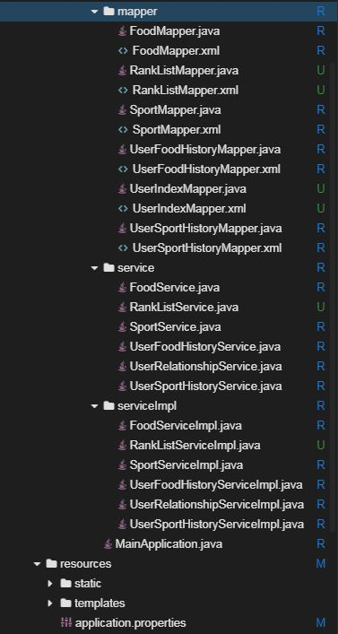

# 实现排行榜

## 介绍

题目需求如下：

需求1. 为激励用户运动，实现用户排行榜功能，前端传`YYYY-MM-DD`格式的日期参数，后端接口返回指定日期，全部用户id、用户消耗能量数值。

## 目标

1. 启动Spring Boot项目代码没有bug，可以正常启动，控制台打印出启动日志。

2. 通过curl访问，正确的URL及返回结果如下所示

   

## 提示语

1. 创建好的项目目录结构如下图所示
   
   
2. 该需求难点在于`SQL语句`，提示可以考虑基于`table user_sport_history` 和`table sport `的表连接

## 知识点

- Spring Boot的开发，包括`@RestController`、 `@RequestMapping`、  `@GetMapping`、 `@PostMapping `、 `@DeleteMapping`、 `@PutMapping`等常见注解的使用
- Mybatis的开发，包括`select`、`resultMap`常见标签的使用
- MySQL中 `group by`、`order by`、`join`的使用

