# 后台接口开发(用户侧-2)

##  一、实验简介

### 1.1 实验内容
​	本节实验依然是用户端后台接口开发，主要有三大功能

- 记录用户饮食情况
- 记录用户运动情况


- 显示用户主要生理指标与用户饮食、运动关系，以此来指导用户合理饮食和运动

### 1.2 实验知识点

- Spring Boot HTTP开发、常用配置
- Mybatis 常用配置及CURD操作
- Mybatis分页
- Mybatis级联查询

### 1.3 效果展示

​	安装`jq`软件，可以美化`json`数据，为了减少版面，这里演示一个接口，大家在测试的时候可以在`curl`后增加一个管道符`|`使用`jq`

```shell
$ sudo apt-get update
$ sudo apt-get -y install jq
```

​	下图为通过`curl`向后台接口发送请求，后台接口返回给前端的数据。该接口功能为获取`userId=1`用户的生理指标与用户饮食、运动数据，前端可以使用这组数据渲染页面，展示用户体重、血压等指标与用户运动、饮食的关系。

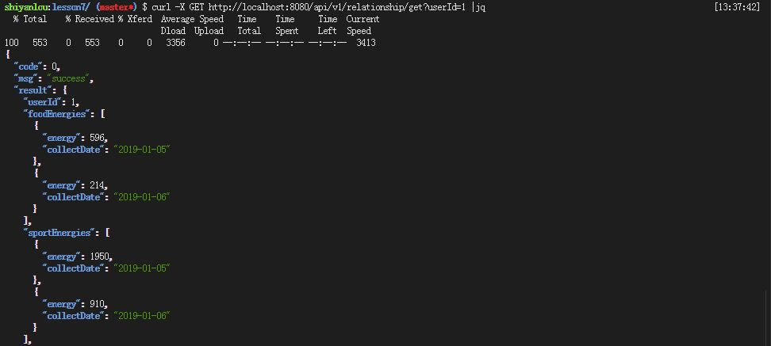


​	上面的`json`数据主要字段含义解释如下：

- `userId` ：用户`id`
- `foodEnergies` ：用户饮食情况
  - `energy` ：用户摄入能量，单位千卡
  - `collectDate` ：记录用户摄入能量日期
- `sportEnergies` ：用户运动情况
  - `energy` ：用户运动消耗能量，单位千卡
  - `collectDate` ：记录用户消耗能量日期
- `userIndexs `：用户主要生理指标
  - `id` ：主键`id`
  - `indexType` ：用户生理指标类型
  - `indexContent` ：用户生理指标
  - `collectDate `：记录用户生理指标日期


### 1.4 实验环境

- Eclipse Neon.2 Release (4.6.2)
- Java 1.8
- Maven 3.5
- Spring Boot 2.0.6
- Mybatis 3.4.6
- MySQL 5.7
- curl

## 二、实验步骤

#### 2.1 项目结构


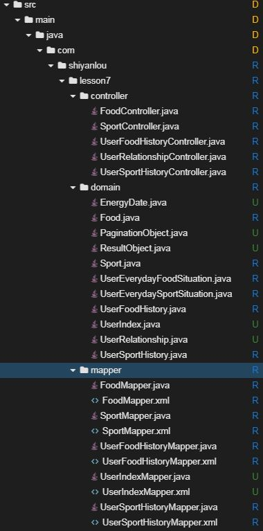

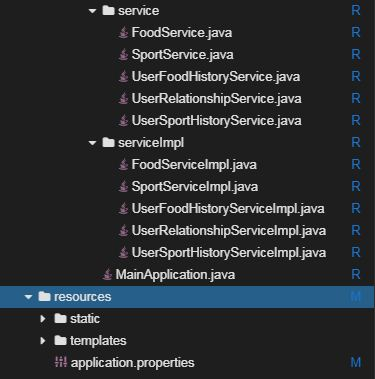

#### 2.2 创建项目

在web IDE界面中，选择File -> Open New Terminal，在终端中输入

```shell
$ mvn archetype:generate -DgroupId=com.shiyanlou -DartifactId=lesson7 -DarchetypeArtifactId=maven-archetype-webapp
```

参数介绍：

- `archetype:generate`：表示使用maven创建项目基本骨架
- `DgroupId`：该项目所属组织，一般将域名倒着写，例如：com.shiyanlou
- `DartifactId`：项目名称，例如：lesson7
- `DarchetypeArtifactId`：指定所用maven项目骨架类型

输入命令后，maven开始创建项目、下载所需的依赖，等待片刻，maven提示我们输入版本号，直接回车，我们使用默认版本号`1.0-SNAPSHOT`即可。随后maven会输出`groupId`、`artifactId`、`version`、`package`这些基本信息，直接输入`Y`确认即可。最后可以看到绿色的`BUILD SUCCESS`项目创建成功的提示。

然后在web IDE界面中，选择File -> Open Workspace切换工作空间，选择lesson7目录，必须切换到该目录下，否则识别不了项目。

最后大家可以根据上图所示的目录结构，自己创建目录、文件，较为简单，无需赘述。


#### 2.3 修改pom文件

`将如下配置文件覆盖到pom.xml中`

- `spring-boot-starter-web`：Spring Boot为Web开发提供支持
- `mybatis-spring-boot-starter`：为Mybatis与Spring Boot整合提供支持
- `mysql-connector-java`：MySQL的JDBC驱动包，连接MySQL数据库时必须使用该jar包。
- `druid`：阿里巴巴开源的数据库连接池

- `pagehelper-spring-boot-starter`用来支持Mybatis分页
- `spring-boot-devtools`用来支持热部署，当配置了`devtools `后，我们在`classpath`修改任何文件，保存后，项目都将会自动重启，方便开发。

   ```xml
   <?xml version="1.0" encoding="UTF-8"?>
   <project xmlns="http://maven.apache.org/POM/4.0.0" xmlns:xsi="http://www.w3.org/2001/XMLSchema-instance"
   	xsi:schemaLocation="http://maven.apache.org/POM/4.0.0 http://maven.apache.org/xsd/maven-4.0.0.xsd">
   	<modelVersion>4.0.0</modelVersion>

   	<groupId>com.shiyanlou</groupId>
   	<artifactId>lesson7</artifactId>
   	<version>0.0.1-SNAPSHOT</version>
   	<packaging>jar</packaging>

   	<name>health</name>
   	<description>Demo project for Spring Boot</description>

   	<parent>
   		<groupId>org.springframework.boot</groupId>
   		<artifactId>spring-boot-starter-parent</artifactId>
   		<version>2.0.1.RELEASE</version>
   		<relativePath /> <!-- lookup parent from repository -->
   	</parent>

   	<properties>
   		<project.build.sourceEncoding>UTF-8</project.build.sourceEncoding>
   		<project.reporting.outputEncoding>UTF-8</project.reporting.outputEncoding>
   		<java.version>1.8</java.version>
   	</properties>

   	<dependencies>
   		<dependency>
   			<groupId>org.springframework.boot</groupId>
   			<artifactId>spring-boot-starter-web</artifactId>
   		</dependency>
   		<dependency>
   			<groupId>org.mybatis.spring.boot</groupId>
   			<artifactId>mybatis-spring-boot-starter</artifactId>
   			<version>1.3.2</version>
   		</dependency>

   		<dependency>
   			<groupId>mysql</groupId>
   			<artifactId>mysql-connector-java</artifactId>
   			<scope>runtime</scope>
   		</dependency>

   		<dependency>
   			<groupId>com.alibaba</groupId>
   			<artifactId>druid</artifactId>
   			<version>1.1.6</version>
   		</dependency>

   		<dependency>
   			<groupId>com.github.pagehelper</groupId>
   			<artifactId>pagehelper-spring-boot-starter</artifactId>
   			<version>1.2.3</version>
   		</dependency>

   		<dependency>
   			<groupId>org.springframework.boot</groupId>
   			<artifactId>spring-boot-devtools</artifactId>
   			<optional>true</optional>
   		</dependency>

   		<dependency>
   			<groupId>org.springframework.boot</groupId>
   			<artifactId>spring-boot-starter-test</artifactId>
   			<scope>test</scope>
   		</dependency>
   	</dependencies>

   	<build>
   		<plugins>
   			<plugin>
   				<groupId>org.springframework.boot</groupId>
   				<artifactId>spring-boot-maven-plugin</artifactId>
   			</plugin>
   		</plugins>

   		<resources>
               <resource>
                   <directory>src/main/java</directory>
                   <excludes>
                       <exclude>**/*.java</exclude>
                   </excludes>
               </resource>
           </resources>
   	</build>
   </project>
   ```


#### 2.4 创建application文件

`该文件主要介绍关于数据库基本的基本配置十分重要，选中src/main/resources，右键 -> New -> file-> Name填入application.properties -> Finish。`

- `spring.datasource.driver-class-name`：指定driver-class
- `spring.datasource.url`：指定数据库host、port、database、encode
- `spring.datasource.username`：指定用户名
- `spring.datasource.password`：指定密码
- `spring.datasource.type`：指定数据库连接池
- `logging.level`：开启日志，开发时可以打印SQL语句

```properties
spring.datasource.driver-class-name=com.mysql.jdbc.Driver
spring.datasource.url=jdbc:mysql://localhost:3306/lesson7?useUnicode=true&characterEncoding=utf-8
spring.datasource.username=root
spring.datasource.password=
spring.datasource.type=com.alibaba.druid.pool.DruidDataSource
logging.level.com.shiyanlou.lesson7.mapper=debug
```


#### 2.5 创建数据库和数据表

启动MySQL数据库服务

```sh
$ sudo service mysql start
```

进入MySQL数据库

```sh
$ mysql -uroot
```

创建数据库

```sql
mysql> create database lesson7; 
```
导入数据表

```sh
$ mysql -uroot lesson7 < dump.sql
```

由下图可见五张数据表的关系。

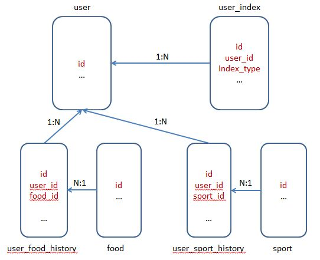

#### 2.6 创建mapper目录及文件

`FoodMapper.java` 是对`table food`的CRUD，实现对食物的后台管理

```java
package com.shiyanlou.lesson7.mapper;

import java.util.List;

import com.shiyanlou.lesson7.domain.Food;

public interface FoodMapper {
   	
  	/**
	 * 创建食物
	 * @param food
	 * @return
	 */
	int insert(Food food);
	
   	/**
	 * 查询食物
	 * @param id
	 * @return
	 */
	Food getById(int id);
	
   	/**
	 * 查询所有食物
	 * @param
	 * @return
	 */
	List<Food> getAll();
	
   	/**
	 * 更新食物
	 * @param food
	 * @return
	 */
	int update(Food food);
	
   	/**
	 * 删除食物
	 * @param id
	 * @return
	 */
	int delete(int id);
}
```


`SportMapper.java `是对`table sport`的CRUD，实现对运动的后台管理

```java
package com.shiyanlou.lesson7.mapper;

import java.util.List;

import com.shiyanlou.lesson7.domain.Sport;

public interface SportMapper {
 	 
  	/**
	 * 创建运动
	 * @param sport
	 * @return
	 */
	int insert(Sport sport);
	
  	/**
	 * 查询运动
	 * @param id
	 * @return
	 */
	Sport getById(int id);
	
  	/**
	 * 查询所有运动
	 * @param
	 * @return
	 */
	List<Sport> getAll();
	
  	/**
	 * 更新运动
	 * @param sport
	 * @return
	 */
	int update(Sport sport);
	
  	/**
	 * 删除运动
	 * @param id
	 * @return
	 */
	int delete(int id);
}
```


`UserFoodHistoryMapper.java` 是对`table user_food_history`的增删操作，实现对用户饮食历史的管理

```java
package com.shiyanlou.lesson7.mapper;

import java.util.List;

import com.shiyanlou.lesson7.domain.EnergyDate;
import com.shiyanlou.lesson7.domain.UserFoodHistory;

public interface UserFoodHistoryMapper {
	// 记录用户饮食
	public int insert(UserFoodHistory userFoodHistory);
	// 获取指定用户所用饮食记录
	public List<UserFoodHistory> getAll(int userId);
	// 获取指定用户每日的摄入能量
	public List<EnergyDate> getSumFoodEnergy(int userId);
}
```


`UserSportHistoryMapper.java` 是对`table user_sport_history`的增删操作，实现对用户运动历史的管理

```java
package com.shiyanlou.lesson7.mapper;

import java.util.List;

import com.shiyanlou.lesson7.domain.EnergyDate;
import com.shiyanlou.lesson7.domain.UserSportHistory;

public interface UserSportHistoryMapper {
	// 记录用户运动
	public int insert(UserSportHistory userSportHistory);
	// 获取指定用户所有运动记录
	public List<UserSportHistory> getAll(int userId);
	//  获取指定用户每日的运动消耗能量
	public List<EnergyDate> getSumConsumeEnergy(int userId);
}
```


`UserIndexMapper.java` 是对`table user_index`的查询操作，实现对用户生理指标的管理 

```java
package com.shiyanlou.lesson7.mapper;

import java.util.List;

import com.shiyanlou.lesson7.domain.UserIndex;

public interface UserIndexMapper {
	// 获取指定用户所有生理指标
	List<UserIndex> getById(int userId);
}
```


`FoodMapper.xml`  实现`FoodMapper.java`接口中定义的方法

```xml
<?xml version="1.0" encoding="UTF-8"?>
 <!DOCTYPE mapper 
 PUBLIC "-//mybatis.org//DTD Mapper 3.0//EN" 
 "http://mybatis.org/dtd/mybatis-3-mapper.dtd">
 
<mapper namespace="com.shiyanlou.lesson7.mapper.FoodMapper">
	<select id="getById" parameterType="Integer" resultType="com.shiyanlou.lesson7.domain.Food">
		select id, name, description,
		food_energy as foodEnergy
		from food where id = #{id};
	</select>
	
	<select id="getByIdBreif" parameterType="Integer" resultType="com.shiyanlou.lesson7.domain.Food">
		select id, name,
		food_energy as foodEnergy
		from food where id = #{id};
	</select>
	
	<insert id="insert" parameterType="com.shiyanlou.lesson7.domain.Food"
	useGeneratedKeys="true" keyProperty="id">
		insert into food(name, description, food_energy) 
		values(#{name}, #{description}, #{foodEnergy});
	</insert>
	
	<select id="getAll" resultType="com.shiyanlou.lesson7.domain.Food">
		select id, name, description,
		food_energy as foodEnergy
		from food
	</select>
	
	<update id="update" parameterType="com.shiyanlou.lesson7.domain.Food">
		update food
		<set>
			<if test="name != null and name != ''">
				name = #{name},
			</if>
			<if test="description != null and description != ''">
				description = #{description},
			</if>
			<if test="foodEnergy != null and foodEnergy != ''">
				food_energy = #{foodEnergy},
			</if>
		</set>
		where id = #{id};
	</update>
	
	<delete id="delete" parameterType="Integer">
		delete from food where id = #{id};
	</delete>
</mapper>
```


`SportMapper.xml` 实现`SportMapper.java`接口中定义的方法

```xml
<?xml version="1.0" encoding="UTF-8"?>
 <!DOCTYPE mapper 
 PUBLIC "-//mybatis.org//DTD Mapper 3.0//EN" 
 "http://mybatis.org/dtd/mybatis-3-mapper.dtd">
 
<mapper namespace="com.shiyanlou.lesson7.mapper.SportMapper">
	<select id="getById" parameterType="Integer" resultType="com.shiyanlou.lesson7.domain.Sport">
		select id, name, description, 
		consume_energy as consumeEnergy
		from sport where id = #{id};
	</select>
	
	<select id="getByIdBreif" parameterType="Integer" resultType="com.shiyanlou.lesson7.domain.Sport">
		select id, name,
		consume_energy as consumeEnergy
		from sport where id = #{id};
	</select>
	
	<insert id="insert" parameterType="com.shiyanlou.lesson7.domain.Sport"
	useGeneratedKeys="true" keyProperty="id">
		insert into sport(name, description, consume_energy) 
		values(#{name}, #{description}, #{consumeEnergy});
	</insert>
	
	<select id="getAll" resultType="com.shiyanlou.lesson7.domain.Sport">
		select * from sport
	</select>
	
	<update id="update" parameterType="com.shiyanlou.lesson7.domain.Sport">
		update sport
		<set>
			<if test="name != null and name != ''">
				name = #{name},
			</if>
			<if test="description != null and description != ''">
				description = #{description},
			</if>
			<if test="consumeEnergy != null and consumeEnergy != ''">
				consume_energy = #{consumeEnergy},
			</if>
		</set>
		where id = #{id};
	</update>
	
	<delete id="delete" parameterType="Integer">
		delete from sport where id = #{id};
	</delete>
</mapper>
```


`UserFoodHistoryMapper.xml` 实现`UserFoodHistoryMapper.java`接口中定义的方法

```xml
<?xml version="1.0" encoding="UTF-8"?>
 <!DOCTYPE mapper 
 PUBLIC "-//mybatis.org//DTD Mapper 3.0//EN" 
 "http://mybatis.org/dtd/mybatis-3-mapper.dtd">
 <mapper namespace="com.shiyanlou.lesson7.mapper.UserFoodHistoryMapper">
 
 	<resultMap type="com.shiyanlou.lesson7.domain.UserFoodHistory" 
 		id="UserFoodHistoryResultMap">
 		<id column="id" property="id"/>
 		<result column="user_id" property="userId"/>
 		<result column="food_quantity" property="foodQuantity"/>
 		<result column="collect_date" property="collectDate"/>
 		<association property="food" column="food_id"
 			select="com.shiyanlou.lesson7.mapper.FoodMapper.getByIdBreif" />
 	</resultMap>
 
 	<select id="getAll" parameterType="Integer" 
 		resultMap="UserFoodHistoryResultMap">
 		select 
 		id,
 		user_id,
 		food_id,
 		food_quantity,
 		collect_date
 		from user_food_history where user_id = #{userId};
 	</select>
 	
 	<resultMap type="com.shiyanlou.lesson7.domain.EnergyDate" id="EnergyDateMap">
 		<result column="sum_food_energy" property="energy"/>
 		<result column="collect_date" property="collectDate"/>
 	</resultMap>
 	
 	<select id="getSumFoodEnergy" parameterType="Integer" resultMap="EnergyDateMap">
 		select 
	      sum(food_quantity * food_energy / 500) as sum_food_energy, collect_date 
	    from 
	      user_food_history u 
	    join 
	      food f 
	    on 
	      u.food_id = f.id 
	    where 
	      user_id = #{userId}
	    group by 
	      collect_date;
 	</select>
 	
 	<insert id="insert" parameterType="com.shiyanlou.lesson7.domain.UserFoodHistory" 
 		useGeneratedKeys="true" keyProperty="id">
 		insert into 
 			user_food_history
 			(user_id, food_id, food_quantity, collect_date) 
 		values
 			(#{userId}, #{food.id}, #{foodQuantity}, #{collectDate});
 	</insert>
 </mapper>
```


`UserSportHistoryMapper.xml` 实现`UserSportHistoryMapper.java`接口中定义的方法

```xml
<?xml version="1.0" encoding="UTF-8"?>
 <!DOCTYPE mapper 
 PUBLIC "-//mybatis.org//DTD Mapper 3.0//EN" 
 "http://mybatis.org/dtd/mybatis-3-mapper.dtd">
 <mapper namespace="com.shiyanlou.lesson7.mapper.UserSportHistoryMapper">
 
 	<resultMap type="com.shiyanlou.lesson7.domain.UserSportHistory" 
 		id="UserSportHistoryResultMap">
 		<id column="id" property="id"/>
 		<result column="user_id" property="userId"/>
 		<result column="sport_time" property="sportTime"/>
 		<result column="collect_date" property="collectDate"/>
 		<association property="sport" column="sport_id"
 			select="com.shiyanlou.lesson7.mapper.SportMapper.getByIdBreif" />
 	</resultMap>
 
 	<select id="getAll" parameterType="Integer" 
 		resultMap="UserSportHistoryResultMap">
 		select 
 		id,
 		user_id,
 		sport_id,
 		sport_time,
 		collect_date
 		from user_sport_history where user_id = #{userId};
 	</select>
 	
 	<resultMap type="com.shiyanlou.lesson7.domain.EnergyDate" id="EnergyDateMap">
 		<result column="sum_consume_energy" property="energy"/>
 		<result column="collect_date" property="collectDate"/>
 	</resultMap>
 	
 	<select id="getSumConsumeEnergy" parameterType="Integer" resultMap="EnergyDateMap">
 		select 
 			sum(sport_time * consume_energy) as sum_consume_energy, collect_date 
 		from 
 			user_sport_history u 
 		join 
 			sport s 
 		on 
 			u.sport_id = s.id 
 		where 
 			user_id = #{userId}
 		group by 
 			collect_date;
 	</select>
 	
 	<insert id="insert" parameterType="com.shiyanlou.lesson7.domain.UserSportHistory" 
 		useGeneratedKeys="true" keyProperty="id">
 		insert into 
 			user_sport_history
 			(user_id, sport_id, sport_time, collect_date) 
 		values
 			(#{userId}, #{sport.id}, #{sportTime}, #{collectDate});
 	</insert>
 </mapper>
```


`UserIndexMapper.xml` 实现`UserIndexMapper.java`接口中定义的方法

```xml
<?xml version="1.0" encoding="UTF-8"?>
 <!DOCTYPE mapper 
 PUBLIC "-//mybatis.org//DTD Mapper 3.0//EN" 
 "http://mybatis.org/dtd/mybatis-3-mapper.dtd">
 <mapper namespace="com.shiyanlou.lesson7.mapper.UserIndexMapper">
	<select id="getById" parameterType="Integer" 
	resultType="com.shiyanlou.lesson7.domain.UserIndex">
		select id, 
		index_type as indexType,
		index_content as indexContent,
		collect_date as collectDate
 		from user_index where user_id = #{userId};
	</select>
</mapper> 
```


#### 2.7 创建domain目录及文件

`ResultObject ` 封装后端返回结果、后端状态、失败消息等属性

```java
package com.shiyanlou.lesson6.domain;

public class ResultObject {

  	// 后台状态
	private int code;
  	// 返回消息
	private String msg;
  	// 结果
	private Object result;
	public ResultObject() {
		super();
		// TODO Auto-generated constructor stub
	}
	public ResultObject(int code, String msg, Object result) {
		super();
		this.code = code;
		this.msg = msg;
		this.result = result;
	}
  
  	// 属性setter、getter方法
	public int getCode() {
		return code;
	}
	public void setCode(int code) {
		this.code = code;
	}
	public String getMsg() {
		return msg;
	}
	public void setMsg(String msg) {
		this.msg = msg;
	}
	public Object getResult() {
		return result;
	}
	public void setResult(Object result) {
		this.result = result;
	}
  
  	// 重写toString方法
	@Override
	public String toString() {
		return "ResultObject [code=" + code + ", msg=" + msg + ", result=" + result + "]";
	}
}
```


`PaginationObject.java` 封装分页查询结果

```java
package com.shiyanlou.lesson6.domain;

public class PaginationObject {
	
  	// 结果
	private Object list;
  	// 第几页
	private int pageNum;
  	// 每页记录个数
	private int pageSize;
  	// 记录总数
	private long total;
	public PaginationObject() {
		super();
		// TODO Auto-generated constructor stub
	}
	public PaginationObject(Object list, int pageNum, int pageSize, long total) {
		super();
		this.list = list;
		this.pageNum = pageNum;
		this.pageSize = pageSize;
		this.total = total;
	}
  
  	// 属性setter、getter方法
	public Object getList() {
		return list;
	}
	public void setList(Object list) {
		this.list = list;
	}
	public int getPageNum() {
		return pageNum;
	}
	public void setPageNum(int pageNum) {
		this.pageNum = pageNum;
	}
	public int getPageSize() {
		return pageSize;
	}
	public void setPageSize(int pageSize) {
		this.pageSize = pageSize;
	}
	public long getTotal() {
		return total;
	}
	public void setTotal(long total) {
		this.total = total;
	}
  
  	// 重写toString方法
	@Override
	public String toString() {
		return "PaginationObject [list=" + list + ", pageNum=" + pageNum + ", pageSize=" + pageSize + ", total=" + total + "]";
	}
}
```


`EnergyDate.java` 表示某日用户消耗、摄入能量情况

```java
package com.shiyanlou.lesson7.domain;

import java.sql.Date;

public class EnergyDate {

	private int energy;
  	// 用户摄入能量或消耗能量
	private Date collectDate;
    // 日期
	public EnergyDate() {
		super();
		// TODO Auto-generated constructor stub
	}
	public EnergyDate(int energy, Date collectDate) {
		super();
		this.energy = energy;
		this.collectDate = collectDate;
	}
	public int getEnergy() {
		return energy;
	}
	public void setEnergy(int energy) {
		this.energy = energy;
	}
	public Date getCollectDate() {
		return collectDate;
	}
	public void setCollectDate(Date collectDate) {
		this.collectDate = collectDate;
	}
  	
  	// 重写toString方法
	@Override
	public String toString() {
		return "EnergyDate [energy=" + energy + ", collectDate=" + collectDate + "]";
	}
}
```


`Food.java` 食物类，描述食物信息

```java
package com.shiyanlou.lesson7.domain;

import com.fasterxml.jackson.annotation.JsonInclude;
import com.fasterxml.jackson.annotation.JsonInclude.Include;

@JsonInclude(Include.NON_DEFAULT)
public class Food {

    // 主键自增id
	private int id;
  	// 食物名称
	private String name;
    // 食物描述
	private String description;
    // 食物每500g所含能量
	private int foodEnergy;
  
	public Food() {
		super();
		// TODO Auto-generated constructor stub
	}

	public Food(String name, String description, int foodEnergy) {
		super();
		this.name = name;
		this.description = description;
		this.foodEnergy = foodEnergy;
	}

	public int getId() {
		return id;
	}

	public void setId(int id) {
		this.id = id;
	}

  	// 属性setter、getter方法
	public String getName() {
		return name;
	}

	public void setName(String name) {
		this.name = name;
	}

	public String getDescription() {
		return description;
	}

	public void setDescription(String description) {
		this.description = description;
	}

	public int getFoodEnergy() {
		return foodEnergy;
	}

	public void setFoodEnergy(int foodEnergy) {
		this.foodEnergy = foodEnergy;
	}

  	// 重写toString方法
	@Override
	public String toString() {
		return "Food [id=" + id + ", name=" + name + ", description=" + description + ", foodEnergy=" + foodEnergy + "]";
	}	
}
```


`Sport.java` 运动类，描述运动信息

```java
package com.shiyanlou.lesson7.domain;

import com.fasterxml.jackson.annotation.JsonInclude;
import com.fasterxml.jackson.annotation.JsonInclude.Include;

@JsonInclude(Include.NON_DEFAULT)
public class Sport {
  
  	// 主键自增id
	private int id;
  	// 运动名称
	private String name;
  	// 运动描述  
	private String description;
	// 运动每小时所消耗能量
	private int consumeEnergy;
	
	public Sport() {
		super();
		// TODO Auto-generated constructor stub
	}

	public Sport(String name, String description, int consumeEnergy) {
		super();
		this.name = name;
		this.description = description;
		this.consumeEnergy = consumeEnergy;
	}

    // 属性setter、getter方法
	public int getId() {
		return id;
	}

	public void setId(int id) {
		this.id = id;
	}

	public String getName() {
		return name;
	}

	public void setName(String name) {
		this.name = name;
	}

	public String getDescription() {
		return description;
	}

	public void setDescription(String description) {
		this.description = description;
	}

	public int getConsumeEnergy() {
		return consumeEnergy;
	}

	public void setConsumeEnergy(int consumeEnergy) {
		this.consumeEnergy = consumeEnergy;
	}

  	// 重写toString方法
	@Override
	public String toString() {
		return "Sport [id=" + id + ", name=" + name + ", description=" + description + ", consumeEnergy=" + consumeEnergy + "]";
	}	
}
```


`UserFoodHistory.java` 记录用户饮食历史

```java
package com.shiyanlou.lesson7.domain;

import java.sql.Date;

import com.fasterxml.jackson.annotation.JsonIgnore;
import com.fasterxml.jackson.annotation.JsonInclude;
import com.fasterxml.jackson.annotation.JsonInclude.Include;

@JsonInclude(Include.NON_DEFAULT)
public class UserFoodHistory {
  	// 主键自增id
	private int id;
  	// 用户id
	private int userId;
  	// 食物详情
	private Food food;
  	// 该食物摄入量，单位g
	private int foodQuantity;
  	// 摄入饮食日期
	private Date collectDate;
	
	public UserFoodHistory() {
		super();
		// TODO Auto-generated constructor stub
	}

	public UserFoodHistory(int userId, Food food, int foodQuantity, Date collectDate) {
		super();
		this.userId = userId;
		this.food = food;
		this.foodQuantity = foodQuantity;
		this.collectDate = collectDate;
	}

    // 属性setter、getter方法
	public int getId() {
		return id;
	}

	public void setId(int id) {
		this.id = id;
	}

	public int getUserId() {
		return userId;
	}

	public void setUserId(int userId) {
		this.userId = userId;
	}

	public Food getFood() {
		return food;
	}

	public void setFood(Food food) {
		this.food = food;
	}

	public int getFoodQuantity() {
		return foodQuantity;
	}

	public void setFoodQuantity(int foodQuantity) {
		this.foodQuantity = foodQuantity;
	}

	public Date getCollectDate() {
		return collectDate;
	}

	public void setCollectDate(Date collectDate) {
		this.collectDate = collectDate;
	}

  	// 重写toString
	@Override
	public String toString() {
		return "UserFoodHistory [id=" + id + ", userId=" + userId + ", food=" + food + ", foodQuantity=" + foodQuantity + ", collectDate=" + collectDate + "]";
	}
}
```


`UserSportHistory.java` 记录用户运动历史

```java
package com.shiyanlou.lesson7.domain;

import java.sql.Date;

import com.fasterxml.jackson.annotation.JsonIgnore;
import com.fasterxml.jackson.annotation.JsonInclude;
import com.fasterxml.jackson.annotation.JsonInclude.Include;

@JsonInclude(Include.NON_DEFAULT)
public class UserSportHistory {
	
    // 主键自增id
	private int id;
  	// 用户id
	private int userId;
  	// 运动详情
	private Sport sport;
  	// 运动时间，单位h
	private int sportTime;
  	// 运动日期
	private Date collectDate;
	
	public UserSportHistory() {
		super();
		// TODO Auto-generated constructor stub
	}

	public UserSportHistory(int userId, Sport sport, int sportTime, Date collectDate) {
		super();
		this.userId = userId;
		this.sport = sport;
		this.sportTime = sportTime;
		this.collectDate = collectDate;
	}

  	// 属性的setter、getter方法
	public int getId() {
		return id;
	}

	public void setId(int id) {
		this.id = id;
	}

	public int getUserId() {
		return userId;
	}

	public void setUserId(int userId) {
		this.userId = userId;
	}

	public Sport getSport() {
		return sport;
	}

	public void setSport(Sport sport) {
		this.sport = sport;
	}

	public int getSportTime() {
		return sportTime;
	}

	public void setSportTime(int sportTime) {
		this.sportTime = sportTime;
	}

	public Date getCollectDate() {
		return collectDate;
	}

	public void setCollectDate(Date collectDate) {
		this.collectDate = collectDate;
	}

  	// 重写toString方法
	@Override
	public String toString() {
		return "UserSportHistory [id=" + id + ", userId=" + userId + ", sport=" + sport + ", sportTime=" + sportTime + ", collectDate=" + collectDate + "]";
	}
}
```


`UserEverydayFoodSituation.java` 表示用户某日摄入能量情况

```java
package com.shiyanlou.lesson7.domain;

import java.sql.Date;
import java.util.List;

public class UserEverydayFoodSituation {
  	
  	// 用户id
	private int userId;
    // 饮食日期
	private Date collectDate;
  	// 该日摄入总能量
	private int sumFoodEnergy;
  	// 该日摄入食物详情
	private List<UserFoodHistory> userFoodHistories;
  
	public UserEverydayFoodSituation() {
		super();
		// TODO Auto-generated constructor stub
	}

	public UserEverydayFoodSituation(int userId, Date collectDate, int sumFoodEnergy,
			List<UserFoodHistory> userFoodHistories) {
		super();
		this.userId = userId;
		this.collectDate = collectDate;
		this.sumFoodEnergy = sumFoodEnergy;
		this.userFoodHistories = userFoodHistories;
	}

    // 属性setter、getter方法
	public int getUserId() {
		return userId;
	}

	public void setUserId(int userId) {
		this.userId = userId;
	}

	public Date getCollectDate() {
		return collectDate;
	}

	public void setCollectDate(Date collectDate) {
		this.collectDate = collectDate;
	}

	public int getSumFoodEnergy() {
		return sumFoodEnergy;
	}

	public void setSumFoodEnergy(int sumFoodEnergy) {
		this.sumFoodEnergy = sumFoodEnergy;
	}

	public List<UserFoodHistory> getUserFoodHistories() {
		return userFoodHistories;
	}

	public void setUserFoodHistories(List<UserFoodHistory> userFoodHistories) {
		this.userFoodHistories = userFoodHistories;
	}

  	// 重写toString方法
	@Override
	public String toString() {
		return "UserEverydayFoodSituation [userId=" + userId + ", collectDate=" + collectDate + ", sumFoodEnergy=" + sumFoodEnergy + ", userFoodHistories=" + userFoodHistories + "]";
	}
}
```


`UserEverydaySportSituation.java` 表示用户某日消耗能量情况

```java
package com.shiyanlou.lesson7.domain;

import java.sql.Date;
import java.util.List;

public class UserEverydaySportSituation {
  
  	// 用户id
	private int userId;
  	// 用户运动日期
	private Date collectDate;
    // 该日总消耗能量
	private int sumConsumeEnergy;
	// 该日用户各项运动详情
	private List<UserSportHistory> userSportHistories;
	
	public UserEverydaySportSituation() {
		super();
		// TODO Auto-generated constructor stub
	}

	public UserEverydaySportSituation(int userId, Date collectDate, int sumConsumeEnergy,
			List<UserSportHistory> userSportHistories) {
		super();
		this.userId = userId;
		this.collectDate = collectDate;
		this.sumConsumeEnergy = sumConsumeEnergy;
		this.userSportHistories = userSportHistories;
	}

  	// 属性setter、getter方法
	public int getUserId() {
		return userId;
	}

	public void setUserId(int userId) {
		this.userId = userId;
	}

	public Date getCollectDate() {
		return collectDate;
	}

	public void setCollectDate(Date collectDate) {
		this.collectDate = collectDate;
	}

	public int getSumConsumeEnergy() {
		return sumConsumeEnergy;
	}

	public void setSumConsumeEnergy(int sumConsumeEnergy) {
		this.sumConsumeEnergy = sumConsumeEnergy;
	}

	public List<UserSportHistory> getUserSportHistories() {
		return userSportHistories;
	}

	public void setUserSportHistories(List<UserSportHistory> userSportHistories) {
		this.userSportHistories = userSportHistories;
	}

  	// 重写toString方法
	@Override
	public String toString() {
		return "UserEverydaySportSituation [userId=" + userId + ", collectDate=" + collectDate + ", sumConsumeEnergy=" + sumConsumeEnergy + ", userSportHistories=" + userSportHistories + "]";
	}
}
```


`UserRelationship.java` 表示用户每日摄入能量、消耗能量、生理指标关系

```java
package com.shiyanlou.lesson7.domain;

import java.util.List;
import java.util.Map;

public class UserRelationship {
	
  	// 用户id
	private int userId;
  	// 用户每日饮食摄入能量
	private List<EnergyDate> foodEnergies;
  	// 用户每日运动消耗能量
	private List<EnergyDate> sportEnergies;
  	// 用户每日各项生理指标的情况
	private Map<Integer, List<UserIndex>> userIndexs;
  
	public UserRelationship() {
		super();
		// TODO Auto-generated constructor stub
	}
	public UserRelationship(int userId, List<EnergyDate> foodEnergies, List<EnergyDate> sportEnergies,
			Map<Integer, List<UserIndex>> userIndexs) {
		super();
		this.userId = userId;
		this.foodEnergies = foodEnergies;
		this.sportEnergies = sportEnergies;
		this.userIndexs = userIndexs;
	}
  
  	// 属性setter、getter方法
	public int getUserId() {
		return userId;
	}
	public void setUserId(int userId) {
		this.userId = userId;
	}
	public List<EnergyDate> getFoodEnergies() {
		return foodEnergies;
	}
	public void setFoodEnergies(List<EnergyDate> foodEnergies) {
		this.foodEnergies = foodEnergies;
	}
	public List<EnergyDate> getSportEnergies() {
		return sportEnergies;
	}
	public void setSportEnergies(List<EnergyDate> sportEnergies) {
		this.sportEnergies = sportEnergies;
	}
	public Map<Integer, List<UserIndex>> getUserIndexs() {
		return userIndexs;
	}
	public void setUserIndexs(Map<Integer, List<UserIndex>> userIndexs) {
		this.userIndexs = userIndexs;
	}
  	
  	// 重写toString方法
	@Override
	public String toString() {
		return "UserRelationship [userId=" + userId + ", foodEnergies=" + foodEnergies + ", sportEnergies=" + sportEnergies + ", userIndexs=" + userIndexs + "]";
	}
}
```


`UserIndex.java` 用户生理指标类，封装`id`、生理指标等属性

```java
package com.shiyanlou.lesson7.domain;

import java.sql.Date;

import com.fasterxml.jackson.annotation.JsonInclude;
import com.fasterxml.jackson.annotation.JsonInclude.Include;

public class UserIndex {

  	// 自增id在delete和update时会使用
	private int id;
  
  	// 用户id
	@JsonInclude(Include.NON_DEFAULT)
	private int userId;
  
  	// 生理指标类型，包括（体重、血压、血糖、血脂、心率等）
	@JsonInclude(Include.NON_DEFAULT)
	private int indexType;
  
  	// 生理指标值
	private int indexContent;
  
  	// 用户上传日期
	private Date collectDate;
  
	public UserIndex() {
		super();
		// TODO Auto-generated constructor stub
	}
	public UserIndex(int userId, int indexType, int indexContent, Date collectDate) {
		super();
		this.userId = userId;
		this.indexType = indexType;
		this.indexContent = indexContent;
		this.collectDate = collectDate;
	}
  
    // 属性setter、getter方法
	public int getId() {
		return id;
	}
	public void setId(int id) {
		this.id = id;
	}
	public int getUserId() {
		return userId;
	}
	public void setUserId(int userId) {
		this.userId = userId;
	}
	public int getIndexType() {
		return indexType;
	}
	public void setIndexType(int indexType) {
		this.indexType = indexType;
	}
	public int getIndexContent() {
		return indexContent;
	}
	public void setIndexContent(int indexContent) {
		this.indexContent = indexContent;
	}
	public Date getCollectDate() {
		return collectDate;
	}
	public void setCollectDate(Date collectDate) {
		this.collectDate = collectDate;
	}
  	
  	// 重写toString方法
	@Override
	public String toString() {
		return "UserIndex [id=" + id + ", userId=" + userId + ", indexType=" + indexType + ", indexContent=" + indexContent + ", collectDate=" + collectDate + "]";
	}
}
```


#### 2.8 创建service目录及文件

`FoodService.java` 食物业务接口，定义增删改查等方法

```java
package com.shiyanlou.lesson7.service;

import com.shiyanlou.lesson7.domain.Food;
import com.shiyanlou.lesson7.domain.PaginationObject;

public interface FoodService {
	
  	/**
	 * 查询食物
	 * @param id
	 * @return
	 */
	public Food getFoodById(int id);
	
  	/**
	 * 创建食物
	 * @param food
	 * @return
	 */
	public int insertFood(Food food);
	
  	/**
	 * 分页查询所有食物
	 * @param pageNum 第几页, pageSize 每页多少个
	 * @return
	 */
	public PaginationObject getAllFood(int pageNum, int pageSize);
	
  	/**
	 * 更新食物
	 * @param food
	 * @return
	 */
	public int updateFood(Food food); 
	
  	/**
	 * 删除食物
	 * @param id
	 * @return
	 */
	public int deleteFood(int id);
}
```


`SportService.java` 运动业务接口，定义增删改查等方法

```java
package com.shiyanlou.lesson7.service;

import com.shiyanlou.lesson7.domain.PaginationObject;
import com.shiyanlou.lesson7.domain.Sport;

public interface SportService {
	
  	/**
	 * 查询运动
	 * @param id
	 * @return
	 */
	public Sport getSportById(int id);
	
    /**
	 * 创建运动
	 * @param sport
	 * @return
	 */
	public int insertSport(Sport sport);
	  
  	/**
	 * 分页查询运动
	 * @param pageNum 第几页, pageSize 每页多少个
	 * @return
	 */
	public PaginationObject getAllSport(int pageNum, int pageSize);
	
    /**
	 * 更新运动
	 * @param sport
	 * @return
	 */
	public int updateSport(Sport sport); 
	
    /**
	 * 删除运动
	 * @param id
	 * @return
	 */
	public int deleteSport(int id);
}
```


`UserFoodHistoryService.java` 用户饮食历史业务接口，定义插入、查询等方法

```java
package com.shiyanlou.lesson7.service;

import java.util.List;

import com.shiyanlou.lesson7.domain.UserEverydayFoodSituation;
import com.shiyanlou.lesson7.domain.UserFoodHistory;


public interface UserFoodHistoryService {

    /**
	 * 创建用户饮食记录
	 * @param userFoodHistory
	 * @return
	 */
	public int insertUserFoodHistory(UserFoodHistory userFoodHistory);
	
      /**
	 * 查询用户所有饮食记录
	 * @param userId
	 * @return
	 */
	public List<UserEverydayFoodSituation> getAllUserFoodHistory(int userId);
}
```


`UserRelationshipService.java` 用户饮食、运动、生理指标关系业务接口，定义查询等方法

```java
package com.shiyanlou.lesson7.service;

import com.shiyanlou.lesson7.domain.UserRelationship;

public interface UserRelationshipService {
  	    
  	/**
	 * 查询用户饮食、运动、生理指标关系
	 * @param userId
	 * @return
	 */
	public UserRelationship getRelationship(int userId);
}
```


`UserSportHistoryService.java` 用户运动历史业务接口，定义插入、查询等方法

```java
package com.shiyanlou.lesson7.service;

import java.util.List;

import com.shiyanlou.lesson7.domain.UserEverydaySportSituation;
import com.shiyanlou.lesson7.domain.UserSportHistory;

public interface UserSportHistoryService {

    /**
	 * 创建用户运动记录
	 * @param userSportHistory
	 * @return
	 */
	public int insertUserSportHistory(UserSportHistory userSportHistory);
	
    /**
	 * 查询用户所有运动记录
	 * @param userId
	 * @return
	 */
	public List<UserEverydaySportSituation> getAllUserSportHistory(int userId);
}
```


#### 2.9 创建serviceImpl目录及文件

`FoodServiceImpl.java` 食物业务类，实现`FoodService.java`接口中定义增删改查等方法

```java
package com.shiyanlou.lesson7.serviceImpl;

import java.util.List;

import org.springframework.beans.factory.annotation.Autowired;
import org.springframework.stereotype.Service;

import com.github.pagehelper.PageHelper;
import com.github.pagehelper.PageInfo;
import com.shiyanlou.lesson7.domain.Food;
import com.shiyanlou.lesson7.domain.PaginationObject;
import com.shiyanlou.lesson7.mapper.FoodMapper;
import com.shiyanlou.lesson7.service.FoodService;

// 标识service
@Service
public class FoodServiceImpl implements FoodService{

  	// 自动注入mapper
	@Autowired
	private FoodMapper foodMapper;
	
    /**
	 * 查询食物
	 * @param id
	 * @return
	 */
	public Food getFoodById(int id) {
		Food food = foodMapper.getById(id);
		return food;
	}
	
 	 /**
	 * 创建食物
	 * @param food
	 * @return
	 */
	public int insertFood(Food food) {
		int modifyId = foodMapper.insert(food);
		return modifyId;
	}
	
   /**
	 * 分页查询食物
	 * @param pageNum, pageSize
	 * @return
	 */
	public PaginationObject getAllFood(int pageNum, int pageSize) {
		PageHelper.startPage(pageNum, pageSize);
		List<Food> foods = foodMapper.getAll();
		PageInfo<Food> appsPageInfo = new PageInfo<>(foods);
		long total = appsPageInfo.getTotal();
		PaginationObject paginationObject = new PaginationObject(foods, pageNum, pageSize, total);
		return paginationObject;
	}
		
   /**
	 * 更新食物
	 * @param food
	 * @return
	 */
	public int updateFood(Food food) {
		int modifyId = foodMapper.update(food);
		return modifyId;
	} 
		
   /**
	 * 删除食物
	 * @param id
	 * @return
	 */
	public int deleteFood(int id) {
		int modifyId = foodMapper.delete(id);
		return modifyId;
	}
}
```


`SportServiceImpl.java` 运动业务类，实现`SportService.java`接口中定义增删改查等方法

```java
package com.shiyanlou.lesson7.serviceImpl;

import java.util.List;

import org.springframework.beans.factory.annotation.Autowired;
import org.springframework.stereotype.Service;

import com.github.pagehelper.PageHelper;
import com.github.pagehelper.PageInfo;
import com.shiyanlou.lesson7.domain.PaginationObject;
import com.shiyanlou.lesson7.domain.Sport;
import com.shiyanlou.lesson7.mapper.SportMapper;
import com.shiyanlou.lesson7.service.SportService;

// 标识service
@Service
public class SportServiceImpl implements SportService{

    // 自动注入mapper
	@Autowired
	private SportMapper sportMapper;
	
    /**
	 * 查询运动
	 * @param id
	 * @return
	 */
	public Sport getSportById(int id) {
		Sport sport = sportMapper.getById(id);
		return sport;
	}
	  
  	/**
	 * 创建运动
	 * @param sport
	 * @return
	 */
	public int insertSport(Sport sport) {
		int modifyId = sportMapper.insert(sport);
		return modifyId;
	}
  
    /**
	 * 分页查询运动
	 * @param pageNum, pageSize
	 * @return
	 */
	public PaginationObject getAllSport(int pageNum, int pageSize) {
		PageHelper.startPage(pageNum, pageSize);
		List<Sport> sports = sportMapper.getAll();
		PageInfo<Sport> appsPageInfo = new PageInfo<>(sports);
		long total = appsPageInfo.getTotal();
		PaginationObject paginationObject = new PaginationObject(sports, pageNum, pageSize, total);
		return paginationObject;	}
	
    /**
	 * 更新运动
	 * @param sport
	 * @return
	 */
	public int updateSport(Sport sport) {
		int modifyId = sportMapper.update(sport);
		return modifyId;
	} 
	
    /**
	 * 删除运动
	 * @param id
	 * @return
	 */
	public int deleteSport(int id) {
		int modifyId = sportMapper.delete(id);
		return modifyId;
	}
}
```


`UserFoodHistoryServiceImpl.java` 用户饮食历史业务类，实现`UserFoodHistoryService.java`接口中定义插入、查询等方法

```java
package com.shiyanlou.lesson7.serviceImpl;

import java.sql.Date;
import java.util.ArrayList;
import java.util.HashMap;
import java.util.List;
import java.util.Map;
import java.util.Map.Entry;

import org.springframework.beans.factory.annotation.Autowired;
import org.springframework.stereotype.Service;

import com.shiyanlou.lesson7.domain.UserEverydayFoodSituation;
import com.shiyanlou.lesson7.domain.UserFoodHistory;
import com.shiyanlou.lesson7.mapper.UserFoodHistoryMapper;
import com.shiyanlou.lesson7.service.UserFoodHistoryService;

// 标识service
@Service
public class UserFoodHistoryServiceImpl implements UserFoodHistoryService{
  
  	// 自动注入mapper
	@Autowired
	private UserFoodHistoryMapper userFoodHistoryMapper;
  
  	/**
	 * 创建用户饮食记录
	 * @param userFoodHistory
	 * @return
	 */
	public int insertUserFoodHistory(UserFoodHistory userFoodHistory) {
		int modifyId = userFoodHistoryMapper.insert(userFoodHistory);
		return modifyId;
	}
	
    /**
	 * 查询用户所有饮食记录
	 * @param userId
	 * @return
	 */
	public List<UserEverydayFoodSituation> getAllUserFoodHistory(int userId) {
      	// 获取用户所有饮食记录
		List<UserFoodHistory> userFoodHistories = userFoodHistoryMapper.getAll(userId);
      
        // userFoodMap，key为日期，value为用户该日所有饮食记录
		Map<Date, List<UserFoodHistory>> userFoodMap = new HashMap<>();
		
      	for(UserFoodHistory userFoodHistory: userFoodHistories) {
			Date cDate = userFoodHistory.getCollectDate();
          	// 如果当前日期已经存在于userFoodMap中，将这条饮食记录直接添加到list末尾
			if (userFoodMap.containsKey(cDate)) {
				List<UserFoodHistory> userFoodList = userFoodMap.get(cDate);
				userFoodList.add(userFoodHistory);
              // 如果userFoodMap中不存在当前日期，则新建list，并将这条饮食记录直接添加到list中
			} else {
				List<UserFoodHistory> userFoodList = new ArrayList<>();
				userFoodList.add(userFoodHistory);
				userFoodMap.put(cDate, userFoodList);
			}
		}
		
      	// userEverydayFoodSituations中，一个元素代表用户一天的饮食情况和摄入能量情况
		List<UserEverydayFoodSituation> userEverydayFoodSituations = new ArrayList<>();
		
		for(Entry<Date, List<UserFoodHistory>> entry: userFoodMap.entrySet()) {
			UserEverydayFoodSituation userEverydayFoodSituation = new UserEverydayFoodSituation();
			userEverydayFoodSituation.setUserId(userId);
			userEverydayFoodSituation.setCollectDate(entry.getKey());
			userEverydayFoodSituation.setUserFoodHistories(entry.getValue());
			
          	// 某日摄入能量总和
			int sumFoodEnergy = 0;
          	
          	// 统计食物能量总和
			for(UserFoodHistory userFoodHistory: entry.getValue()) {
				sumFoodEnergy += userFoodHistory.getFoodQuantity() * userFoodHistory.getFood().getFoodEnergy() / 500;
			}
          
			userEverydayFoodSituation.setSumFoodEnergy(sumFoodEnergy);
			userEverydayFoodSituations.add(userEverydayFoodSituation);
		}
		
		return userEverydayFoodSituations;
	}
}
```


`UserRelationshipServiceImpl.java` 用户饮食、运动、生理指标业务类，实现`UserRelationService.java`接口中定义查询等方法

```java
package com.shiyanlou.lesson7.serviceImpl;

import java.util.ArrayList;
import java.util.HashMap;
import java.util.List;
import java.util.Map;

import org.springframework.beans.factory.annotation.Autowired;
import org.springframework.stereotype.Service;

import com.shiyanlou.lesson7.domain.EnergyDate;
import com.shiyanlou.lesson7.domain.UserIndex;
import com.shiyanlou.lesson7.domain.UserRelationship;
import com.shiyanlou.lesson7.mapper.UserFoodHistoryMapper;
import com.shiyanlou.lesson7.mapper.UserIndexMapper;
import com.shiyanlou.lesson7.mapper.UserSportHistoryMapper;

import com.shiyanlou.lesson7.service.UserRelationshipService;

// 标识service
@Service
public class UserRelationshipServiceImpl implements UserRelationshipService {
  	
  	// 自动注入userFoodHistoryMapper	
	@Autowired
	private UserFoodHistoryMapper userFoodHistoryMapper;
	
  	// 自动注入userSportHistoryMapper
	@Autowired
	private UserSportHistoryMapper userSportHistoryMapper;
	
  	// 自动注入userIndexMapper
	@Autowired
	private UserIndexMapper userIndexMapper;
	
	public UserRelationship getRelationship(int userId) {
		UserRelationship relationship = new UserRelationship();
      
        // foodEnergies，用户每天摄入能量和日期
		List<EnergyDate> foodEnergies = userFoodHistoryMapper.getSumFoodEnergy(userId);
       	// sportEnergyDates，用户每天运动消耗能量和日期
		List<EnergyDate> sportEnergyDates = userSportHistoryMapper.getSumConsumeEnergy(userId);			
      	// userIndexs，用户所有生理指标
		List<UserIndex> userIndexs = userIndexMapper.getById(userId);
      	// map，key：生理指标类型，value：用户该项生理指标历史情况
		Map<Integer, List<UserIndex>> map = new HashMap<>();
		
      	// 根据生理指标类型分类
		for(UserIndex userIndex: userIndexs) {
			int indexType = userIndex.getIndexType();
			if (map.containsKey(indexType)) {
				List<UserIndex> userIndexs2 = map.get(indexType);
				userIndexs2.add(userIndex);
			} else {
				List<UserIndex> userIndexs2 = new ArrayList<>();
				userIndexs2.add(userIndex);
				map.put(indexType, userIndexs2);
			}
		}
		
		relationship.setUserId(userId);
		relationship.setFoodEnergies(foodEnergies);
		relationship.setSportEnergies(sportEnergyDates);
		relationship.setUserIndexs(map);
		return relationship;
	}
}
```


`UserSportHistoryServiceImpl.java` 用户运动历史业务类，实现`UserSportdHistoryService.java`接口中定义查询等方法

```java
package com.shiyanlou.lesson7.serviceImpl;

import java.sql.Date;
import java.util.ArrayList;
import java.util.HashMap;
import java.util.List;
import java.util.Map;
import java.util.Map.Entry;

import org.springframework.beans.factory.annotation.Autowired;
import org.springframework.stereotype.Service;

import com.shiyanlou.lesson7.domain.UserEverydaySportSituation;
import com.shiyanlou.lesson7.domain.UserSportHistory;
import com.shiyanlou.lesson7.mapper.UserSportHistoryMapper;
import com.shiyanlou.lesson7.service.UserSportHistoryService;

// 标识service
@Service
public class UserSportHistoryServiceImpl implements UserSportHistoryService{

   	// 自动注入mapper
	@Autowired
	private UserSportHistoryMapper userSportHistoryMapper;
	
  	/**
	 * 创建用户运动记录
	 * @param userFoodHistory
	 * @return
	 */
	public int insertUserSportHistory(UserSportHistory userSportHistory) {
		int modifyId = userSportHistoryMapper.insert(userSportHistory);
		return modifyId;
	}
	
  	/**
	 * 查询用户运动记录
	 * @param userId
	 * @return
	 */
	public List<UserEverydaySportSituation> getAllUserSportHistory(int userId) {
		List<UserSportHistory> userSportHistories = userSportHistoryMapper.getAll(userId);
      
        // userSportMap，key为日期，value为用户该日运动情况
		Map<Date, List<UserSportHistory>> userSportMap = new HashMap<>();

		for(UserSportHistory userSportHistory: userSportHistories) {
			Date cDate = userSportHistory.getCollectDate();
             
          	// 如果当前日期已经存在于userSportMap中，将这条运动记录直接添加到list末尾
			if (userSportMap.containsKey(cDate)) {
				List<UserSportHistory> userSportList = userSportMap.get(cDate);
				userSportList.add(userSportHistory);
            
             // 如果userSportMap中不存在当前日期，则新建list，并将这条运动记录直接添加到list中
			} else {
				List<UserSportHistory> userSportList = new ArrayList<>();
				userSportList.add(userSportHistory);
				userSportMap.put(cDate, userSportList);
			}
		}
		
        // userEverydaySportSituations，一个元素代表用户一天的运动情况和消耗能量情况
		List<UserEverydaySportSituation> userEverydaySportSituations = new ArrayList<>();
		
		for(Entry<Date, List<UserSportHistory>> entry: userSportMap.entrySet()) {
			UserEverydaySportSituation userEverydaySportSituation = new UserEverydaySportSituation();
			userEverydaySportSituation.setUserId(userId);
			userEverydaySportSituation.setCollectDate(entry.getKey());
			userEverydaySportSituation.setUserSportHistories(entry.getValue());
			
          	// 消耗能量总和
			int sumConsumeEnergy = 0;
			for(UserSportHistory userSportHistory: entry.getValue()) {
				sumConsumeEnergy += userSportHistory.getSportTime() * userSportHistory.getSport().getConsumeEnergy();
			}
          	
			userEverydaySportSituation.setSumConsumeEnergy(sumConsumeEnergy);
			userEverydaySportSituations.add(userEverydaySportSituation);
		}
		
		return userEverydaySportSituations;
	}
}
```


#### 2.10 创建controller目录及文件


`FoodController.java` 食物控制器，为食物类增删改查等方法提供访问控制接口

```java
package com.shiyanlou.lesson7.controller;

import java.util.HashMap;
import java.util.Map;

import org.springframework.beans.factory.annotation.Autowired;
import org.springframework.web.bind.annotation.DeleteMapping;
import org.springframework.web.bind.annotation.GetMapping;
import org.springframework.web.bind.annotation.PostMapping;
import org.springframework.web.bind.annotation.PutMapping;
import org.springframework.web.bind.annotation.RequestBody;
import org.springframework.web.bind.annotation.RequestMapping;
import org.springframework.web.bind.annotation.RequestParam;
import org.springframework.web.bind.annotation.RestController;

import com.shiyanlou.lesson7.domain.Food;
import com.shiyanlou.lesson7.domain.PaginationObject;
import com.shiyanlou.lesson7.domain.ResultObject;
import com.shiyanlou.lesson7.service.FoodService;

// 标识controller，返回json数据，URL前缀/api/v1/food
@RestController
@RequestMapping("api/v1/food")
public class FoodController {

  	// 自动注入service
	@Autowired
	private FoodService foodService;
	
  	 /**
	 * 查询食物
	 * @param id
	 * @return
	 */
	@GetMapping("get")
	public ResultObject getFoodById(@RequestParam int id) {
		Food food = foodService.getFoodById(id);
		ResultObject resultObject = new ResultObject(200, "success", food);
		return resultObject;
	}
	
    /**
	 * 新建食物
	 * @param food
	 * @return
	 */
	@PostMapping("add")
	public ResultObject insertFood(@RequestBody Food food) {
		int modifyId = foodService.insertFood(food);
		Map<String, Integer> map = new HashMap<>();
		map.put("modifyId", modifyId);
		ResultObject resultObject = new ResultObject(200, "success", map);
		return resultObject;
	}
	
    /**
	 * 分页查询食物
	 * @param pageNum, pageSize
	 * @return
	 */
	@GetMapping("list")
	public ResultObject getAllFood(@RequestParam int pageNum, @RequestParam int pageSize) {
		PaginationObject paginationObj = foodService.getAllFood(pageNum, pageSize);
		ResultObject resultObject = new ResultObject(200, "success", paginationObj);

		return resultObject;
	}
	
    /**
	 * 删除食物
	 * @param id
	 * @return
	 */
	@DeleteMapping("delete")
	public ResultObject deleteFood(@RequestParam int id) {
		int modifyId = foodService.deleteFood(id);
		Map<String, Integer> map = new HashMap<>();
		map.put("modifyId", modifyId);
		ResultObject resultObject = new ResultObject(200, "success", map);
		return resultObject;
	}
	
    /**
	 * 更新食物
	 * @param food
	 * @return
	 */
	@PutMapping("edit")
	public ResultObject updateFood(@RequestBody Food food) {
		int modifyId = foodService.updateFood(food);
		Map<String, Integer> map = new HashMap<>();
		map.put("modifyId", modifyId);
		ResultObject resultObject = new ResultObject(200, "success", map);
		return resultObject;
	}
}
```


`SportController.java` 运动控制器，为运动类增删改查等方法提供访问控制接口

```java
package com.shiyanlou.lesson7.controller;

import java.util.HashMap;
import java.util.Map;

import org.springframework.beans.factory.annotation.Autowired;
import org.springframework.web.bind.annotation.DeleteMapping;
import org.springframework.web.bind.annotation.GetMapping;
import org.springframework.web.bind.annotation.PostMapping;
import org.springframework.web.bind.annotation.PutMapping;
import org.springframework.web.bind.annotation.RequestBody;
import org.springframework.web.bind.annotation.RequestMapping;
import org.springframework.web.bind.annotation.RequestParam;
import org.springframework.web.bind.annotation.RestController;

import com.shiyanlou.lesson7.domain.PaginationObject;
import com.shiyanlou.lesson7.domain.ResultObject;
import com.shiyanlou.lesson7.domain.Sport;
import com.shiyanlou.lesson7.service.SportService;

// 标识controller，返回json数据，URL前缀/api/v1/sport
@RestController
@RequestMapping("api/v1/sport")
public class SportController {
	
  	// 自动注入service
	@Autowired
	private SportService sportService;
	
    /**
	 * 查询运动
	 * @param id
	 * @return
	 */
	@GetMapping("get")
	public ResultObject getSportById(@RequestParam int id) {
		Sport sport = sportService.getSportById(id);
		ResultObject resultObject = new ResultObject(200, "success", sport);
		return resultObject;
	}
	
    /**
	 * 新建运动
	 * @param sport
	 * @return
	 */
	@PostMapping("add")
	public ResultObject insertSport(@RequestBody Sport sport) {
		int modifyId = sportService.insertSport(sport);
		Map<String, Integer> map = new HashMap<>();
		map.put("modifyId", modifyId);
		ResultObject resultObject = new ResultObject(200, "success", map);
		return resultObject;
	}
	
    /**
	 * 分页查询运动
	 * @param pageNum, pageSize
	 * @return
	 */
	@GetMapping("list")
	public ResultObject getAllSport(@RequestParam int pageNum, @RequestParam int pageSize) {
		PaginationObject paginationObject = sportService.getAllSport(pageNum, pageSize);
		ResultObject resultObject = new ResultObject(200, "success", paginationObject);
		return resultObject;
	}
	
    /**
	 * 删除运动
	 * @param id
	 * @return
	 */
	@DeleteMapping("delete")
	public ResultObject deleteSport(@RequestParam int id) {
		int modifyId = sportService.deleteSport(id);
		Map<String, Integer> map = new HashMap<>();
		map.put("modifyId", modifyId);
		ResultObject resultObject = new ResultObject(200, "success", map);
		return resultObject;
	}
	
    /**
	 * 更新运动
	 * @param sport
	 * @return
	 */
	@PutMapping("edit")
	public ResultObject updateSport(@RequestBody Sport sport) {
		int modifyId = sportService.updateSport(sport);
		Map<String, Integer> map = new HashMap<>();
		map.put("modifyId", modifyId);
		ResultObject resultObject = new ResultObject(200, "success", map);
		return resultObject;
	}
}
```


`UserFoodHistoryController.java` 用户饮食历史控制器，为用户饮食历史类增删改查等方法提供访问控制接口

```java
package com.shiyanlou.lesson7.controller;

import java.util.HashMap;
import java.util.List;
import java.util.Map;

import org.springframework.beans.factory.annotation.Autowired;
import org.springframework.web.bind.annotation.GetMapping;
import org.springframework.web.bind.annotation.PostMapping;
import org.springframework.web.bind.annotation.RequestBody;
import org.springframework.web.bind.annotation.RequestMapping;
import org.springframework.web.bind.annotation.RequestParam;
import org.springframework.web.bind.annotation.RestController;

import com.shiyanlou.lesson7.domain.ResultObject;
import com.shiyanlou.lesson7.domain.UserEverydayFoodSituation;
import com.shiyanlou.lesson7.domain.UserFoodHistory;
import com.shiyanlou.lesson7.service.UserFoodHistoryService;

// 标识controller，返回json数据，URL前缀/api/v1/user_food_history
@RestController
@RequestMapping("/api/v1/user_food_history")
public class UserFoodHistoryController {

  	// 自动注入service
	@Autowired
	private UserFoodHistoryService userFoodHistoryService;
	
    /**
	 * 新建用户饮食记录
	 * @param userFoodHistory
	 * @return
	 */
	@PostMapping("add")
	public ResultObject insertUserFoodHistory(@RequestBody UserFoodHistory userFoodHistory) {
		int modifyId = userFoodHistoryService.insertUserFoodHistory(userFoodHistory);
		Map<String, Integer> map = new HashMap<>();
		map.put("modifyId", modifyId);
		ResultObject resultObject = new ResultObject();
		resultObject.setResult(map);
		if (modifyId == 1) {
			resultObject.setCode(1);
			resultObject.setMsg("success");
		} else {
			resultObject.setCode(-1);
			resultObject.setMsg("fail");
		}
		
		return resultObject;
	}
	
    /**
	 * 查询用户所有运动历史记录
	 * @param userId
	 * @return
	 */
	@GetMapping("get")
	public ResultObject getAllUserFoodHistory(@RequestParam int userId) {
		List<UserEverydayFoodSituation> userEverydayFoodSituations = userFoodHistoryService.getAllUserFoodHistory(userId);
		ResultObject resultObject = new ResultObject(200, "success", userEverydayFoodSituations);
		return resultObject;
	}	
}
```


`UserRelationshipController.java` 用户饮食、运功、生理指标控制器，为用户饮食、运动、生理指标类增删改查等方法提供访问控制接口

```java
package com.shiyanlou.lesson7.controller;

import org.springframework.beans.factory.annotation.Autowired;
import org.springframework.web.bind.annotation.RequestMapping;
import org.springframework.web.bind.annotation.RequestParam;
import org.springframework.web.bind.annotation.RestController;

import com.shiyanlou.lesson7.domain.ResultObject;
import com.shiyanlou.lesson7.domain.UserRelationship;
import com.shiyanlou.lesson7.service.UserRelationshipService;

// 标识controller，返回json数据，URL前缀/api/v1/relationship
@RestController
@RequestMapping("api/v1/relationship")
public class UserRelationshipController {

 	// 自动注入service
	@Autowired
	private UserRelationshipService relationshipService;
	
    /**
	 * 查询用户饮食、运动、生理指标关系
	 * @param userId
	 * @return
	 */
	@RequestMapping("get")
	public ResultObject getRelationship(@RequestParam int userId) {
		UserRelationship relationship = relationshipService.getRelationship(userId);
		ResultObject resultObject = new ResultObject(0, "success", relationship);
		return resultObject;
	}
}
```


`UserSportHistoryController.java` 用户运动历史控制器，为用户运动历史类增删改查等方法提供访问控制接口

```java
package com.shiyanlou.lesson7.controller;

import java.util.HashMap;
import java.util.List;
import java.util.Map;

import org.springframework.beans.factory.annotation.Autowired;
import org.springframework.web.bind.annotation.GetMapping;
import org.springframework.web.bind.annotation.PathVariable;
import org.springframework.web.bind.annotation.PostMapping;
import org.springframework.web.bind.annotation.RequestBody;
import org.springframework.web.bind.annotation.RequestMapping;
import org.springframework.web.bind.annotation.RequestParam;
import org.springframework.web.bind.annotation.RestController;

import com.shiyanlou.lesson7.domain.ResultObject;
import com.shiyanlou.lesson7.domain.UserEverydaySportSituation;
import com.shiyanlou.lesson7.domain.UserSportHistory;
import com.shiyanlou.lesson7.service.UserSportHistoryService;

// 标识controller，返回json数据，URL前缀/api/v1/user_sport_history
@RestController
@RequestMapping("/api/v1/user_sport_history")
public class UserSportHistoryController {

 	// 自动注入service
	@Autowired
	private UserSportHistoryService userSportHistoryService;
	
    /**
	 * 新建用户饮食记录
	 * @param userSportHistory
	 * @return
	 */
	@PostMapping("add")
	public ResultObject insertUserSportHistory(@RequestBody UserSportHistory userSportHistory) {
		int modifyId = userSportHistoryService.insertUserSportHistory(userSportHistory);
		Map<String, Integer> map = new HashMap<>();
		map.put("modifyId", modifyId);
		ResultObject resultObject = new ResultObject();
		resultObject.setResult(map);
      	
      	// 通过modifyid判断是否执行成功
		if (modifyId == 1) {
			resultObject.setCode(1);
			resultObject.setMsg("success");
		} else {
			resultObject.setCode(-1);
			resultObject.setMsg("fail");
		}
		
		return resultObject;
	}
	
   	/**
	 * 查询用户饮食历史
	 * @param userId
	 * @return
	 */
	@GetMapping("get")
	public ResultObject getAllUserSportHistory(@RequestParam int userId) {
		List<UserEverydaySportSituation> userEverydaySportSituations = userSportHistoryService.getAllUserSportHistory(userId);
		ResultObject resultObject = new ResultObject(200, "success", userEverydaySportSituations);

		return resultObject;
	}
	
}
```


#### 2.11 创建启动类文件

`MainApplication.java`，内置Tomcat，整个web程序的入口

- `MapperScan`注解十分重要，`value`为`mapper`所在路径，Spring Boot由这个注解可以得知去哪里扫描`mapper`文件

```java
package com.shiyanlou.lesson7;

import org.mybatis.spring.annotation.MapperScan;
import org.springframework.boot.SpringApplication;
import org.springframework.boot.autoconfigure.SpringBootApplication;

// springboot入口
@SpringBootApplication
@MapperScan("com.shiyanlou.lesson7.mapper")

public class MainApplication {

	public static void main(String[] args) {
		SpringApplication.run(MainApplication.class, args);
	}
}
```


#### 2.12 访问测试

​	在终端中输入如下命令，启动web项目

```shell
$ mvn spring-boot:run
```

​	可以看到控制台打印出启动日志，然后打开另外一个`terminal`可以使用`curl`进行测试，下面是接口测试的截图，大家可以仿照测试

​	大家可以再打开一个`teminal`安装`jq`软件，可以美化`json`数据，为了减少版面没有使用`jq`，大家在测试的时候可以在`curl`后增加一个管道符`|`使用`jq`

```shell
$ sudo apt-get update
$ sudo apt-get -y install jq
```

- 分页显示`food`

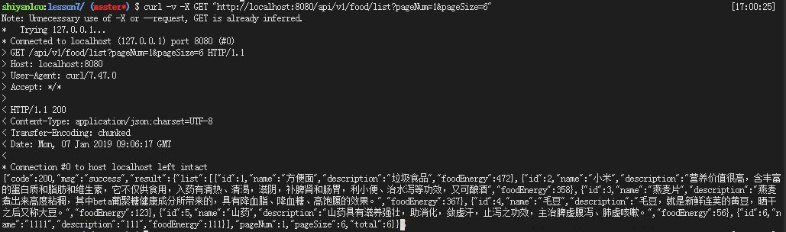

- 获取指定`food`的信息

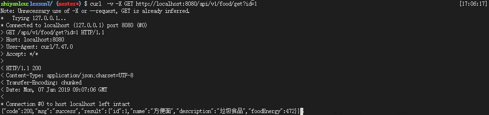

- 新增`food`

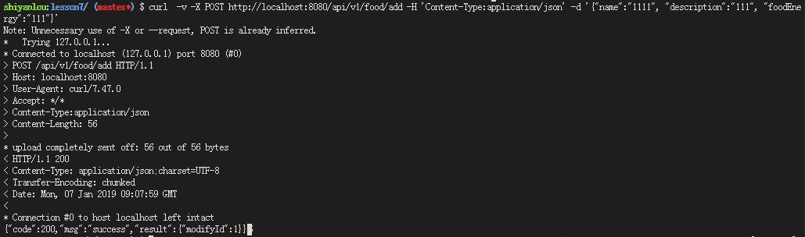

- `table food`中的数据


- 修改指定`food`的数据

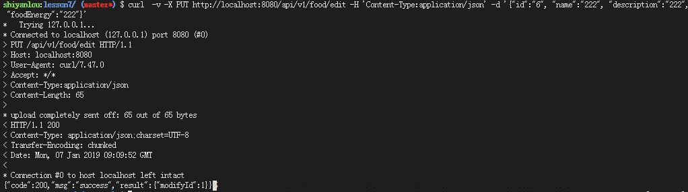

- `id=6`的`food`修改后`table food`的数据

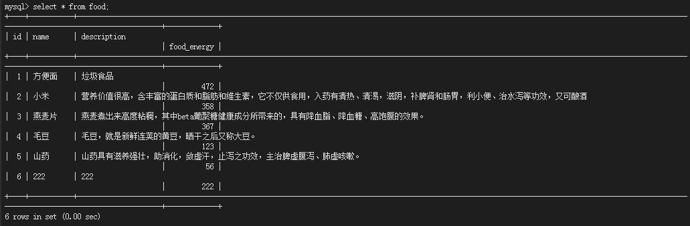

- 删除指定`food`的信息

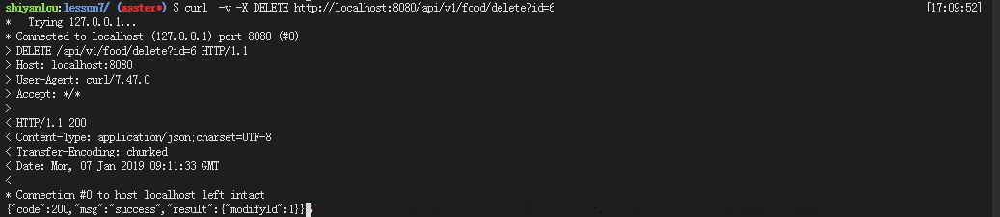

- 删除指定`food`后，`table food`中的数据

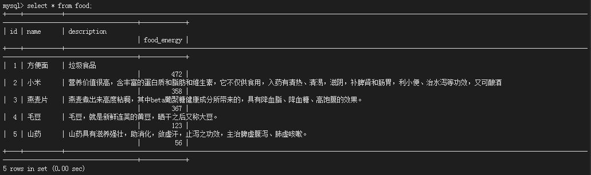

- 用户上传饮食数据

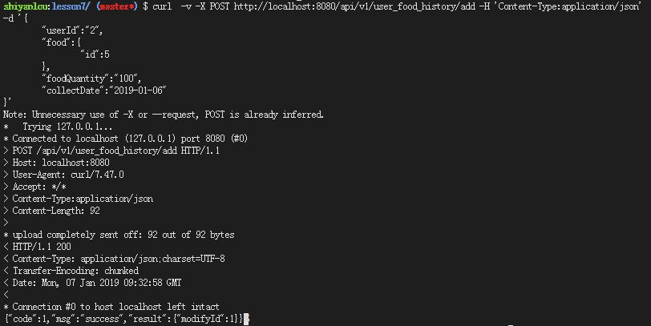

- 显示指定`user`的用户饮食信息

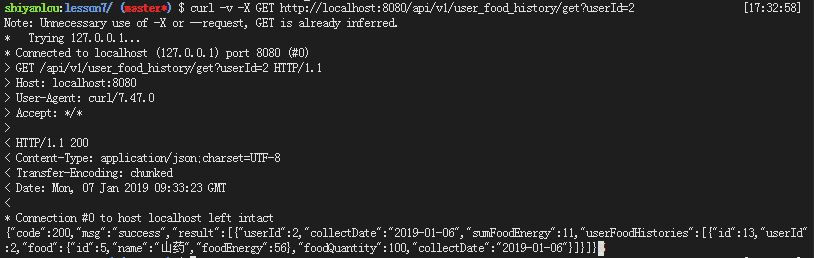

- 显示指定`sport`

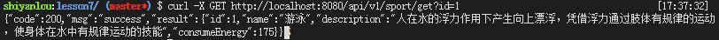
- 创建`sport`

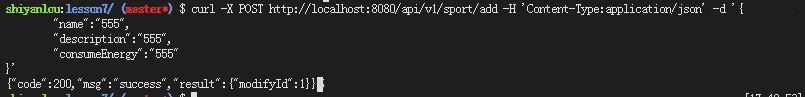

- 修改指定`sport`


- 删除指定`sport`

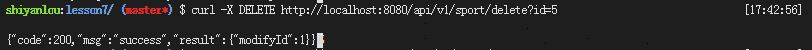

- 分页显示`sport`

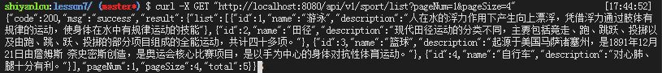

- 用户上传运动记录

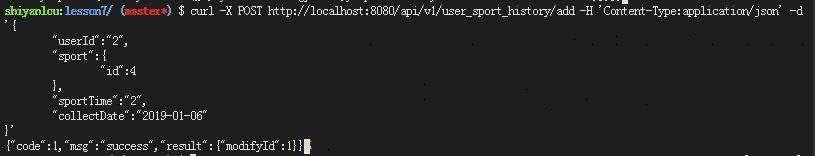

- 显示指定用户的运动记录

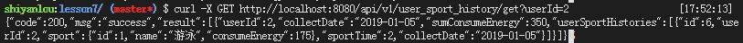

## 三、实验总结

​	本节课依然是开发用户健康管理系统的用户端，使用Spring Boot和Mybatis技术栈，开发了包括食物管理、运动管理、用户运动、饮食记录管理、用户生理指标、运动、饮食关系管理四大功能。熟悉了Spring Boot和Mybatis基本CRUD开发、级联查询、分页插件以及MySQL中 `group by`、`order by`、`join`的使用等技术。