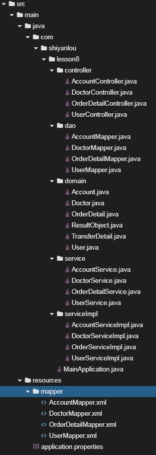

# 应用Mybatis事务支持

## 介绍

题目需求如下：

需求1. 现在数据库中有两张表：

- `table order_detail` ：订单详情表
  - `id` ：主键自增id
  - `user_id` ：用户id
  - `balance` ：账户余额
- `table account` ：账户表
  - `id` ：主键自增id
  - `user_id` ：用户id
  - `doctor_id` ：doctor id
  - `comment` ：订单简单注释

结构如下所示，在用户下单的时候，不仅要扣款，还要记录用户订单情况。通过Mybatis事务的支持，实现即便代码出现`bug`，两条记录要么全部记录成功，要么全部记录失败，不能有数据不一致情况。

## 目标

1. 启动Spring Boot项目代码没有bug，可以正常启动，控制台打印出启动日志。

2. `order_detail` 初始数据

   

3. 通过`curl`访问，创建订单， 由于有`Mybatis`的支持，即便代码出现`bug`，数据库中数据依然正常
   

## 提示语

1. 创建好的项目目录结构如下图所示
   
2. 在开发代码时，使用`@Transactional`注解

## 知识点

- Spring Boot的开发，包括`@RestController`、`@PostMapping `等常见注解的使用
- Mybatis的开发，包括`select`、`insert`、`update`、`delete`常见标签的使用
- Mybatis的事务使用，包括`@Transactional`注解的使用

