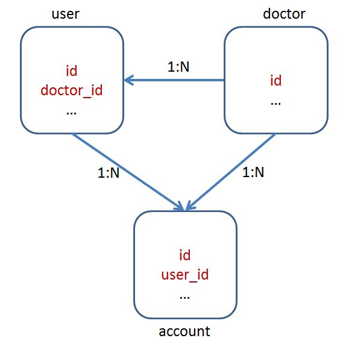
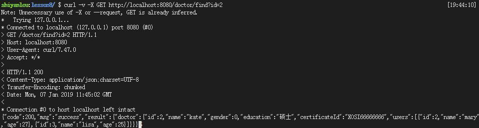
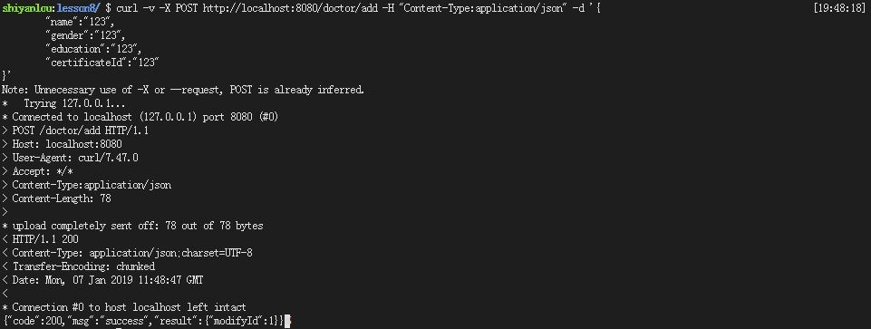
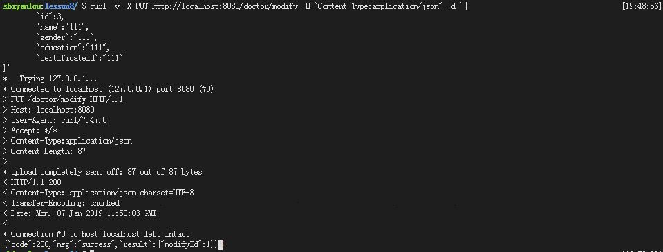
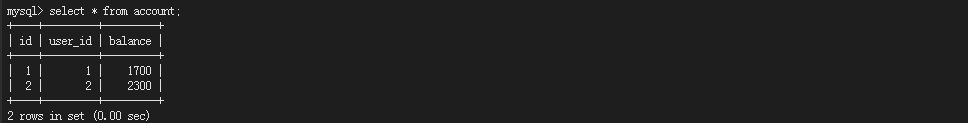
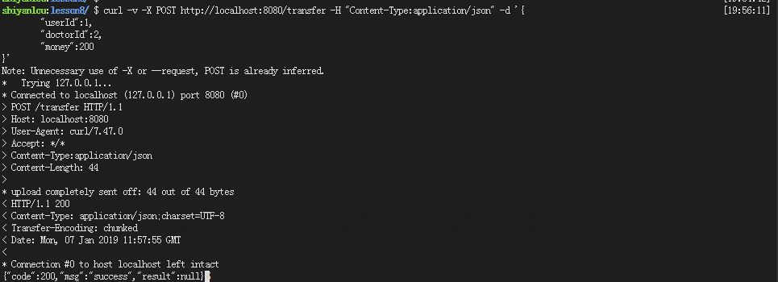
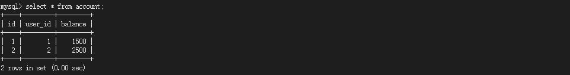
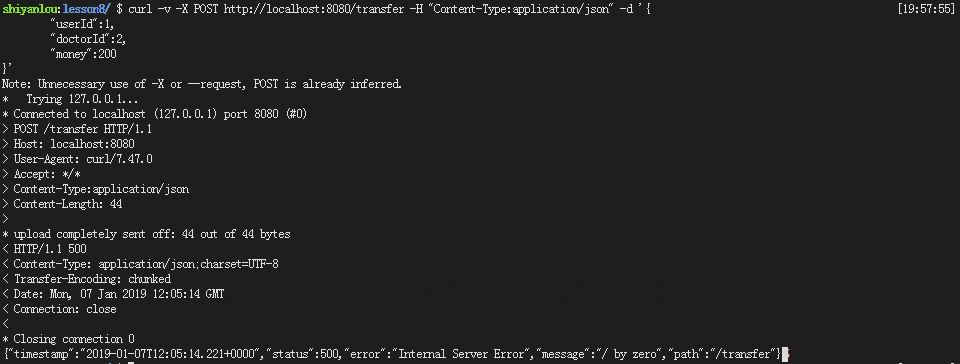
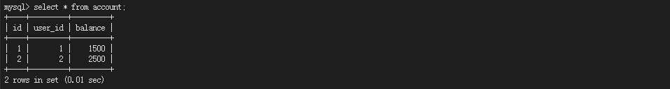
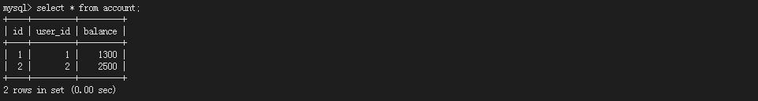

# 后台接口开发(健康指导员端)

##  一、实验简介

### 1.1 实验内容
​	本实验主要是健康管理员端后台接口开发，主要功能有健康管理员基本信息（姓名、性别、年龄、手机）的操作、用户和健康管理员转账功能，通过经典的转账功能。

### 1.2 实验知识点

- Spring Boot HTTP开发、常用配置
- Mybatis 基础配置及CURD操作
- Mybatis 事务

### 1.3 实验环境

- Eclipse Neon.2 Release (4.6.2)
- Java 1.8
- Maven 3.5
- Spring Boot 2.0.6
- Mybatis 3.4.6
- MySQL 5.7
- curl

## 二、实验步骤

#### 2.1 项目结构


#### 2.2 创建项目

在web IDE界面中，选择File -> Open New Terminal，在终端中输入

```shell
$ mvn archetype:generate -DgroupId=com.shiyanlou -DartifactId=lesson8 -DarchetypeArtifactId=maven-archetype-webapp
```

参数介绍：

- `archetype:generate`：表示使用maven创建项目基本骨架
- `DgroupId`：该项目所属组织，一般将域名倒着写，例如：com.shiyanlou
- `DartifactId`：项目名称，例如：lesson8
- `DarchetypeArtifactId`：指定所用maven项目骨架类型

输入命令后，maven开始创建项目、下载所需的依赖，等待片刻，maven提示我们输入版本号，直接回车，我们使用默认版本号`1.0-SNAPSHOT`即可。随后maven会输出`groupId`、`artifactId`、`version`、`package`这些基本信息，直接输入`Y`确认即可。最后可以看到绿色的`BUILD SUCCESS`项目创建成功的提示。

然后在web IDE界面中，选择File -> Open Workspace切换工作空间，选择lesson8目录，必须切换到该目录下，否则识别不了项目。

最后大家可以根据上图所示的目录结构，自己创建目录、文件，较为简单，无需赘述。


#### 2.3 修改pom文件

`将如下配置文件覆盖到pom.xml中`

- `spring-boot-starter-web`：Spring Boot为Web开发提供支持
- `mybatis-spring-boot-starter`：为Mybatis与Spring Boot整合提供支持
- `mysql-connector-java`：MySQL的JDBC驱动包，连接MySQL数据库时必须使用该jar包。
- `druid`：阿里巴巴开源的数据库连接池
- `pagehelper-spring-boot-starter`用来支持Mybatis分页
- `spring-boot-devtools`用来支持热部署，当配置了`devtools `后，我们在`classpath`修改任何文件，保存后，项目都将会自动重启，方便开发。

```xml
<project xmlns="http://maven.apache.org/POM/4.0.0" xmlns:xsi="http://www.w3.org/2001/XMLSchema-instance"
	xsi:schemaLocation="http://maven.apache.org/POM/4.0.0 http://maven.apache.org/xsd/maven-4.0.0.xsd">
	<modelVersion>4.0.0</modelVersion>
	<groupId>com.shiyanlou</groupId>
	<artifactId>lesson5</artifactId>
	<version>0.0.1-SNAPSHOT</version>
	<packaging>jar</packaging>

	<parent>
		<groupId>org.springframework.boot</groupId>
		<artifactId>spring-boot-starter-parent</artifactId>
		<version>2.0.1.RELEASE</version>
		<relativePath /> <!-- lookup parent from repository -->
	</parent>

	<properties>
		<project.build.sourceEncoding>UTF-8</project.build.sourceEncoding>
		<project.reporting.outputEncoding>UTF-8</project.reporting.outputEncoding>
		<java.version>1.8</java.version>
	</properties>

	<dependencies>
		<dependency>
			<groupId>org.springframework.boot</groupId>
			<artifactId>spring-boot-starter-web</artifactId>
		</dependency>

		<dependency>
			<groupId>org.mybatis.spring.boot</groupId>
			<artifactId>mybatis-spring-boot-starter</artifactId>
			<version>1.3.2</version>
		</dependency>

		<dependency>
			<groupId>mysql</groupId>
			<artifactId>mysql-connector-java</artifactId>
			<scope>runtime</scope>
		</dependency>

		<dependency>
			<groupId>com.alibaba</groupId>
			<artifactId>druid</artifactId>
			<version>1.1.6</version>
		</dependency>

		<dependency>
			<groupId>org.springframework.boot</groupId>
			<artifactId>spring-boot-devtools</artifactId>
			<optional>true</optional>
		</dependency>

	</dependencies>

	<build>
		<resources>
			<resource>
				<directory>src/main/resources</directory>
				<includes>
					<include>**/*.properties</include>
					<include>**/*.xml</include>
				</includes>
				<filtering>false</filtering>
			</resource>
		</resources>
		<plugins>
			<plugin>
				<groupId>org.springframework.boot</groupId>
				<artifactId>spring-boot-maven-plugin</artifactId>
			</plugin>
		</plugins>
	</build>
</project>
```
#### 2.4 创建application文件

`该文件主要介绍关于数据库基本的基本配置十分重要，选中src/main/resources，右键 -> New -> file-> Name填入application.properties -> Finish。`

- `spring.datasource.driver-class-name`：指定driver-class
- `spring.datasource.url`：指定数据库host、port、database、encode
- `spring.datasource.username`：指定用户名
- `spring.datasource.password`：指定密码
- `spring.datasource.type`：指定数据库连接池
- `logging.level`：开启日志，开发时可以打印SQL语句

```properties
spring.datasource.driver-class-name=com.mysql.jdbc.Driver
spring.datasource.url=jdbc:mysql://localhost:3306/lesson8?useUnicode=true&characterEncoding=utf-8
spring.datasource.username=root
spring.datasource.password=
spring.datasource.type=com.alibaba.druid.pool.DruidDataSource
logging.level.com.shiyanlou.lesson8.dao=debug

mybatis.typeAliasesPackage=com.shiyanlou.lesson8.domain
mybatis.mapperLocations=classpath:mapper/*.xml
```


#### 2.5 创建数据库和数据表

启动MySQL数据库服务

```sh
$ sudo service mysql start
```

进入MySQL数据库

```sh
$ mysql -uroot -p
```

创建数据库

```sql
mysql> create database lesson8; 
```
导入数据表

```sh
$ mysql -uroot lesson8 < dump.sql
```

由下图可见三张数据表的关系。



#### 2.6 创建dao目录及文件

`AccountMapper.java` 针对`table account`的`mapper`接口文件

```java
package com.shiyanlou.lesson8.dao;

import org.apache.ibatis.annotations.Mapper;

import com.shiyanlou.lesson8.domain.Account;

@Mapper
public interface AccountMapper {

  	/**
	 * 查询账户
	 * @param userId
	 * @return
	 */
	int select(int userId);
		
  	/**
	 * 更新账户
	 * @param account
	 * @return
	 */
	int update(Account account);	
}
```


`DoctorMapper.java` 针对`table doctor`的`mapper`接口文件

```java
package com.shiyanlou.lesson8.dao;

import org.apache.ibatis.annotations.Mapper;

import com.shiyanlou.lesson8.domain.Doctor;

@Mapper
public interface DoctorMapper {

  	 /**
	 * 查询健康管理员
	 * @param id
	 * @return
	 */
	Doctor select(int id);
	
	 /**
	 * 新建健康管理员
	 * @param doctor
	 * @return
	 */
	int insert(Doctor doctor);
	
  	 /**
	 * 更新健康管理员
	 * @param doctor
	 * @return
	 */
  	int update(Doctor doctor);

  	 /**
	 * 删除健康管理员
	 * @param id
	 * @return
	 */
	int delete(int id);
}
```


`UserMapper.java`  针对`table user`的`mapper`接口文件

```java
package com.shiyanlou.lesson8.dao;

import org.apache.ibatis.annotations.Mapper;

import com.shiyanlou.lesson8.domain.User;

@Mapper
public interface UserMapper {

  	 /**
	 * 查询用户
	 * @param id
	 * @return
	 */
	User select(int id);
	
  	 /**
	 * 新建用户
	 * @param user
	 * @return
	 */
	int insert(User user);
		
  	 /**
	 * 更新用户
	 * @param user
	 * @return
	 */
	int update(User user);
	
  	 /**
	 * 删除用户
	 * @param id
	 * @return
	 */
	int delete(int id);
}
```


#### 2.7 创建domain目录及文件

`ResultObject` 封装后端返回数据、后端状态、失败原因消息

```java
package com.shiyanlou.lesson6.domain;

public class ResultObject {

  	// 后台状态
	private int code;
  	// 相关消息
	private String msg;
  	// 结果
	private Object result;
  
  	// 构造函数
	public ResultObject() {
		super();
		// TODO Auto-generated constructor stub
	}
  
   	// 构造函数
	public ResultObject(int code, String msg, Object result) {
		super();
		this.code = code;
		this.msg = msg;
		this.result = result;
	}
  
  	// 属性setter、getter方法
	public int getCode() {
		return code;
	}
	public void setCode(int code) {
		this.code = code;
	}
	public String getMsg() {
		return msg;
	}
	public void setMsg(String msg) {
		this.msg = msg;
	}
	public Object getResult() {
		return result;
	}
	public void setResult(Object result) {
		this.result = result;
	}
  
  	// 重写toString方法
	@Override
	public String toString() {
		return "ResultObject [code=" + code + ", msg=" + msg + ", result=" + result + "]";
	}
}
```


`Account.java` 账号类，封装`id`、用户`id`、账户余额

```java
package com.shiyanlou.lesson8.domain;

public class Account {
  	
  	// 主键id
	private int id;
  	// 用户id
	private int userId;
  	// 账户余额
	private int balance;
	
  	// 构造函数
	public Account() {
		// TODO Auto-generated constructor stub
	}

    // 构造函数
	public Account(int userId, int balance) {
		super();
		this.userId = userId;
		this.balance = balance;
	}

  	// 属性getter、setter方法
	public int getId() {
		return id;
	}

	public void setId(int id) {
		this.id = id;
	}

	public int getUserId() {
		return userId;
	}

	public void setUserId(int userId) {
		this.userId = userId;
	}

	public int getBalance() {
		return balance;
	}

	public void setBalance(int balance) {
		this.balance = balance;
	}

  	// 重写toString方法
	@Override
	public String toString() {
		return "Account [id=" + id + ", userId=" + userId + ", balance=" + balance + "]";
	}
}
```


`Doctor.java` 健康指导员类，封装`id`、姓名、性别、学历

```java
package com.shiyanlou.lesson8.domain;

import java.util.List;

import com.fasterxml.jackson.annotation.JsonInclude;
import com.fasterxml.jackson.annotation.JsonInclude.Include;

public class Doctor {
  	
  	// 主键id
	private int id;
  	// 名称
	private String name;
  	// 性别  	
	private int gender;
  	// 学历
	private String education;
  	// 编号
	private String certificateId;
	
	// 一对多
	@JsonInclude(Include.NON_DEFAULT)
	private List<User> users;
	
  	// 构造函数
	public Doctor() {
		super();
		// TODO Auto-generated constructor stub
	}
  
  	// 构造函数
	public Doctor(String name, int gender, String education, String certificateId, List<User> users) {
		super();
		this.name = name;
		this.gender = gender;
		this.education = education;
		this.certificateId = certificateId;
		this.users = users;
	}

  	// 属性setter、getter方法
	public int getId() {
		return id;
	}

	public void setId(int id) {
		this.id = id;
	}

	public String getName() {
		return name;
	}

	public void setName(String name) {
		this.name = name;
	}

	public int getGender() {
		return gender;
	}

	public void setGender(int gender) {
		this.gender = gender;
	}

	public String getEducation() {
		return education;
	}

	public void setEducation(String education) {
		this.education = education;
	}

	public String getCertificateId() {
		return certificateId;
	}

	public void setCertificateId(String certificateId) {
		this.certificateId = certificateId;
	}

	public List<User> getUsers() {
		return users;
	}

	public void setUsers(List<User> users) {
		this.users = users;
	}

  	// 重写toString方法
	@Override
	public String toString() {
		return "Doctor [id=" + id + ", name=" + name + ", gender=" + gender + ", education=" + education
				+ ", certificateId=" + certificateId + ", users=" + users + "]";
	}
}
```


`TransferDetail.java` 转账类

```java
package com.shiyanlou.lesson8.domain;

import java.sql.Date;

public class TransferDetail {
  
  	// 主键id
	private int id;
  	// 用户id
	private int userId;
  	// 医生id
	private int doctorId;
	// 转账金额
	private int money;

  	// 构造函数
	public TransferDetail() {
		// TODO Auto-generated constructor stub
	}
  	// 构造函数
	public TransferDetail(int userId, int doctorId, int money) {
		super();
		this.userId = userId;
		this.doctorId = doctorId;
		this.money = money;
	}

  	// 属性setter、getter
	public int getId() {
		return id;
	}

	public void setId(int id) {
		this.id = id;
	}

	public int getUserId() {
		return userId;
	}

	public void setUserId(int userId) {
		this.userId = userId;
	}

	public int getDoctorId() {
		return doctorId;
	}

	public void setDoctorId(int doctorId) {
		this.doctorId = doctorId;
	}

	public int getMoney() {
		return money;
	}

	public void setMoney(int money) {
		this.money = money;
	}

   	// 重写toString方法
	@Override
	public String toString() {
		return "TransferDetail [id=" + id + ", userId=" + userId + ", doctorId="
				+ doctorId + ", money=" + money + "]";
	}
}
```


`User.java` 用户类，封装`id`、性别、年龄、姓名等属性

```java
package com.shiyanlou.lesson8.domain;

import com.fasterxml.jackson.annotation.JsonInclude;
import com.fasterxml.jackson.annotation.JsonInclude.Include;

public class User{
  
  	// 自增主键id
	private int id;
    // 用户名称
	private String name;
  	// 用户性别
	@JsonInclude(Include.NON_DEFAULT)
	private int gender;
	// 用户年龄  	
	@JsonInclude(Include.NON_DEFAULT)
	private int age;
	// 多对一
	@JsonInclude(Include.NON_DEFAULT)
	private Doctor doctor;
	
  	// 构造函数
	public User() {
		super();
		// TODO Auto-generated constructor stub
	}

    // 构造函数
	public User(String name, int gender, int age, Doctor doctor) {
		super();
		this.name = name;
		this.gender = gender;
		this.age = age;
		this.doctor = doctor;
	}

  	// 属性setter、getter方法
	public int getId() {
		return id;
	}

	public void setId(int id) {
		this.id = id;
	}

	public String getName() {
		return name;
	}

	public void setName(String name) {
		this.name = name;
	}

	public int getGender() {
		return gender;
	}

	public void setGender(int gender) {
		this.gender = gender;
	}

	public int getAge() {
		return age;
	}

	public void setAge(int age) {
		this.age = age;
	}

	public Doctor getDoctor() {
		return doctor;
	}

	public void setDoctor(Doctor doctor) {
		this.doctor = doctor;
	}
  
   	// 重写toString方法
	@Override
	public String toString() {
		return "User [id=" + id + ", name=" + name + ", gender=" + gender + ", age=" + age + ", doctor="
				+ doctor + "]";
	}	
}
```


#### 2.8 创建service目录及文件

`AccountService.java` 账户业务接口，定义修改方法

```java
package com.shiyanlou.lesson8.service;

import com.shiyanlou.lesson8.domain.TransferDetail;

public interface AccountService {
  
  	 /**
	 * 转账
	 * @param transferDetail
	 * @return
	 */
	public String transfer(TransferDetail transferDetail);
}
```


`DoctorService.java` 健康管理员业务接口，定义增删改查等方法

```java
package com.shiyanlou.lesson8.service;

import com.shiyanlou.lesson8.domain.Doctor;

public interface DoctorService {
	
  	 /**
	 * 创建健康管理员
	 * @param doctor
	 * @return
	 */
	public int insertDoctor(Doctor doctor);
	
  	 /**
	 * 删除健康管理员
	 * @param id
	 * @return
	 */
	public int deleteDoctor(int id);
	
  	 /**
	 * 更新健康管理员
	 * @param doctor
	 * @return
	 */
	public int updateDoctor(Doctor doctor);
	
  	 /**
	 * 查询健康管理员
	 * @param id
	 * @return
	 */
	public Doctor selectDoctor(int id);
}
```


`UserService.java` 用户业务接口，定义增删改查等方法

```java
package com.shiyanlou.lesson8.service;

import com.shiyanlou.lesson8.domain.User;

public interface UserService {
	
  	/**
	 * 创建用户
	 * @param user
	 * @return
	 */
	public int insertUser(User user);
	
  	/**
	 * 删除用户
	 * @param id
	 * @return
	 */
	public int deleteUser(int id);
	
  	/**
	 * 更新用户
	 * @param user
	 * @return
	 */
	public int updateUser(User user);
	
  	/**
	 * 查询用户
	 * @param id
	 * @return
	 */
	public User selectUser(int id);
}
```


#### 2.9 创建serviceImpl目录及文件

`AccountServiceImpl.java` 账户业务类，实现`AccountService.java`接口中定义更新等方法

```java
package com.shiyanlou.lesson8.serviceImpl;

import org.springframework.beans.factory.annotation.Autowired;
import org.springframework.stereotype.Service;
import org.springframework.transaction.annotation.Transactional;

import com.shiyanlou.lesson8.dao.AccountMapper;
import com.shiyanlou.lesson8.domain.Account;
import com.shiyanlou.lesson8.domain.TransferDetail;
import com.shiyanlou.lesson8.service.AccountService;

// 标识service
// 标记事务
@Service
@Transactional
public class AccountServiceImpl implements AccountService{

  	// 自动注入mapper
	@Autowired
	private AccountMapper accountMapper;

  	// 转账
	@Override
	public String transfer(TransferDetail transferDetail) {
		try {
          	// 获取转账金额
			int money = transferDetail.getMoney();
          	// 获取用户id
			int userId = transferDetail.getUserId();
          	// 获取健康管理员id
			int doctorId = transferDetail.getDoctorId();
			
          	// 获取用户余额
			int userBalance = accountMapper.select(userId);
          	// 获取健康管理员余额
			int doctorBalance = accountMapper.select(doctorId);

            // 更新用户、健康管理员账户余额
			if (userBalance >= money) {
				Account userAccount = new Account(userId, userBalance - money);
				accountMapper.update(userAccount);
              	// System.out.println(1/0);
				Account doctorAccount = new Account(doctorId, doctorBalance + money);
				accountMapper.update(doctorAccount);
			} else {
				return "balance error";
			}
			return "success";
		} catch (Exception e) {
			throw e;
		}
		
	}
	
}
```


`DoctorServiceImpl.java` 健康管理员业务类，实现`DoctorService.java`接口中定义增删改查等方法

```java
package com.shiyanlou.lesson8.serviceImpl;

import org.springframework.beans.factory.annotation.Autowired;
import org.springframework.stereotype.Service;

import com.shiyanlou.lesson8.dao.DoctorMapper;
import com.shiyanlou.lesson8.domain.Doctor;
import com.shiyanlou.lesson8.service.DoctorService;


@Service
public class DoctorServiceImpl implements DoctorService{

  	// 自动注入mapper
	@Autowired
	private DoctorMapper doctorMapper;
	
     /**
	 * 创建健康管理员
	 * @param doctor
	 * @return
	 */
	public int insertDoctor(Doctor doctor) {
		int modifyId = doctorMapper.insert(doctor);
		return modifyId;
	}
	
   /**
	 * 删除健康管理员
	 * @param id
	 * @return
	 */
	public int deleteDoctor(int id) {
		int modifyId = doctorMapper.delete(id);
		return modifyId;
	}
	
   /**
	 * 更新健康管理员
	 * @param doctor
	 * @return
	 */
	public int updateDoctor(Doctor doctor) {
		int modifyId = doctorMapper.update(doctor);
		return modifyId;
	}
	
   /**
	 * 查询健康管理员
	 * @param id
	 * @return
	 */
	public Doctor selectDoctor(int id) {
		Doctor doctor = doctorMapper.select(id);
		return doctor;
	}
}
```


`UserServiceImpl.java` 用户业务类，实现`UserService.java`接口中定义增删改查等方法

```java
package com.shiyanlou.lesson8.serviceImpl;

import org.springframework.beans.factory.annotation.Autowired;
import org.springframework.stereotype.Service;

import com.shiyanlou.lesson8.dao.UserMapper;
import com.shiyanlou.lesson8.domain.User;
import com.shiyanlou.lesson8.service.UserService;


@Service
public class UserServiceImpl implements UserService{

    // 自动注入mapper
	@Autowired
	private UserMapper userMapper;
	
    /**
	 * 创建用户
	 * @param user
	 * @return
	 */
	public int insertUser(User user) {
		int modifyId = userMapper.insert(user);
		return modifyId;
	}
	
  	/**
	 * 删除用户
	 * @param id
	 * @return
	 */
	public int deleteUser(int id) {
		int modifyId = userMapper.delete(id);
		return modifyId;
	}
	
  	/**
	 * 更新用户
	 * @param user
	 * @return
	 */
	public int updateUser(User user) {
		int modifyId = userMapper.update(user);
		return modifyId;
	}
	
  	/**
	 * 查询用户
	 * @param id
	 * @return
	 */
	public User selectUser(int id) {
		User user = userMapper.select(id);
		return user;
	}
}
```


#### 2.10 创建controller目录及文件

`AccountController.java` 账户控制器，为账户类更新等方法提供访问控制接口

```java
package com.shiyanlou.lesson8.controller;

import org.springframework.beans.factory.annotation.Autowired;
import org.springframework.web.bind.annotation.PostMapping;
import org.springframework.web.bind.annotation.RequestBody;
import org.springframework.web.bind.annotation.RestController;

import com.shiyanlou.lesson8.domain.ResultObject;
import com.shiyanlou.lesson8.domain.TransferDetail;
import com.shiyanlou.lesson8.service.AccountService;

// 标记controller，返回json数据
@RestController
public class AccountController {
	
  
    // 自动注入service
	@Autowired
	private AccountService accountService;
	
  	/**
	 * 转账
	 * @param transferDetail
	 * @return
	 */
	@PostMapping("transfer")
	public ResultObject add(@RequestBody TransferDetail transferDetail) {
		String status = accountService.transfer(transferDetail);
		ResultObject resultObject = new ResultObject(200, status, null);
		return resultObject;
	}
}
```


`DoctorController.java` 健康管理员控制器，为健康管理员类增删改查等方法提供访问控制接口

```java
package com.shiyanlou.lesson8.controller;

import java.util.HashMap;
import java.util.Map;

import org.springframework.beans.factory.annotation.Autowired;
import org.springframework.web.bind.annotation.DeleteMapping;
import org.springframework.web.bind.annotation.GetMapping;
import org.springframework.web.bind.annotation.PostMapping;
import org.springframework.web.bind.annotation.PutMapping;
import org.springframework.web.bind.annotation.RequestBody;
import org.springframework.web.bind.annotation.RequestMapping;
import org.springframework.web.bind.annotation.RequestParam;
import org.springframework.web.bind.annotation.RestController;

import com.shiyanlou.lesson8.domain.Doctor;
import com.shiyanlou.lesson8.domain.ResultObject;
import com.shiyanlou.lesson8.service.DoctorService;

// 标记controller，返回json数据，URL前缀：/doctor
@RestController
@RequestMapping("doctor")
public class DoctorController {
	
    // 自动注入service
	@Autowired
	private DoctorService doctorService;
	
  	/**
	 * 创建健康管理员
	 * @param doctor
	 * @return
	 */
	@PostMapping("add")
	public ResultObject add(@RequestBody Doctor doctor) {
		int modifyId = doctorService.insertDoctor(doctor);
		Map<String, Integer> map = new HashMap<>();
		map.put("modifyId", modifyId);
		ResultObject resultObject = new ResultObject(200, "success", map);
		return resultObject;
	}
	
	/**
	 * 删除健康管理员
	 * @param id
	 * @return
	 */
	@DeleteMapping("delete")
	public ResultObject delete(@RequestParam int id) {
		int modifyId = doctorService.deleteDoctor(id);
		Map<String, Integer> map = new HashMap<>();
		map.put("modifyId", modifyId);
		ResultObject resultObject = new ResultObject(200, "success", map);
		return resultObject;
	}
	
  	/**
	 * 更新健康管理员
	 * @param doctor
	 * @return
	 */
	@PutMapping("modify")
	public ResultObject modify(@RequestBody Doctor doctor) {
		int modifyId = doctorService.updateDoctor(doctor);
		Map<String, Integer> map = new HashMap<>();
		map.put("modifyId", modifyId);
		ResultObject resultObject = new ResultObject(200, "success", map);
		return resultObject;
	}
	
  	/**
	 * 查询健康管理员
	 * @param id
	 * @return
	 */
	@GetMapping("find")
	public ResultObject find(@RequestParam int id) {
		Doctor doctor = doctorService.selectDoctor(id);
		Map<String, Doctor> map = new HashMap<>();
		map.put("doctor", doctor);
		ResultObject resultObject = new ResultObject(200, "success", map);
		return resultObject;
	}
}
```


`UserController.java`用户控制器，为用户类增删改查等方法提供访问控制接口

```java
package com.shiyanlou.lesson8.controller;

import java.util.HashMap;
import java.util.Map;

import org.springframework.beans.factory.annotation.Autowired;
import org.springframework.web.bind.annotation.DeleteMapping;
import org.springframework.web.bind.annotation.GetMapping;
import org.springframework.web.bind.annotation.PostMapping;
import org.springframework.web.bind.annotation.PutMapping;
import org.springframework.web.bind.annotation.RequestBody;
import org.springframework.web.bind.annotation.RequestMapping;
import org.springframework.web.bind.annotation.RequestParam;
import org.springframework.web.bind.annotation.RestController;

import com.shiyanlou.lesson8.domain.ResultObject;
import com.shiyanlou.lesson8.domain.User;
import com.shiyanlou.lesson8.service.UserService;

// 标记controller，返回json数据，URL前缀：/user
@RestController
@RequestMapping("user")
public class UserController {
	
    // 自动注入service
	@Autowired
	private UserService userService;
	
 	 /**
	 * 创建用户
	 * @param user
	 * @return
	 */
	@PostMapping("add")
	public ResultObject add(@RequestBody User user) {
		int modifyId = userService.insertUser(user);
		Map<String, Integer> map = new HashMap<>();
		map.put("modifyId", modifyId);
		ResultObject resultObject = new ResultObject(200, "success", map);
		return resultObject;
	}
	
	/**
	 * 删除用户
	 * @param id
	 * @return
	 */
	@DeleteMapping("delete")
	public ResultObject delete(@RequestParam int id) {
		int modifyId = userService.deleteUser(id);
		Map<String, Integer> map = new HashMap<>();
		map.put("modifyId", modifyId);
		ResultObject resultObject = new ResultObject(200, "success", map);
		return resultObject;
	}
	
  	/**
	 * 更新用户
	 * @param user
	 * @return
	 */
	@PutMapping("modify")
	public ResultObject modify(@RequestBody User user) {
		int modifyId = userService.updateUser(user);
		Map<String, Integer> map = new HashMap<>();
		map.put("modifyId", modifyId);
		ResultObject resultObject = new ResultObject(200, "success", map);
		return resultObject;
	}
	
 	 /**
	 * 查询用户
	 * @param id
	 * @return
	 */
	@GetMapping("find")
	public ResultObject find(@RequestParam int id) {
		User user = userService.selectUser(id);
		Map<String, User> map = new HashMap<>();
		map.put("user", user);
		ResultObject resultObject = new ResultObject(200, "success", map);
		return resultObject;
	}

}
```


#### 2.11 创建mapper文件

`AccountMapper.xml` 实现`AccountMapper.java`接口中定义的方法

```xml
<?xml version="1.0" encoding="UTF-8"?>
 <!DOCTYPE mapper 
 PUBLIC "-//mybatis.org//DTD Mapper 3.0//EN" 
 "http://mybatis.org/dtd/mybatis-3-mapper.dtd">

<mapper namespace="com.shiyanlou.lesson8.dao.AccountMapper">
	<select id="select" parameterType="Integer" resultType="Integer">
		select balance
		from account where user_id = #{userId};
	</select>
	
	<update id="update" parameterType="com.shiyanlou.lesson8.domain.Account">
		update account
		<set>
			<if test="balance != null and balance != ''">
				balance = #{balance},
			</if>
		</set>
		where user_id = #{userId};
	</update>
</mapper> 
```


`DoctorMapper.xml` 实现`DoctorMapper.java`接口中定义的方法

```xml
<?xml version="1.0" encoding="UTF-8"?>
 <!DOCTYPE mapper 
 PUBLIC "-//mybatis.org//DTD Mapper 3.0//EN" 
 "http://mybatis.org/dtd/mybatis-3-mapper.dtd">

<mapper namespace="com.shiyanlou.lesson8.dao.DoctorMapper">
	<resultMap type="com.shiyanlou.lesson8.domain.Doctor" id="DoctorInfo">
		<id column="id" property="id" />
		<result column="name" property="name" />
		<result column="gender" property="gender" />
		<result column="education" property="education" />
		<result column="certificate_id" property="certificateId" />
		<collection property="users" column="id"
			ofType="com.shiyanlou.lesson8.domain.User" 
			select="com.shiyanlou.lesson8.dao.UserMapper.selectByDoctorId" />
	</resultMap>

	<select id="select" parameterType="Integer" resultMap="DoctorInfo">
		select id, name, gender, education, certificate_id
		from doctor where id = #{id};
	</select>

	<select id="selectBriefById" parameterType="Integer"
		resultType="com.shiyanlou.lesson8.domain.Doctor">
		select id, name, gender, education, certificate_id
		from doctor where id = #{id};
	</select>

	<insert id="insert" parameterType="com.shiyanlou.lesson8.domain.Doctor"
		useGeneratedKeys="true" keyProperty="id">
		insert into doctor(name, gender, education, certificate_id)
		values(#{name}, #{gender}, #{education}, #{certificateId});
	</insert>

	<update id="update" parameterType="com.shiyanlou.lesson8.domain.Doctor">
		update doctor
		<set>
			<if test="name != null and name != ''">
				name = #{name},
			</if>
			<if test="gender != null and gender != ''">
				gender = #{gender},
			</if>
			<if test="education != null and education != ''">
				education = #{education},
			</if>
			<if test="certificateId != null and certificateId != ''">
				certificate_id = #{certificateId},
			</if>
		</set>
		where id = #{id};
	</update>

	<delete id="delete" parameterType="Integer">
		delete from doctor where id =
		#{id};
	</delete>
</mapper> 
```


`UserMapper.xml` 实现`UserMapper.java`接口中定义的方法

```xml
<?xml version="1.0" encoding="UTF-8"?>
 <!DOCTYPE mapper 
 PUBLIC "-//mybatis.org//DTD Mapper 3.0//EN" 
 "http://mybatis.org/dtd/mybatis-3-mapper.dtd">

<mapper namespace="com.shiyanlou.lesson8.dao.UserMapper">
	<resultMap type="com.shiyanlou.lesson8.domain.User" id="UserInfo">
		<id column="id" property="id" />
		<result column="name" property="name" />
		<result column="gender" property="gender" />
		<result column="age" property="age" />

		<association column="doctor_id" property="doctor"
			javaType="com.shiyanlou.lesson8.domain.Doctor" 
			select="com.shiyanlou.lesson8.dao.DoctorMapper.selectBriefById" />
	</resultMap>

	<select id="select" parameterType="Integer" resultMap="UserInfo">
		select id, name, gender, age, doctor_id
		from user where id = #{id};
	</select>

	<select id="selectByDoctorId" resultType="com.shiyanlou.lesson8.domain.User">
		select id, name, gender, age
		from user where doctor_id = #{id};
	</select>

	<insert id="insert" parameterType="com.shiyanlou.lesson8.domain.User"
		useGeneratedKeys="true" keyProperty="id">
		insert into user(name, gender,
		age, doctor_id)
		values(#{name}, #{gender}, #{age}, #{doctor.id});
	</insert>

	<update id="update" parameterType="com.shiyanlou.lesson8.domain.User">
		update user
		<set>
			<if test="name != null and name != ''">
				name = #{name},
			</if>
			<if test="gender != null">
				gender = #{gender},
			</if>
			<if test="age != null">
				age = #{age},
			</if>
			<if test="doctor.id != null">
				doctor_id = #{doctor.id},
			</if>
		</set>
		where id = #{id};
	</update>

	<delete id="delete" parameterType="Integer">
		delete from user where id =
		#{id};
	</delete>
</mapper> 
```


#### 2.12 创建启动类文件

`MainApplication.java`，内置Tomcat，整个web程序的入口

- `MapperScan`注解十分重要，`value`为`mapper`所在路径，Spring Boot由这个注解可以得知去哪里扫描`mapper`文件

```java
package com.shiyanlou.lesson8;

import org.mybatis.spring.annotation.MapperScan;
import org.springframework.boot.SpringApplication;
import org.springframework.boot.autoconfigure.SpringBootApplication;

// springboot 启动类
@SpringBootApplication
@MapperScan("com.shiyanlou.lesson8.dao")
public class MainApplication {

	public static void main(String[] args) {
		SpringApplication.run(MainApplication.class, args);
	}
}
```


#### 2.13 访问测试

在终端中输入如下命令，启动web项目

```shell
$ mvn spring-boot:run
```

`可以看到控制台打印出启动日志，然后可以使用curl进行测试，这里针对userIndex的接口举例进行测试，其他接口同学们可以仿照进行测试。 `

- 显示指定`doctor`的信息

```shell
$ curl -v -X GET "http://localhost:8080/doctor/find?id=2"
```



- 创建`doctor`

```shell
$ curl -v -X POST "http://localhost:8080/doctor/add" -H "Content-Type:application/json" -d '{"name":"123", "gender":"123", "education":"123", "certificateId":"123"}'
```



- 修改指定`doctor`信息
```shell
$ curl -v -X PUT "http://localhost:8080/doctor/modify" -H "Content-Type:application/json" -d '{"id":3, "name":"111", "gender":"111", "education":"111", "certificateId":"111"}'
```



- 删除指定`doctor`

```shell
$ curl -v -X DELETE "http://localhost:8080/doctor/delete?id=3"
```


- `table account`原始数据

```mysql
mysql> select * from account;
```


- 转账接口`userId=1`向`doctorId=2`转账`200`


```shell
$ curl -v -X POST "http://localhost:8080/transfer" -H "Content-Type:application/json" -d '{"userId":1, "doctorId":2, "money":200}'
```


- 转账后，`table account`数据

```mysql
mysql> select * from account;
```


- 将`2.9`中`AccountServiceImpl.java`中的注释去掉，暴露运行异常，重启程序。调用转账接口

```shell
$ curl -v -X POST "http://localhost:8080/transfer" -H "Content-Type:application/json" -d '{"userId":1, "doctorId":2, "money":200}'
```


- 即便程序发生异常，但是`table account`数据依然一致，体现了事务一致性

```mysql
mysql> select * from account;
```


- 将`2.9`中`AccountServiceImpl.java`中的`@Transactional`去掉，重启程序。

```shell
$ curl -v -X POST "http://localhost:8080/transfer" -H "Content-Type:application/json" -d '{"userId":1, "doctorId":2, "money":200}'
```


- 缺少Mybatis的事务支持，`table account`中数据不一致

```mysql
mysql> select * from account;
```



## 三、实验总结

​	本节课主要是开发用户健康管理系统的健康管理员端，使用Spring Boot和Mybatis技术栈，除了CRUD、级联查询等技术外，还学习了Mybatis对事务的支持。