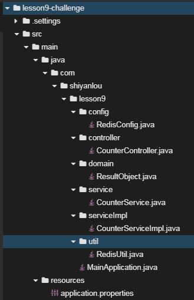

# 基于redis的计数器

## 介绍

题目需求如下：

需求1. 如果在大访问量的秒杀系统中使用MySQL计数，那么整个秒杀系统将会崩溃。现在希望大家开发一个基于redis的计数器，供秒杀系统使用。

- 在redis中提前设置`key`为`counter` ，`value`为`10`的键值对
- 后端提供两个接口
  - 可以获取这个`key`的值
  - 可以减少这个`key` 的值

## 目标

1. 启动Spring Boot项目代码没有bug，可以正常启动，控制台打印出启动日志。

2. 接口输入、输出如下图所示

   


## 提示语

1. 创建好的项目目录结构如下图所示
   

2. 创建`key`命令

   ```shell
   127.0.0.1:6379> set COUNTER 10
   ```

3. 后台接口涉及到的`redis-template API`

   - `get`
   - `decr`

## 知识点

- Spring Boot的开发，包括`@RestController`、`@GetMapping `等常见注解的使用
- Mybatis的开发，包括`select`常见标签的使用
- redis与Spring Boot整合
- redis开发

