# 单点登录

##  一、实验简介

### 1.1 实验内容
​	本实验主要是基于redis实现单点登录。早期互联网应用由于用户少、访问量低，多个系统的代码可以部署在一台机器中，所以session可以直接共享。但是随着互联网的发展，现如今大型网站均是分布式系统，session无法再像以前那样共享。单点登录就是在这样多系统共存的环境下，实现一次登录，多次访问不同的互信的系统，单点登录可以简化用户操作，提高友好性。

​	单点登录可以有多种实现方式，本实验采用token+ redis方式实现。在用户第一次访问后端接口时直接跳到登录页面，使用账号、密码验证用户真实性，验证成功后，后端返回给用户随机产生的token（存储在redis中）。随后，用户访问后端的接口都要携带这个token，使用token来验证用户的有效性。用户注销时，token从redis中删除。

### 1.2 实验知识点

- Spring Boot HTTP开发、常用配置
- Spring Boot 拦截器开发
- Mybatis 开发
- Redis 与 Spring Boot整合

### 1.3 实验环境

- Eclipse Neon.2 Release (4.6.2)
- Java 1.8
- Maven 3.5
- Spring Boot 2.0.6
- Mybatis 3.4.6
- MySQL 5.7
- Redis 3.0.6
- curl

## 二、实验步骤

#### 2.1 项目结构


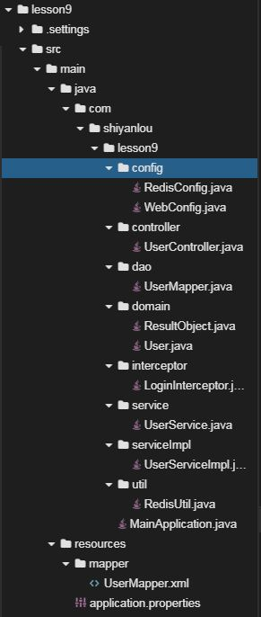

#### 2.2 创建项目

在web IDE界面中，选择File -> Open New Terminal，在终端中输入

```shell
$ mvn archetype:generate -DgroupId=com.shiyanlou -DartifactId=lesson9 -DarchetypeArtifactId=maven-archetype-webapp
```

参数介绍：

- `archetype:generate`：表示使用maven创建项目基本骨架
- `DgroupId`：该项目所属组织，一般将域名倒着写，例如：com.shiyanlou
- `DartifactId`：项目名称，例如：lesson9
- `DarchetypeArtifactId`：指定所用maven项目骨架类型

输入命令后，maven开始创建项目、下载所需的依赖，等待片刻，maven提示我们输入版本号，直接回车，我们使用默认版本号`1.0-SNAPSHOT`即可。随后maven会输出`groupId`、`artifactId`、`version`、`package`这些基本信息，直接输入`Y`确认即可。最后可以看到绿色的`BUILD SUCCESS`项目创建成功的提示。

然后在web IDE界面中，选择File -> Open Workspace切换工作空间，选择lesson9目录，必须切换到该目录下，否则识别不了项目。

最后大家可以根据上图所示的目录结构，自己创建目录、文件，较为简单，无需赘述。


#### 2.3 修改pom文件

`将如下配置文件覆盖到pom.xml中`

- `spring-boot-starter-web `：Spring Boot为Web开发提供支持
- `mybatis-spring-boot-starter` ：为Mybatis与Spring Boot整合提供支持
- `mysql-connector-java` ：MySQL的JDBC驱动包，连接MySQL数据库时必须使用该jar包。
- `druid` ：数据库连接池
- `spring-boot-starter-data-redis` ：为redis与Spring Boot整合提供支持
- `spring-boot-devtools` ：用来支持热部署，当配置了`devtools `后，我们在`classpath`修改任何文件，保存后，项目都将会自动重启，方便开发。
- `json` ：提供对`json`的支持

```xml
<project xmlns="http://maven.apache.org/POM/4.0.0" xmlns:xsi="http://www.w3.org/2001/XMLSchema-instance"
	xsi:schemaLocation="http://maven.apache.org/POM/4.0.0 http://maven.apache.org/xsd/maven-4.0.0.xsd">
	<modelVersion>4.0.0</modelVersion>
	<groupId>com.shiyanlou</groupId>
	<artifactId>lesson9</artifactId>
	<version>0.0.1-SNAPSHOT</version>

	<parent>
		<groupId>org.springframework.boot</groupId>
		<artifactId>spring-boot-starter-parent</artifactId>
		<version>2.0.1.RELEASE</version>
		<relativePath /> <!-- lookup parent from repository -->
	</parent>

	<properties>
		<project.build.sourceEncoding>UTF-8</project.build.sourceEncoding>
		<project.reporting.outputEncoding>UTF-8</project.reporting.outputEncoding>
		<java.version>1.8</java.version>
	</properties>

	<dependencies>
		<dependency>
			<groupId>org.springframework.boot</groupId>
			<artifactId>spring-boot-starter-web</artifactId>
		</dependency>

		<dependency>
			<groupId>org.mybatis.spring.boot</groupId>
			<artifactId>mybatis-spring-boot-starter</artifactId>
			<version>1.3.2</version>
		</dependency>

		<dependency>
			<groupId>mysql</groupId>
			<artifactId>mysql-connector-java</artifactId>
			<scope>runtime</scope>
		</dependency>

		<dependency>
			<groupId>com.alibaba</groupId>
			<artifactId>druid</artifactId>
			<version>1.1.6</version>
		</dependency>
		<dependency>
			<groupId>org.springframework.boot</groupId>
			<artifactId>spring-boot-devtools</artifactId>
			<optional>true</optional>
		</dependency>

		<dependency>
			<groupId>org.springframework.boot</groupId>
			<artifactId>spring-boot-starter-data-redis</artifactId>
		</dependency>

		<dependency>
		    <groupId>org.json</groupId>
		    <artifactId>json</artifactId>
		    <version>20180813</version>
		</dependency>
	</dependencies>

	<build>
		<resources>
			<resource>
				<directory>src/main/resources</directory>
				<includes>
					<include>**/*.properties</include>
					<include>**/*.xml</include>
				</includes>
				<filtering>false</filtering>
			</resource>
		</resources>
		
		<plugins>
			<plugin>
				<groupId>org.springframework.boot</groupId>
				<artifactId>spring-boot-maven-plugin</artifactId>
			</plugin>
		</plugins>
	</build>
</project>
```
#### 2.4 创建application文件

`该文件主要设置关于MySQL、redis、mapper的基本配置`

```properties
#=========MySQL基础配置===========#
# MySQL driver-class
spring.datasource.driver-class-name=com.mysql.jdbc.Driver
# MySQL服务器地址、端口、数据库名称、编码
spring.datasource.url=jdbc:mysql://localhost:3306/lesson9?useUnicode=true&characterEncoding=utf-8
# MySQL用户名
spring.datasource.username=root
# MySQL密码
spring.datasource.password=
# MySQL连接池
spring.datasource.type=com.alibaba.druid.pool.DruidDataSource
# 开启日志
logging.level.com.shiyanlou.lesson9.dao=debug
# mapper位置
mybatis.mapperLocations=classpath:mapper/*.xml

#=========Redis基础配置===========#
# Redis数据库索引（默认为0）
spring.redis.database=0
# Redis服务器地址
spring.redis.host=127.0.0.1
# Redis服务器连接端口
spring.redis.port=6379
# Redis服务器连接密码（默认为空）
spring.redis.password=

#=========Redis线程池配置==========#
# 连接池最大连接数（使用负值表示没有限制）
spring.redis.pool.max-active=200
# 连接池最大阻塞等待时间（使用负值表示没有限制）
spring.redis.pool.max-wait=-1
# 连接池中的最大空闲连接 
spring.redis.pool.max-idle=10 
# 连接池中的最小空闲连接  
spring.redis.pool.min-idle=0  
# 连接超时时间（毫秒）
spring.redis.timeout=1000
```


#### 2.5 创建数据库和数据表

启动MySQL数据库服务

```sh
$ sudo service mysql start
```

进入MySQL数据库

```sh
$ mysql -uroot
```

创建数据库

```sql
mysql> create database lesson9; 
```
导入数据表

```sh
$ mysql -uroot lesson9 < dump.sql
```

本节课数据表较为简单，只有一张`table user`。

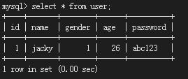

#### 2.6 安装redis数据库

- 安装

```shell
$ sudo apt-get update
$ sudo apt-get install -y redis-server
```
- 启动
```shell
$ sudo service redis-server start
```

- 客户端连接`redis-server`

```shell
$ redis-cli
```

- 测试

```shell
127.0.0.1:6379> keys *
(empty list or set)
127.0.0.1:6379> set name jacky
OK
127.0.0.1:6379> get name
"jacky"
127.0.0.1:6379> keys *
1) "name"
127.0.0.1:6379>
```


#### 2.7 创建dao目录及文件


`UserMapper.java` 针对`table user`的`mapper`接口文件

```java
package com.shiyanlou.lesson9.dao;

import org.apache.ibatis.annotations.Mapper;

import com.shiyanlou.lesson9.domain.User;

@Mapper
public interface UserMapper {
  
  	/**
	 * 查询用户
	 * @param user
	 * @return
	 */
	User select(User user);
}
```


#### 2.8 创建domain目录及文件

`ResultObject.java` 封装后端返回数据

```java
package com.shiyanlou.lesson6.domain;

public class ResultObject {
	
  	// 后台状态
	private int code;
  	// 相关消息
	private String msg;
  	// 后台返回数据
	private Object result;
  	
  	// 构造函数
	public ResultObject() {
		super();
		// TODO Auto-generated constructor stub
	}
  	// 构造函数
	public ResultObject(int code, String msg, Object result) {
		super();
		this.code = code;
		this.msg = msg;
		this.result = result;
	}
  
  	// 属性setter、getter方法
	public int getCode() {
		return code;
	}
	public void setCode(int code) {
		this.code = code;
	}
	public String getMsg() {
		return msg;
	}
	public void setMsg(String msg) {
		this.msg = msg;
	}
	public Object getResult() {
		return result;
	}
	public void setResult(Object result) {
		this.result = result;
	}
  
  	// 重写toString方法
	@Override
	public String toString() {
		return "ResultObject [code=" + code + ", msg=" + msg + ", result=" + result + "]";
	}
}
```


`User.java` 用户类，封装`id`、姓名、年龄、密码等属性

```java
package com.shiyanlou.lesson9.domain;

import java.io.Serializable;

import com.fasterxml.jackson.annotation.JsonInclude;
import com.fasterxml.jackson.annotation.JsonInclude.Include;

@JsonInclude(Include.NON_DEFAULT)
public class User implements Serializable{

	private static final long serialVersionUID = 1L;
  	// 主键自增id
	private int id;
  	// 姓名
	private String name;
  	// 性别
	private int gender;
  	// 年龄
	private int age;
  	// 密码
	private String password;
	
  	// 构造函数
	public User() {
		super();
		// TODO Auto-generated constructor stub
	}
	// 构造函数
	public User(String name, int gender, int age, String password) {
		super();
		this.name = name;
		this.gender = gender;
		this.age = age;
		this.password = password;
	}

  	// 属性setter、getter方法
	public int getId() {
		return id;
	}

	public void setId(int id) {
		this.id = id;
	}

	public String getName() {
		return name;
	}

	public void setName(String name) {
		this.name = name;
	}

	public int getGender() {
		return gender;
	}

	public void setGender(int gender) {
		this.gender = gender;
	}

	public int getAge() {
		return age;
	}

	public void setAge(int age) {
		this.age = age;
	}

	public String getPassword() {
		return password;
	}

	public void setPassword(String password) {
		this.password = password;
	}

  	// 重写toString方法
	@Override
	public String toString() {
		return "User [id=" + id + ", name=" + name + ", gender=" + gender + ", age=" + age + ", password=" + password + "]";
	}
}
```


#### 2.9 创建service目录及文件

`UserService.java` 用户业务接口，定义登录、注销等方法

```java
package com.shiyanlou.lesson9.service;

import com.shiyanlou.lesson9.domain.ResultObject;
import com.shiyanlou.lesson9.domain.User;

public interface UserService {

  	/**
	 * 登录
	 * @param user
	 * @return
	 */
	public ResultObject login(User user);

  	/**
	 * 注销
	 * @param token
	 * @return
	 */
	public ResultObject logout(String token);
}
```


#### 2.10 创建serviceImpl目录及文件

`UserServiceImpl.java` 用户业务类，实现`UserService.java`接口中定义登录、注销等方法

```java
package com.shiyanlou.lesson9.serviceImpl;

import java.util.HashMap;
import java.util.Map;
import java.util.UUID;

import org.springframework.beans.factory.annotation.Autowired;
import org.springframework.stereotype.Service;

import com.shiyanlou.lesson9.dao.UserMapper;
import com.shiyanlou.lesson9.domain.ResultObject;
import com.shiyanlou.lesson9.domain.User;
import com.shiyanlou.lesson9.service.UserService;
import com.shiyanlou.lesson9.util.RedisUtil;

// 标识service
@Service
public class UserServiceImpl implements UserService{

  	// 自动注入mapper
	@Autowired
	private UserMapper userMapper;

  	// 自动注入redisUtil
	@Autowired
	private RedisUtil redisUtil;
	
   	/**
	 * 登录
	 * @param user
	 * @return
	 */
	@Override
	public ResultObject login(User user) {
		ResultObject resultObject = new ResultObject();
      
      	// 查询用户账号、密码是否正确
		User fullUser = userMapper.select(user);
      	// 不正确直接返回
		if (fullUser == null) {
			resultObject.setCode(-1);
			resultObject.setMsg("name or password error");
			return resultObject;
		}
		
      	// 生成随机token
		String token = UUID.randomUUID().toString();
		int interval = 60 * 5;
      	
      	// 将用户的token作为key, 用户信息作为value
		redisUtil.set(token, fullUser, interval);
		// 防止同一个账号多人登录
		redisUtil.set(Integer.toString(fullUser.getId()), token, interval);

		resultObject.setCode(1);
		resultObject.setMsg("login success");
		Map<String, Object> map = new HashMap<>();
		map.put("token", token);
		
		fullUser.setPassword(null);
		map.put("user", fullUser);
		resultObject.setResult(map);
		
		return resultObject;
	}

  	 /**
	 * 注销
	 * @param token
	 * @return
	 */
	@Override
	public ResultObject logout(String token) {
		User user = (User)redisUtil.get(token);
		redisUtil.del(Integer.toString(user.getId()));
		redisUtil.del(token);
		return new ResultObject(1, "success", null);
	}
}
```


#### 2.11 创建controller目录及文件

`UserController.java` 用户控制器，为用户类登录、注销等方法提供访问控制接口

```java
package com.shiyanlou.lesson9.controller;

import org.springframework.beans.factory.annotation.Autowired;
import org.springframework.web.bind.annotation.GetMapping;
import org.springframework.web.bind.annotation.PostMapping;
import org.springframework.web.bind.annotation.RequestBody;
import org.springframework.web.bind.annotation.RequestMapping;
import org.springframework.web.bind.annotation.RequestParam;
import org.springframework.web.bind.annotation.RestController;

import com.shiyanlou.lesson9.domain.ResultObject;
import com.shiyanlou.lesson9.domain.User;
import com.shiyanlou.lesson9.service.UserService;

// 标记controller，返回json数据，URL前缀：/user
@RestController
@RequestMapping("user")
public class UserController {
	
  	// 自动注入service
	@Autowired
	private UserService userService;
  
    /**
	 * 登录
	 * @param user
	 * @return
	 */
	@PostMapping("login")
	public ResultObject login(@RequestBody User user) {
		if (user == null) {
			return new ResultObject(-1, "param empty", null);
		}
		ResultObject resultObject = userService.login(user);
		return resultObject;
	}
	
  	 /**
	 * 测试单点登录
	 * @param
	 * @return
	 */
	@GetMapping("test")
	public ResultObject test() {
		ResultObject resultObject = new ResultObject(1, "test success", null);
		return resultObject;
	}
	
	 /**
	 * 注销
	 * @param token
	 * @return
	 */
	@GetMapping("logout")
	public ResultObject logout(@RequestParam String token) {
		ResultObject resultObject = userService.logout(token);
		return resultObject;
	}

}
```


#### 2.12 创建mapper文件

`UserMapper.xml` 实现`UserMapper.java`接口中定义的方法

```xml
<?xml version="1.0" encoding="UTF-8"?>
 <!DOCTYPE mapper 
 PUBLIC "-//mybatis.org//DTD Mapper 3.0//EN" 
 "http://mybatis.org/dtd/mybatis-3-mapper.dtd">

<mapper namespace="com.shiyanlou.lesson9.dao.UserMapper">
	<select id="select" parameterType="com.shiyanlou.lesson9.domain.User"
	 resultType="com.shiyanlou.lesson9.domain.User">
		select 
			id, name, gender, age, password
		from 
			user 
		where 
			name = #{name} 
			and 
			password = #{password};
	</select>
</mapper> 
```


#### 2.13 创建config文件

`RedisConfig.java` `redis`序列化方式配置文件

```java
package com.shiyanlou.lesson9.config;

import org.springframework.context.annotation.Bean;
import org.springframework.context.annotation.Configuration;
import org.springframework.data.redis.connection.RedisConnectionFactory;
import org.springframework.data.redis.core.RedisTemplate;
import org.springframework.data.redis.serializer.Jackson2JsonRedisSerializer;
import org.springframework.data.redis.serializer.StringRedisSerializer;
import com.fasterxml.jackson.annotation.JsonAutoDetect;
import com.fasterxml.jackson.annotation.PropertyAccessor;
import com.fasterxml.jackson.databind.ObjectMapper;

// 标识configuration
@Configuration
public class RedisConfig {

	@Bean
	@SuppressWarnings("all")
	public RedisTemplate<String, Object> redisTemplate(RedisConnectionFactory factory) {
		RedisTemplate<String, Object> template = new RedisTemplate<String, Object>();
		template.setConnectionFactory(factory);
		
		Jackson2JsonRedisSerializer jackson2JsonRedisSerializer = new Jackson2JsonRedisSerializer(Object.class);
		ObjectMapper om = new ObjectMapper();
		om.setVisibility(PropertyAccessor.ALL, JsonAutoDetect.Visibility.ANY);
		om.enableDefaultTyping(ObjectMapper.DefaultTyping.NON_FINAL);
		jackson2JsonRedisSerializer.setObjectMapper(om);
		
		StringRedisSerializer stringRedisSerializer = new StringRedisSerializer();
		// key采用String的序列化方式
		template.setKeySerializer(stringRedisSerializer);
		// hash的key也采用String的序列化方式
		template.setHashKeySerializer(stringRedisSerializer);
		// value序列化方式采用jackson
		template.setValueSerializer(jackson2JsonRedisSerializer);
		// hash的value序列化方式采用jackson
		template.setHashValueSerializer(jackson2JsonRedisSerializer);
		
		template.afterPropertiesSet();
		
		return template;
	}

}
```


`WebConfig.java` 配置拦截器，拦截除登录接口外的其他所有接口

```java
package com.shiyanlou.lesson9.config;

import org.springframework.beans.factory.annotation.Autowired;
import org.springframework.context.annotation.Configuration;
import org.springframework.web.servlet.config.annotation.InterceptorRegistry;
import org.springframework.web.servlet.config.annotation.WebMvcConfigurationSupport;

import com.shiyanlou.lesson9.interceptor.LoginInterceptor;

// 标识configuration
@Configuration
public class WebConfig extends WebMvcConfigurationSupport{

  	// 自动注入拦截器
	@Autowired
	private LoginInterceptor loginInterceptor;
	
	@Override
    public void addInterceptors(InterceptorRegistry registry) {
			registry.addInterceptor(loginInterceptor).addPathPatterns("/user/**").excludePathPatterns("/user/login");

        super.addInterceptors(registry);
    }
}
```


#### 2.14 创建interceptor文件

`LoginInterceptor.java` 登录拦截器

```java
package com.shiyanlou.lesson9.interceptor;

import java.io.IOException;
import java.io.OutputStream;

import javax.servlet.http.HttpServletRequest;
import javax.servlet.http.HttpServletResponse;

import org.apache.commons.logging.Log;
import org.apache.commons.logging.LogFactory;
import org.json.JSONObject;
import org.springframework.beans.factory.annotation.Autowired;

import org.springframework.stereotype.Component;
import org.springframework.web.servlet.HandlerInterceptor;
import org.springframework.web.servlet.ModelAndView;

import com.shiyanlou.lesson9.domain.ResultObject;
import com.shiyanlou.lesson9.domain.User;
import com.shiyanlou.lesson9.util.RedisUtil;

@Component
public class LoginInterceptor  implements HandlerInterceptor{

	private static final Log logger = LogFactory.getLog(LoginInterceptor.class);

	@Autowired
	private RedisUtil redisUtil;

	@Override
	public boolean preHandle(HttpServletRequest request, HttpServletResponse response, Object handler) {
		try {
			// 校验用户是否已经登录, 如果登录过, 将之前用户踢掉, 同时更新缓存中用户信息
			// 获取用户id
			// step 1 检查请求是否携带token
			
			String token = request.getParameter("token");
			if (token == null) {
				render(response, "lack token");
				return false;
			}
			
			// step 2  检查token是否合法
			User user = (User)redisUtil.get(token);
			if (user != null) {
				Object preToken = redisUtil.get(Integer.toString(user.getId()));
				// step 3  检查同一账号是否被其他用户登录
				if (!token.equals(preToken)) {
					render(response, "another user login");
					return false;
				// step 4  至此登录成功，查看token过期时间是否小于1分钟, 返回值单位毫秒，故 * 1000比较
				} else {
					Long expire = redisUtil.getExpire(token);
					if (expire < 60 * 1000) {
						redisUtil.expire(token, 60 * 30);
					}
				}
			} else {
				render(response, "token error");
				return false;
			}
		} catch (Exception e) {
			logger.info("preHandle=" + e);
		}
		return true;
	}

	 @Override  
    public void postHandle(HttpServletRequest request, HttpServletResponse response, Object handler,  
            ModelAndView modelAndView) throws Exception {  
  
    }  
  
    @Override  
    public void afterCompletion(HttpServletRequest request, HttpServletResponse response, Object handler, Exception ex)  
            throws Exception {  
    }  
	    
	public void render(HttpServletResponse response, String msg) throws IOException {
		ResultObject resultObject = new ResultObject(-1, msg, null);
		
		JSONObject object = new JSONObject(resultObject);

		response.setContentType("application/json;charset=UTF-8");
        OutputStream out = response.getOutputStream();
        out.write(object.toString().getBytes("UTF-8"));
        out.flush();
        out.close();
	}
}
```


#### 2.15 创建util文件

`RedisUtil.java` 封装`redis`常用接口

```java
package com.shiyanlou.lesson9.util;

import java.util.concurrent.TimeUnit;

import org.springframework.beans.factory.annotation.Autowired;
import org.springframework.data.redis.core.RedisTemplate;
import org.springframework.stereotype.Component;
import org.springframework.util.CollectionUtils;

@Component
public class RedisUtil {
	
	@Autowired
	private RedisTemplate<String, Object> redisTemplate;

	/**
	 * 设置过期时间
	 * @param key
	 * @param time
	 * @return
	 */
	public boolean expire(String key, long time) {
		try {
			if (time > 0) {
				redisTemplate.expire(key, time, TimeUnit.SECONDS);
			}
			return true;
		} catch (Exception e) {
			e.printStackTrace();
			return false;
		}
	}

	/**
	 * 获取key的过期时间
	 * @param key
	 * @return
	 */
	public long getExpire(String key) {
		return redisTemplate.getExpire(key, TimeUnit.SECONDS);
	}

	/**
	 * 检测key是否存在
	 * @param key
	 * @return
	 */
	public boolean hasKey(String key) {
		try {
			return redisTemplate.hasKey(key);
		} catch (Exception e) {
			e.printStackTrace();
			return false;
		}
	}

	/**
	 * 删除key
	 * @param key
	 */
	@SuppressWarnings("unchecked")
	public void del(String... key) {
		if (key != null && key.length > 0) {
			if (key.length == 1) {
				redisTemplate.delete(key[0]);
			} else {
				redisTemplate.delete(CollectionUtils.arrayToList(key));
			}
		}
	}

	/**
	 * 获取key
	 * @param key
	 * @return
	 */
	
	public Object get(String key) {
		return key == null ? null : redisTemplate.opsForValue().get(key);
	}

	/**
	 * 设置key
	 * @param key
	 * @param value
	 * @return
	 */
	public boolean set(String key, Object value) {
		try {
			redisTemplate.opsForValue().set(key, value);
			return true;
		} catch (Exception e) {
			e.printStackTrace();
			return false;
		}
	}

	/**
	 * 设置带有过期时间的key，默认永不过期
	 * @param key
	 * @param value
	 * @param time
	 * @return
	 */
	public boolean set(String key, Object value, long time) {
		try {
			if (time > 0) {
				redisTemplate.opsForValue().set(key, value, time, TimeUnit.SECONDS);
			} else {
				set(key, value);
			}
			return true;
		} catch (Exception e) {
			e.printStackTrace();
			return false;
		}
	}

	/**
	 * value + delta
	 * @param key
	 * @param delta
	 * @return
	 */
	public long incr(String key, long delta) {
		if (delta < 0) {
			throw new RuntimeException("delta must > 0");
		}
		return redisTemplate.opsForValue().increment(key, delta);
	}

	/**
	 * value - delta
	 * @param key
	 * @param delta
	 * @return
	 */
	public long decr(String key, long delta) {
		if (delta < 0) {
			throw new RuntimeException("delta must > 0");
		}
		return redisTemplate.opsForValue().increment(key, -delta);
	}
}
```


#### 2.16 创建启动类文件

`MainApplication.java`，内置Tomcat，整个web程序的入口

- `MapperScan`注解十分重要，`value`为`mapper`所在路径，Spring Boot由这个注解可以得知去哪里扫描`mapper`文件

```java
package com.shiyanlou.lesson9;

import org.mybatis.spring.annotation.MapperScan;
import org.springframework.boot.SpringApplication;
import org.springframework.boot.autoconfigure.SpringBootApplication;

@SpringBootApplication
@MapperScan("com.shiyanlou.lesson9.dao")
public class MainApplication {

	public static void main(String[] args) {
		SpringApplication.run(MainApplication.class, args);
	}
}
```


#### 2.17 访问测试

在终端中输入如下命令，启动web项目

```shell
$ mvn spring-boot:run
```

`可以看到控制台打印出启动日志，然后可以使用curl进行测试 ` 

安装`jq`

```shell
$ sudo apt-get install -y jq 
```


- 使用正确的账号密码登录，成功获取用户信息和token

```shell
$ curl -X POST http://localhost:8080/user/login -H "Content-Type:application/json" -d '{"name":"jacky", "password":"abc123"}' | jq
```

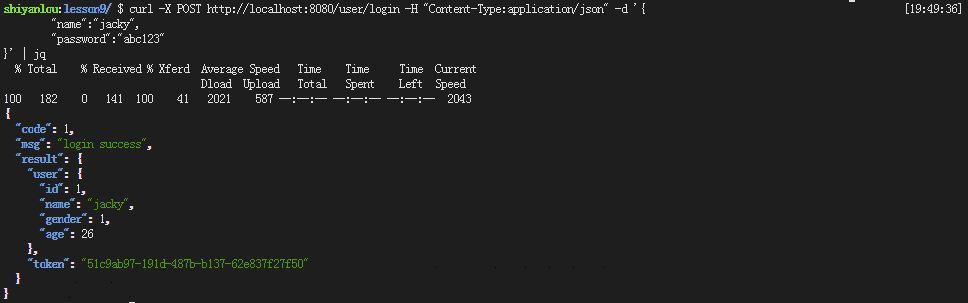

- 成功登录后，redis存储了两对键值对信息
  - key：token，value：用户信息，该键值对记录用户信息
  - key： userId，value：token，该键值对防止一个账号被多个用户登录

```shell
$ keys *
```
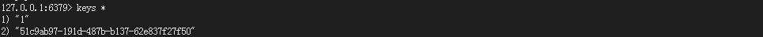

- 用户名、密码错误，无法登录

```shell
$ curl -X POST http://localhost:8080/user/login -H "Content-Type:application/json" -d '{"name":"jacky", "password":"112233"}' | jq
```
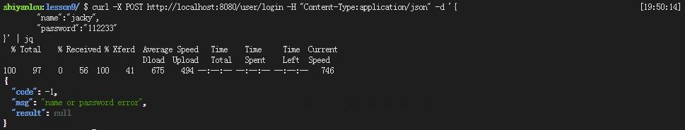

- 访问其他接口没有携带token参数，访问失败

```shell
$ curl -X GET http://localhost:8080/user/test | jq
```
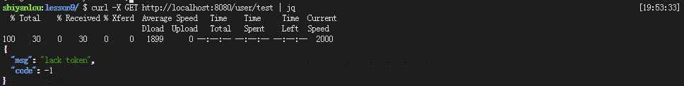

- 访问其他接口携带正确的token参数，成功访问

```shell
$ curl -X GET http://localhost:8080/user/test?token=51c9ab97-191d-487b-b137-62e837f27f50 | jq
```
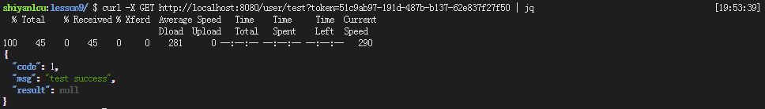

- 访问其他接口携带错误的、伪造的token参数，访问失败

```shell
$ curl -X GET http://localhost:8080/user/test?token=111111 | jq
```
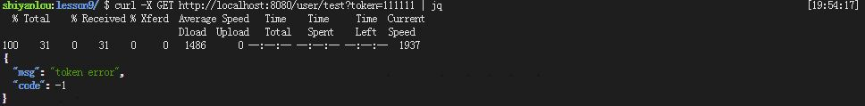

- 另外一个用户使用正确的账号、密码成功登录

```shell
$ curl -X POST http://localhost:8080/user/login -H "Content-Type:application/json" -d '{"name":"jacky", "password":"abc123"}' | jq
```
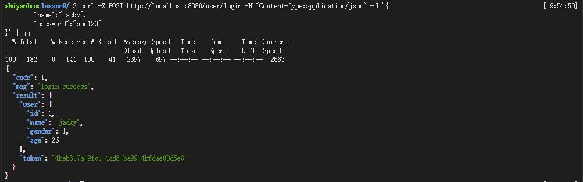

- 之前登录的用户被“顶下去”，类似于视频网站VIP会员的机制，一个VIP账号不允许多个人使用

```shell
$ curl -X GET http://localhost:8080/user/test?token=51c9ab97-191d-487b-b137-62e837f27f50 | jq
```
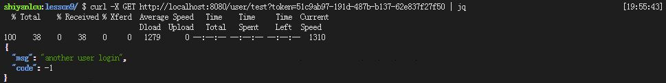

- 注销

```shell
$ curl -X GET http://localhost:8080/user/logout?token=4170a069-efe5-4fef-bacb-46de3c02e687 | jq
```
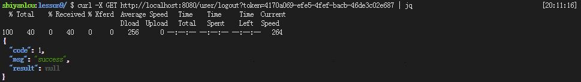


## 三、实验总结

​	本节课主要是开发基于redis和token的单点登录，使用Spring Boot和Mybatis、redis-template技术栈，主要学习了Spring Boot与redis的整合。