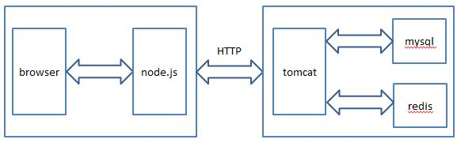
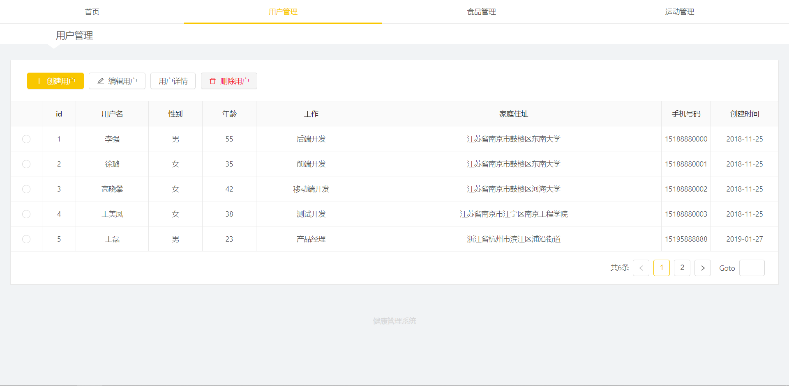
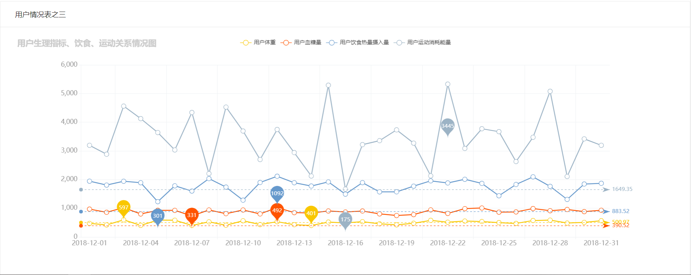

# 课程详情

## 项目介绍

​	本课程分为基础篇、项目篇两部分。基本篇五次课程分别介绍Spring Boot快速入门、基础Web开发、单元测试、过滤器、拦截器、监听器、整合Mybatis。项目篇是一个前后端分离的的用户健康管理系统，前后端通过`json`数据来进行通信，后端基于Spring Boot和Mybatis，前端基于react、AntD、echarts，在Linux环境下使用curl工具对后端接口进行测试，后端接口分为用户端和健康指导员端两部分。主要实现了用户管理、食物管理、运动管理、用户生理指标信息、饮食情况、运动情况记录、单点登录等功能。

​	开发过程中涉及了大量进阶知识，包括Spring Boot、Mybatis的高级功能，Mysql，Redis 等组件在项目开发中都扮演了重要的角色。本课程将会为大家细致反复地讲解这些组件的安装、使用方法，使大家掌握目前主流互联网公司的web架构——前后端分离架构，而不是重复Jsp等已经被淘汰的陈旧技术。

## 从这个训练营你能够学到什么

+ 当前主流互联网公司web开发架构——前后端分离架构
+ 从入门到深入理解Spring Boot，包括从Spring Boot HTTP基本开发、常用配置到过滤器、拦截器、监听器的开发以及整合Mybatis、redis等技术
+ 深入学习Mybatis等后端主流开发技术，包括分页、级联查询、事务等功能
+ 深入学习MySQL、学会 Redis 基本配置及使用，并且通过redis实现单点登录
+ 提升后端开发的综合能力，包括模块功能逻辑、数据库表的设计、使用curl工具自测接口可用性

## 效果演示

+ 架构设计

+ 用户管理效果图

+ 用户详情部分效果图

## 适合人群

+ 已经具备基本的Java web开发知识，希望深入学习Web开发，通过中等难度的项目锻炼开发能力

### 涉及前驱知识：

1. Java基础

2. MySQL、Redis基础

3. Spring、Mybatis基础

## 实验列表

+ 实验1  Spring Boot 快速入门

知识点: 1.Spring Boot 基本介绍 2.maven构建项目 3.Spring Boot目录结构介绍

+ 实验2  Spring Boot 基础Web开发

知识点: 1.Spring Boot 基础HTTP开发 2.开发工具Curl介绍

+ 实验3  Spring Boot 单元测试

知识点: 1.Spring Boot Service测试 2.Spring Boot Controller测试 3.单元测试回滚

+ 实验4  Spring Boot过滤器、拦截器、监听器

知识点: 1、过滤器、拦截器、监听器介绍及实例

+ 实验5  Spring Boot整合Mybatis	

知识点: 1.搭建实验平台 2.Mybatis 基本介绍 3.Mybatis 级联查询

+ 实验6  后端接口开发（用户侧1）

知识点: 1.Spring Boot 基础HTTP开发、常用配置 2.Spring Boot 热部署 3.Mybatis 基础配置及CURD操作 4.Mybatis分页

+ 实验7  后端接口开发（用户侧2）

知识点: 1.Spring Boot 基础HTTP开发 2.Mybatis 级联查询

+ 实验8 后端接口开发（健康指导员侧）

知识点: 1.事务、隔离级别介绍 2.事务实战 3.Mybatis 级联查询

+ 实验9  后端接口开发（单点登录）

知识点: 1.Spring Boot整合redis 2.基于token实现单点登录

+ 实验10  前端页面开发

知识点: 1.React基本使用 2.Antd基本使用3.echarts基本使用

